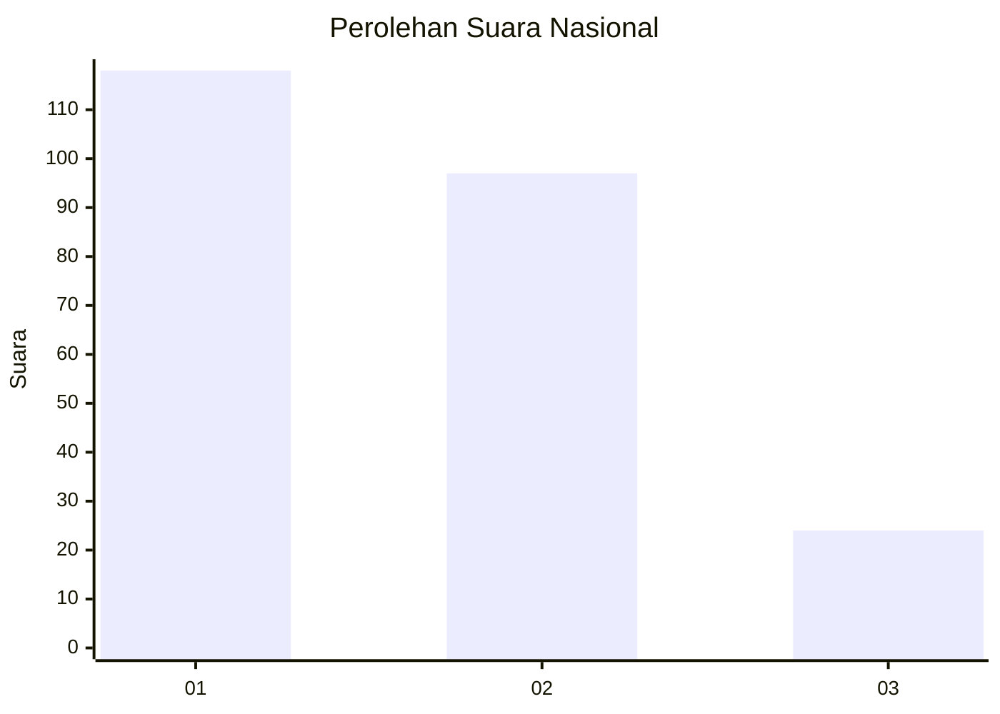
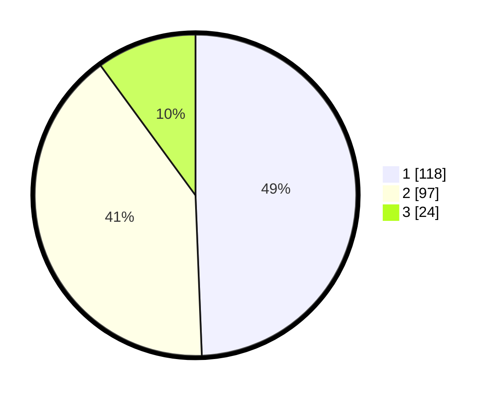

# Hasil

## Grafik

## Tabel

| No.    | Nama Paslon    | Suara | Suara (raw) | Persentase |
|:------ |:-------------- | -----:| -----------:| ----------:|
| 100025 | ANIES MUHAIMIN | 118   | [118][p-1]  | 49,37      |
| 100026 | PRABOWO GIBRAN | 97    | [97][p-2]   | 40,59      |
| 100027 | GANJAR MAHFUD  | 24    | [24][p-3]   | 10,04      |

[p-1]: https://github.com/gigit-pemilu/pemilu-2024/blob/main/pilpres/hitung-suara/sub/31-dki-jakarta/sub/74-jakarta-selatan/sub/09-jagakarsa/sub/1004-lenteng-agung/sub/167-tps/sub/paslon-1.txt
[p-2]: https://github.com/gigit-pemilu/pemilu-2024/blob/main/pilpres/hitung-suara/sub/31-dki-jakarta/sub/74-jakarta-selatan/sub/09-jagakarsa/sub/1004-lenteng-agung/sub/167-tps/sub/paslon-2.txt
[p-3]: https://github.com/gigit-pemilu/pemilu-2024/blob/main/pilpres/hitung-suara/sub/31-dki-jakarta/sub/74-jakarta-selatan/sub/09-jagakarsa/sub/1004-lenteng-agung/sub/167-tps/sub/paslon-3.txt

## Foto C Plano

https://sirekap-obj-formc.kpu.go.id/0762/pemilu/ppwp/31/74/09/10/04/3174091004167-20240214-225133--ade04950-e4e9-4fee-b556-444e795f6721.jpg

https://sirekap-obj-formc.kpu.go.id/0762/pemilu/ppwp/31/74/09/10/04/3174091004167-20240214-225415--85b46edc-5913-47e2-9d1c-edb231c3a21d.jpg

https://sirekap-obj-formc.kpu.go.id/0762/pemilu/ppwp/31/74/09/10/04/3174091004167-20240214-230111--e8f3ec88-2a69-4a6c-96aa-93e620d6149d.jpg

## Metadata

| Key        | Value               |
| ---------- | ------------------- |
| Time Stamp | 2024-02-25 12:00:00 |

