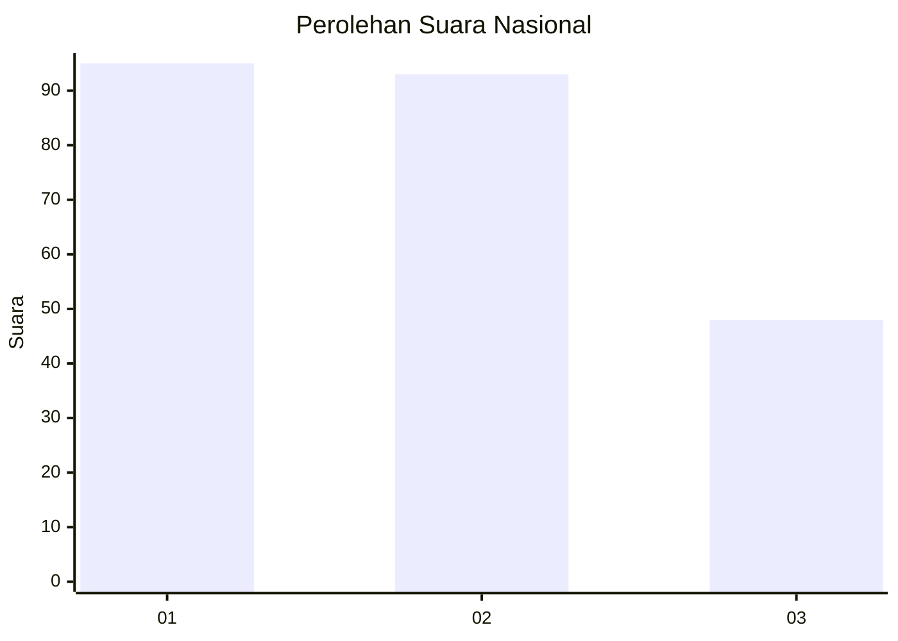
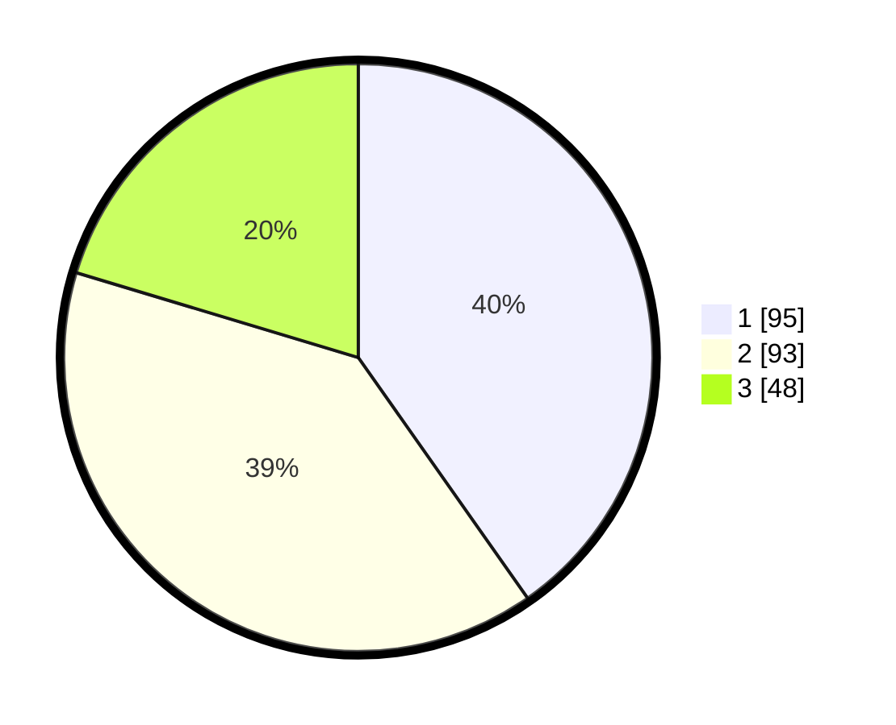

# Hasil

## Grafik

## Tabel

| No.    | Nama Paslon    | Suara | Suara (raw) | Persentase |
|:------ |:-------------- | -----:| -----------:| ----------:|
| 100025 | ANIES MUHAIMIN | 95    | [95][p-1]   | 40,25      |
| 100026 | PRABOWO GIBRAN | 93    | [93][p-2]   | 39,41      |
| 100027 | GANJAR MAHFUD  | 48    | [48][p-3]   | 20,34      |

[p-1]: https://github.com/gigit-pemilu/pemilu-2024/blob/main/pilpres/hitung-suara/sub/31-dki-jakarta/sub/74-jakarta-selatan/sub/09-jagakarsa/sub/1004-lenteng-agung/sub/171-tps/sub/paslon-1.txt
[p-2]: https://github.com/gigit-pemilu/pemilu-2024/blob/main/pilpres/hitung-suara/sub/31-dki-jakarta/sub/74-jakarta-selatan/sub/09-jagakarsa/sub/1004-lenteng-agung/sub/171-tps/sub/paslon-2.txt
[p-3]: https://github.com/gigit-pemilu/pemilu-2024/blob/main/pilpres/hitung-suara/sub/31-dki-jakarta/sub/74-jakarta-selatan/sub/09-jagakarsa/sub/1004-lenteng-agung/sub/171-tps/sub/paslon-3.txt

## Foto C Plano

https://sirekap-obj-formc.kpu.go.id/f9f8/pemilu/ppwp/31/74/09/10/04/3174091004171-20240214-191521--4e46c269-70f7-40ef-8d83-f1f3a9106d5e.jpg

https://sirekap-obj-formc.kpu.go.id/f9f8/pemilu/ppwp/31/74/09/10/04/3174091004171-20240214-191526--7e9a4278-32b2-4504-bc87-7860189cd8e3.jpg

https://sirekap-obj-formc.kpu.go.id/f9f8/pemilu/ppwp/31/74/09/10/04/3174091004171-20240214-191648--d9338df1-ebd9-4875-83be-97f977663e95.jpg

## Metadata

| Key        | Value               |
| ---------- | ------------------- |
| Time Stamp | 2024-02-24 22:31:28 |

