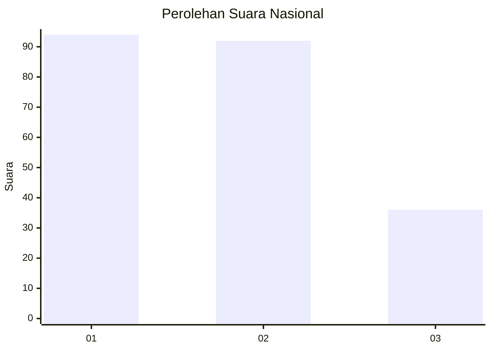
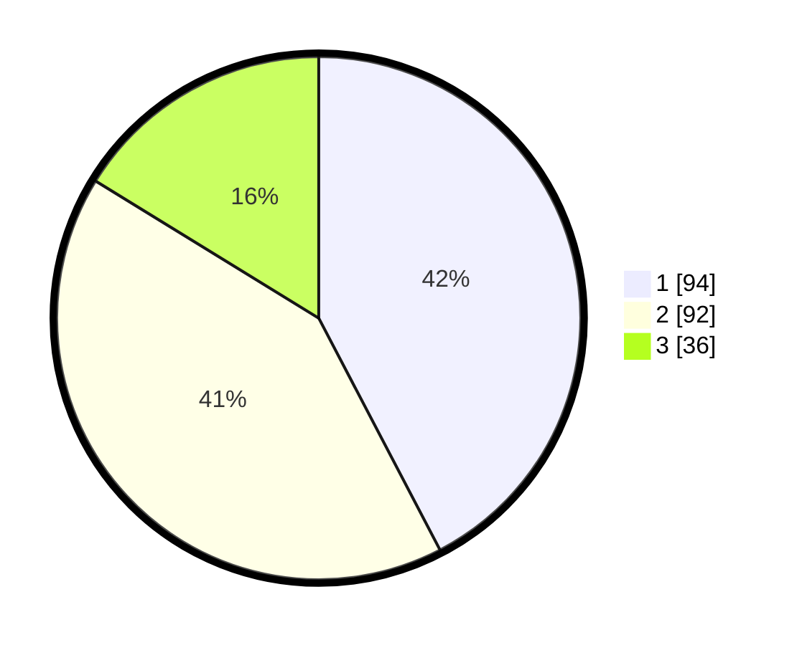

# Hasil

## Grafik

## Tabel

| No.    | Nama Paslon    | Suara | Suara (raw) | Persentase |
|:------ |:-------------- | -----:| -----------:| ----------:|
| 100025 | ANIES MUHAIMIN | 94    | [94][p-1]   | 42,34      |
| 100026 | PRABOWO GIBRAN | 92    | [92][p-2]   | 41,44      |
| 100027 | GANJAR MAHFUD  | 36    | [36][p-3]   | 16,22      |

[p-1]: https://github.com/gigit-pemilu/pemilu-2024/blob/main/pilpres/hitung-suara/sub/31-dki-jakarta/sub/74-jakarta-selatan/sub/09-jagakarsa/sub/1004-lenteng-agung/sub/172-tps/sub/paslon-1.txt
[p-2]: https://github.com/gigit-pemilu/pemilu-2024/blob/main/pilpres/hitung-suara/sub/31-dki-jakarta/sub/74-jakarta-selatan/sub/09-jagakarsa/sub/1004-lenteng-agung/sub/172-tps/sub/paslon-2.txt
[p-3]: https://github.com/gigit-pemilu/pemilu-2024/blob/main/pilpres/hitung-suara/sub/31-dki-jakarta/sub/74-jakarta-selatan/sub/09-jagakarsa/sub/1004-lenteng-agung/sub/172-tps/sub/paslon-3.txt

## Foto C Plano

https://sirekap-obj-formc.kpu.go.id/33bd/pemilu/ppwp/31/74/09/10/04/3174091004172-20240214-203946--fbf6c341-cc5f-429b-9b01-cd9c0ef2792c.jpg

https://sirekap-obj-formc.kpu.go.id/33bd/pemilu/ppwp/31/74/09/10/04/3174091004172-20240214-202515--d1156baa-5d69-4fd9-add4-31247e491211.jpg

https://sirekap-obj-formc.kpu.go.id/33bd/pemilu/ppwp/31/74/09/10/04/3174091004172-20240214-203614--dca796c0-1f12-46bc-b0db-93b41cdcb314.jpg

## Metadata

| Key        | Value               |
| ---------- | ------------------- |
| Time Stamp | 2024-02-24 22:31:28 |

