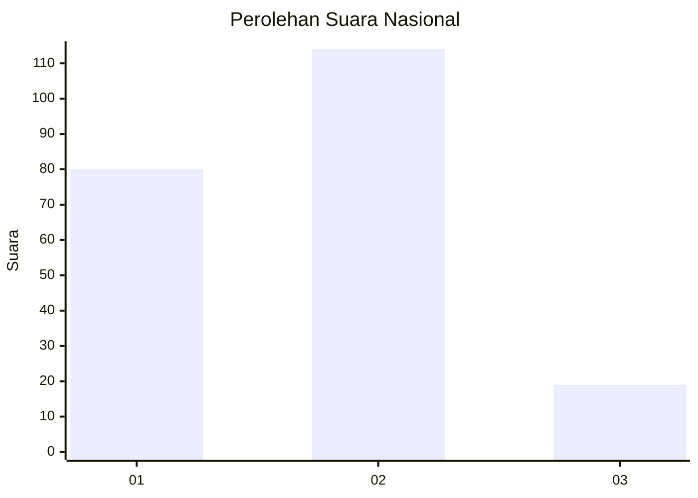

# Hasil

## Grafik

## Tabel

| No.    | Nama Paslon    | Suara | Suara (raw) | Persentase |
|:------ |:-------------- | -----:| -----------:| ----------:|
| 100025 | ANIES MUHAIMIN | 80    | [80][p-1]   | 37,56      |
| 100026 | PRABOWO GIBRAN | 114   | [114][p-2]  | 53,52      |
| 100027 | GANJAR MAHFUD  | 19    | [19][p-3]   | 8,92       |

[p-1]: https://github.com/gigit-pemilu/pemilu-2024/blob/main/pilpres/hitung-suara/sub/31-dki-jakarta/sub/74-jakarta-selatan/sub/09-jagakarsa/sub/1004-lenteng-agung/sub/192-tps/sub/paslon-1.txt
[p-2]: https://github.com/gigit-pemilu/pemilu-2024/blob/main/pilpres/hitung-suara/sub/31-dki-jakarta/sub/74-jakarta-selatan/sub/09-jagakarsa/sub/1004-lenteng-agung/sub/192-tps/sub/paslon-2.txt
[p-3]: https://github.com/gigit-pemilu/pemilu-2024/blob/main/pilpres/hitung-suara/sub/31-dki-jakarta/sub/74-jakarta-selatan/sub/09-jagakarsa/sub/1004-lenteng-agung/sub/192-tps/sub/paslon-3.txt

## Foto C Plano

https://sirekap-obj-formc.kpu.go.id/d828/pemilu/ppwp/31/74/09/10/04/3174091004192-20240215-052907--e02055d4-4d47-4c17-95a8-5f74aa14a2a9.jpg

https://sirekap-obj-formc.kpu.go.id/d828/pemilu/ppwp/31/74/09/10/04/3174091004192-20240215-053025--6f63f8b1-500c-4016-a381-378d1c37c993.jpg

https://sirekap-obj-formc.kpu.go.id/d828/pemilu/ppwp/31/74/09/10/04/3174091004192-20240215-053219--e16f54e4-fede-452e-840f-9b44b20de860.jpg

## Metadata

| Key        | Value               |
| ---------- | ------------------- |
| Time Stamp | 2024-02-24 22:31:28 |

