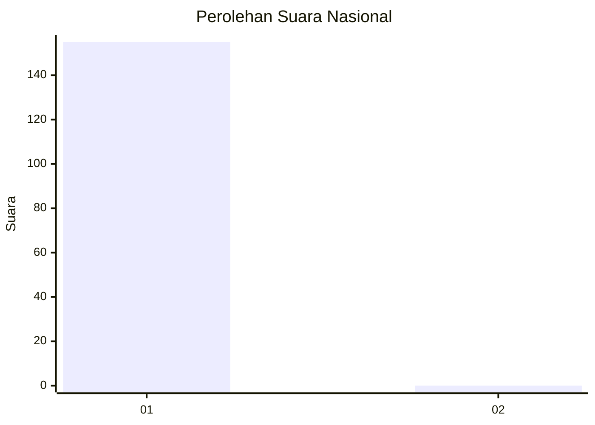
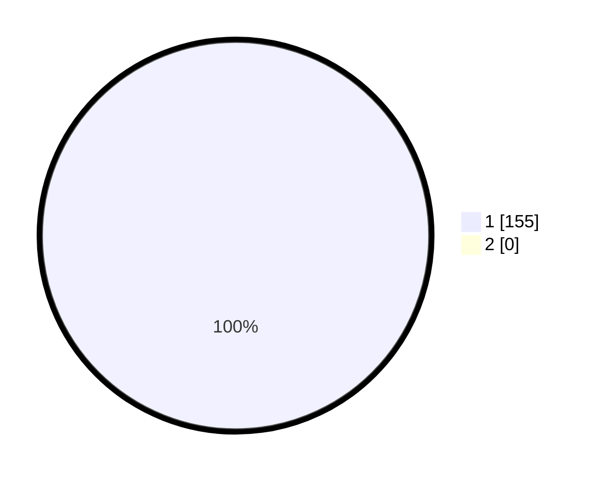

# Hasil

## Grafik

## Tabel

| No.    | Nama Paslon    | Suara | Suara (raw) | Persentase |
|:------ |:-------------- | -----:| -----------:| ----------:|
| 100025 | ANIES MUHAIMIN | 155   | [155][p-1]  | 100,00     |
| 100026 | PRABOWO GIBRAN | 0     | [0][p-2]    | 0,00       |

[p-1]: https://github.com/gigit-pemilu/pemilu-2024/blob/main/pilpres/hitung-suara/sub/31-dki-jakarta/sub/74-jakarta-selatan/sub/09-jagakarsa/sub/1004-lenteng-agung/sub/197-tps/sub/paslon-1.txt
[p-2]: https://github.com/gigit-pemilu/pemilu-2024/blob/main/pilpres/hitung-suara/sub/31-dki-jakarta/sub/74-jakarta-selatan/sub/09-jagakarsa/sub/1004-lenteng-agung/sub/197-tps/sub/paslon-2.txt
[p-3]: https://github.com/gigit-pemilu/pemilu-2024/blob/main/pilpres/hitung-suara/sub/31-dki-jakarta/sub/74-jakarta-selatan/sub/09-jagakarsa/sub/1004-lenteng-agung/sub/197-tps/sub/paslon-3.txt

## Foto C Plano

https://sirekap-obj-formc.kpu.go.id/5302/pemilu/ppwp/31/74/09/10/04/3174091004197-20240215-010436--a2071197-25e3-44f8-be2a-5fe69a73e717.jpg

https://sirekap-obj-formc.kpu.go.id/5302/pemilu/ppwp/31/74/09/10/04/3174091004197-20240215-024419--920b0eb5-92b0-47d4-a25b-dcb57f5f187b.jpg

https://sirekap-obj-formc.kpu.go.id/5302/pemilu/ppwp/31/74/09/10/04/3174091004197-20240215-024429--ca294e53-bc3b-42ba-8e95-d5cb71cd4041.jpg

## Metadata

| Key        | Value               |
| ---------- | ------------------- |
| Time Stamp | 2024-02-24 22:31:28 |

