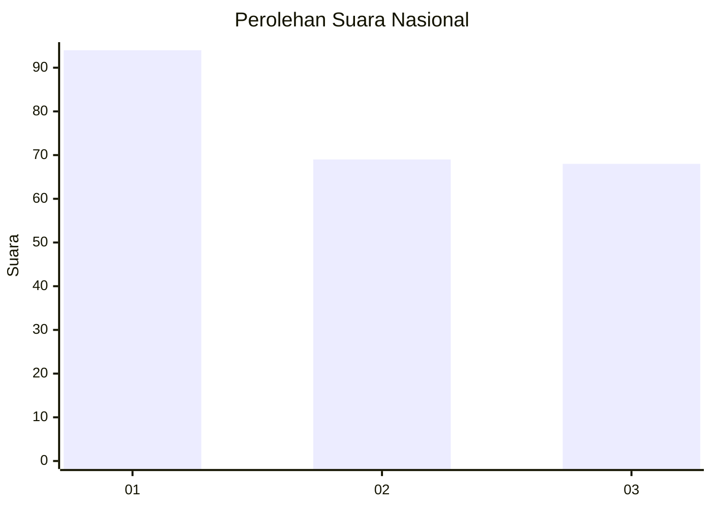
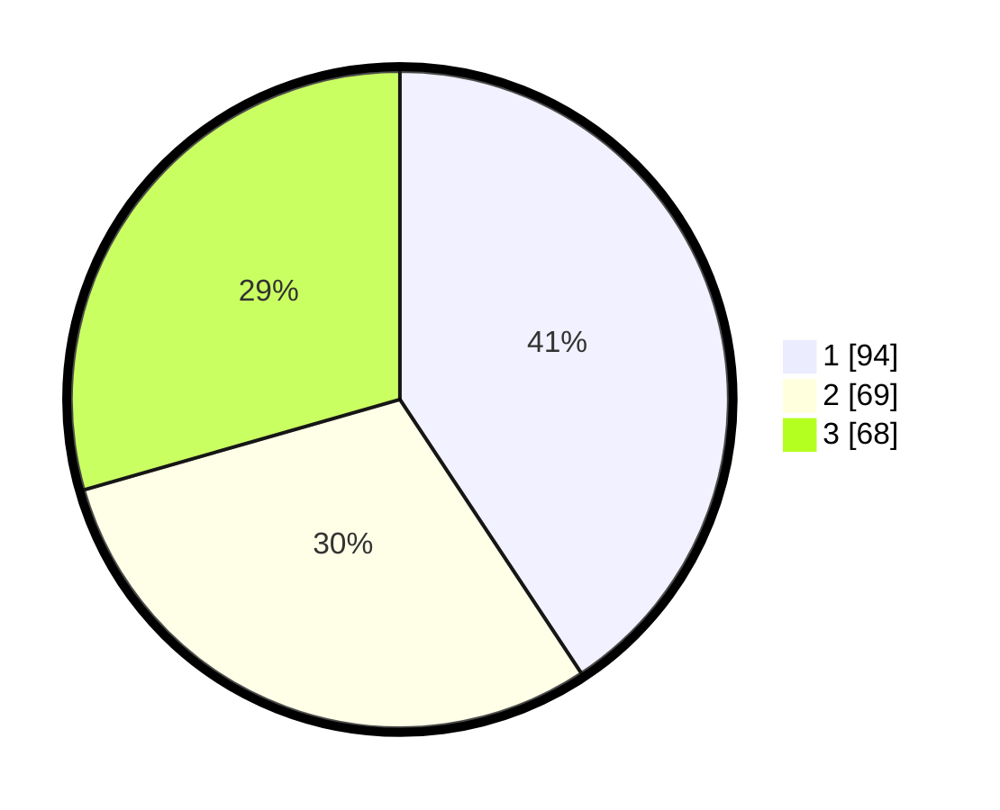

# Hasil

## Grafik

## Tabel

| No. | Nama Paslon    | Suara | Suara (raw) | Persentase |
|:--- |:-------------- | -----:| -----------:| ----------:|
| 1   | ANIES MUHAIMIN | 94    | [94][p-1]   | 40,69      |
| 2   | PRABOWO GIBRAN | 69    | [69][p-2]   | 29,87      |
| 3   | GANJAR MAHFUD  | 68    | [68][p-3]   | 29,44      |

[p-1]: https://github.com/gigit-pemilu/pemilu-2024/blob/main/pilpres/hitung-suara/sub/31-dki-jakarta/sub/74-jakarta-selatan/sub/09-jagakarsa/sub/1005-tanjung-barat/sub/005-tps/sub/paslon-1.txt
[p-2]: https://github.com/gigit-pemilu/pemilu-2024/blob/main/pilpres/hitung-suara/sub/31-dki-jakarta/sub/74-jakarta-selatan/sub/09-jagakarsa/sub/1005-tanjung-barat/sub/005-tps/sub/paslon-2.txt
[p-3]: https://github.com/gigit-pemilu/pemilu-2024/blob/main/pilpres/hitung-suara/sub/31-dki-jakarta/sub/74-jakarta-selatan/sub/09-jagakarsa/sub/1005-tanjung-barat/sub/005-tps/sub/paslon-3.txt

## Foto C Plano

https://sirekap-obj-formc.kpu.go.id/d60e/pemilu/ppwp/31/74/09/10/05/3174091005005-20240214-221418--266f0422-57e8-449f-9c23-e2a8b3d090ed.jpg

https://sirekap-obj-formc.kpu.go.id/d60e/pemilu/ppwp/31/74/09/10/05/3174091005005-20240214-221749--7181c524-1a2c-4c9c-bd5a-2e28571504fc.jpg

https://sirekap-obj-formc.kpu.go.id/d60e/pemilu/ppwp/31/74/09/10/05/3174091005005-20240214-221938--d7d29038-e67d-4030-93d7-80cf63b74f9d.jpg

## Metadata

| Key        | Value               |
| ---------- | ------------------- |
| Time Stamp | 2024-02-24 22:31:28 |

