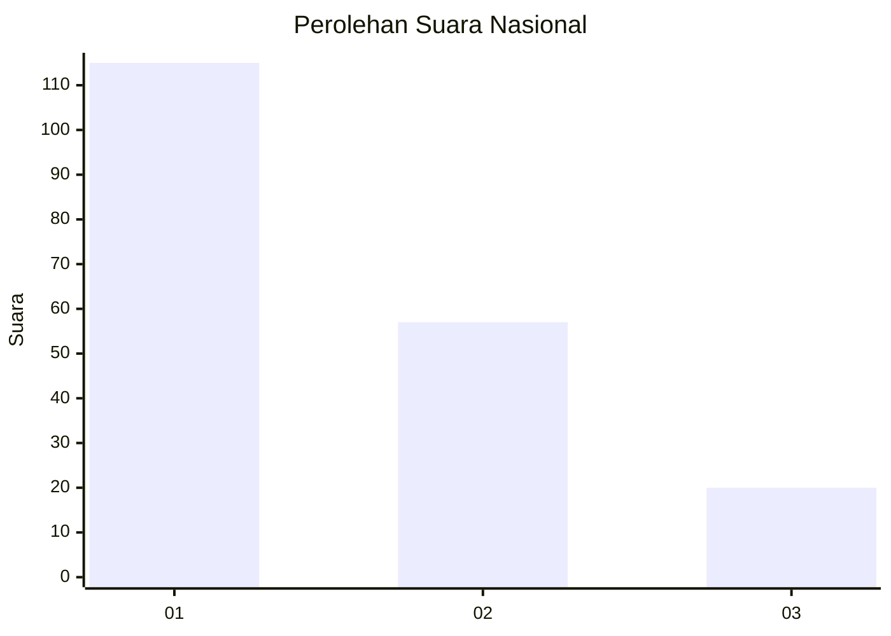
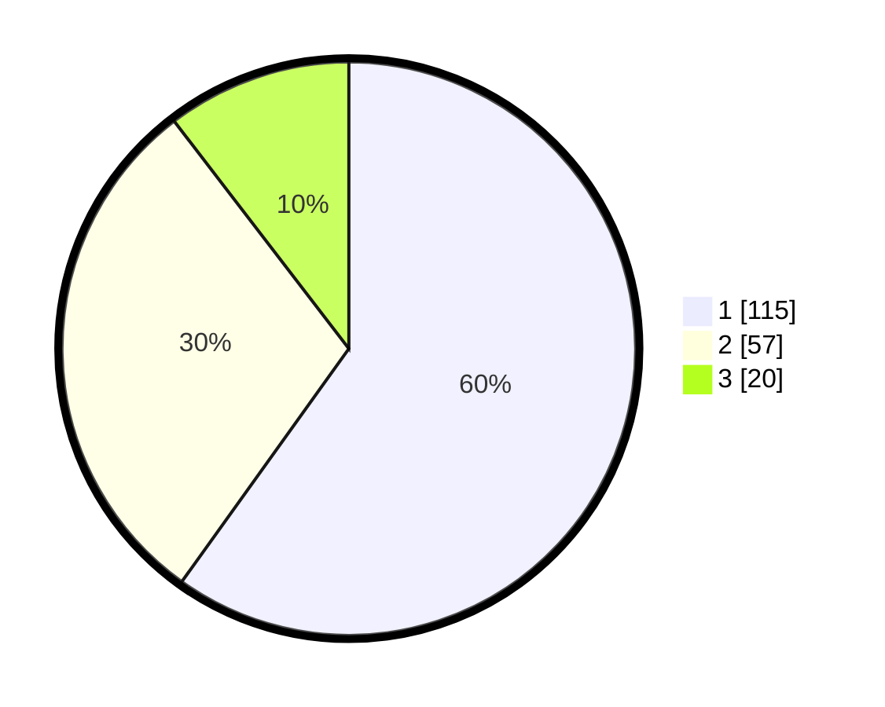

# Hasil

## Grafik

## Tabel

| No.    | Nama Paslon    | Suara | Suara (raw) | Persentase |
|:------ |:-------------- | -----:| -----------:| ----------:|
| 100025 | ANIES MUHAIMIN | 115   | [115][p-1]  | 59,90      |
| 100026 | PRABOWO GIBRAN | 57    | [57][p-2]   | 29,69      |
| 100027 | GANJAR MAHFUD  | 20    | [20][p-3]   | 10,42      |

[p-1]: https://github.com/gigit-pemilu/pemilu-2024/blob/main/pilpres/hitung-suara/sub/31-dki-jakarta/sub/74-jakarta-selatan/sub/09-jagakarsa/sub/1005-tanjung-barat/sub/012-tps/sub/paslon-1.txt
[p-2]: https://github.com/gigit-pemilu/pemilu-2024/blob/main/pilpres/hitung-suara/sub/31-dki-jakarta/sub/74-jakarta-selatan/sub/09-jagakarsa/sub/1005-tanjung-barat/sub/012-tps/sub/paslon-2.txt
[p-3]: https://github.com/gigit-pemilu/pemilu-2024/blob/main/pilpres/hitung-suara/sub/31-dki-jakarta/sub/74-jakarta-selatan/sub/09-jagakarsa/sub/1005-tanjung-barat/sub/012-tps/sub/paslon-3.txt

## Foto C Plano

https://sirekap-obj-formc.kpu.go.id/2734/pemilu/ppwp/31/74/09/10/05/3174091005012-20240219-095455--b2effa6a-0b4d-4920-adfc-25049bb90ba3.jpg

https://sirekap-obj-formc.kpu.go.id/2734/pemilu/ppwp/31/74/09/10/05/3174091005012-20240219-101611--0384d62c-6ea6-4eb1-bb38-718613cd5d02.jpg

https://sirekap-obj-formc.kpu.go.id/2734/pemilu/ppwp/31/74/09/10/05/3174091005012-20240219-101757--26538920-27e6-4100-b118-17ed189def68.jpg

## Metadata

| Key        | Value               |
| ---------- | ------------------- |
| Time Stamp | 2024-02-24 22:31:28 |

