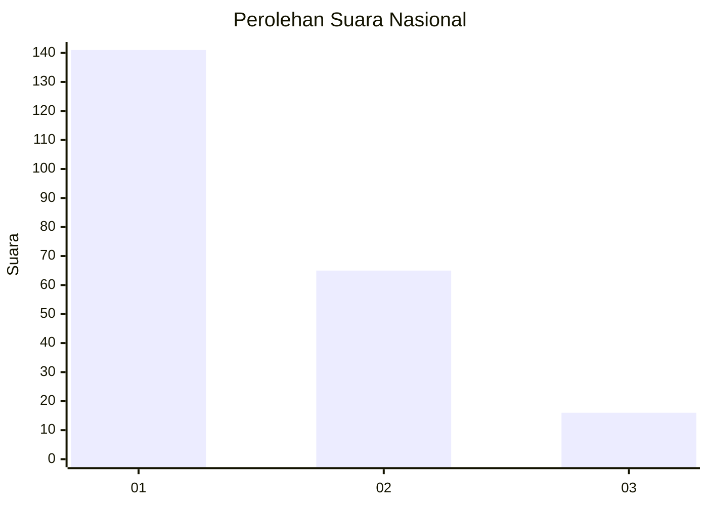
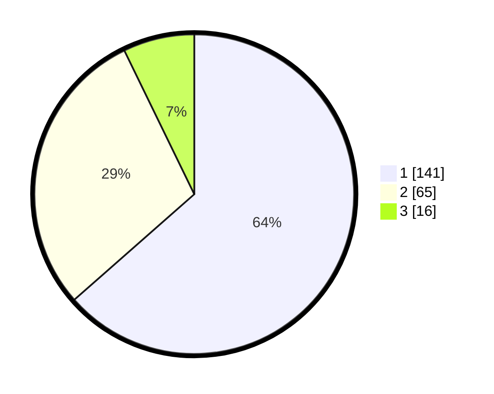

# Hasil

## Grafik

## Tabel

| No.    | Nama Paslon    | Suara | Suara (raw) | Persentase |
|:------ |:-------------- | -----:| -----------:| ----------:|
| 100025 | ANIES MUHAIMIN | 141   | [141][p-1]  | 63,51      |
| 100026 | PRABOWO GIBRAN | 65    | [65][p-2]   | 29,28      |
| 100027 | GANJAR MAHFUD  | 16    | [16][p-3]   | 7,21       |

[p-1]: https://github.com/gigit-pemilu/pemilu-2024/blob/main/pilpres/hitung-suara/sub/31-dki-jakarta/sub/74-jakarta-selatan/sub/09-jagakarsa/sub/1005-tanjung-barat/sub/014-tps/sub/paslon-1.txt
[p-2]: https://github.com/gigit-pemilu/pemilu-2024/blob/main/pilpres/hitung-suara/sub/31-dki-jakarta/sub/74-jakarta-selatan/sub/09-jagakarsa/sub/1005-tanjung-barat/sub/014-tps/sub/paslon-2.txt
[p-3]: https://github.com/gigit-pemilu/pemilu-2024/blob/main/pilpres/hitung-suara/sub/31-dki-jakarta/sub/74-jakarta-selatan/sub/09-jagakarsa/sub/1005-tanjung-barat/sub/014-tps/sub/paslon-3.txt

## Foto C Plano

https://sirekap-obj-formc.kpu.go.id/8562/pemilu/ppwp/31/74/09/10/05/3174091005014-20240214-224445--001d6c3d-248c-4bf5-84b2-aed29f041bb4.jpg

https://sirekap-obj-formc.kpu.go.id/8562/pemilu/ppwp/31/74/09/10/05/3174091005014-20240214-224624--f1c8cd2c-8a54-4101-802e-d38a1a87d650.jpg

https://sirekap-obj-formc.kpu.go.id/8562/pemilu/ppwp/31/74/09/10/05/3174091005014-20240214-224944--c3de5187-79d0-4991-b1d8-2ec3699183a6.jpg

## Metadata

| Key        | Value               |
| ---------- | ------------------- |
| Time Stamp | 2024-02-24 22:31:28 |

