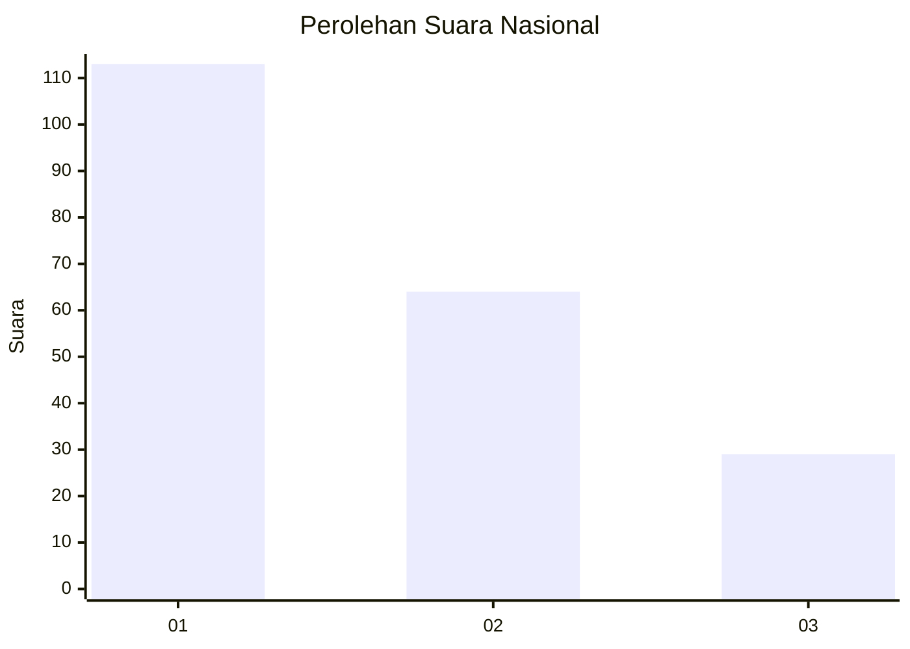
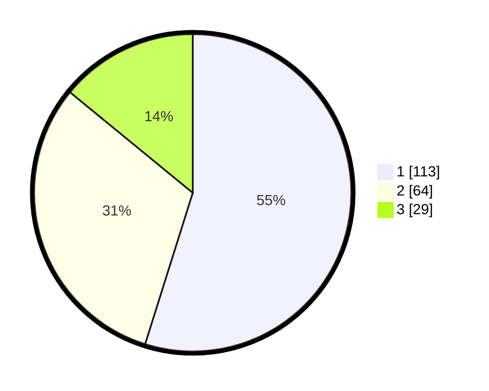

# Hasil

## Grafik

## Tabel

| No.    | Nama Paslon    | Suara | Suara (raw) | Persentase |
|:------ |:-------------- | -----:| -----------:| ----------:|
| 100025 | ANIES MUHAIMIN | 113   | [113][p-1]  | 54,85      |
| 100026 | PRABOWO GIBRAN | 64    | [64][p-2]   | 31,07      |
| 100027 | GANJAR MAHFUD  | 29    | [29][p-3]   | 14,08      |

[p-1]: https://github.com/gigit-pemilu/pemilu-2024/blob/main/pilpres/hitung-suara/sub/31-dki-jakarta/sub/74-jakarta-selatan/sub/09-jagakarsa/sub/1005-tanjung-barat/sub/023-tps/sub/paslon-1.txt
[p-2]: https://github.com/gigit-pemilu/pemilu-2024/blob/main/pilpres/hitung-suara/sub/31-dki-jakarta/sub/74-jakarta-selatan/sub/09-jagakarsa/sub/1005-tanjung-barat/sub/023-tps/sub/paslon-2.txt
[p-3]: https://github.com/gigit-pemilu/pemilu-2024/blob/main/pilpres/hitung-suara/sub/31-dki-jakarta/sub/74-jakarta-selatan/sub/09-jagakarsa/sub/1005-tanjung-barat/sub/023-tps/sub/paslon-3.txt

## Foto C Plano

https://sirekap-obj-formc.kpu.go.id/39cd/pemilu/ppwp/31/74/09/10/05/3174091005023-20240216-141342--721c3f54-b34b-44f0-819c-ea4ecbb404d1.jpg

https://sirekap-obj-formc.kpu.go.id/39cd/pemilu/ppwp/31/74/09/10/05/3174091005023-20240216-141222--2d551c2f-ced7-4fc7-afda-8c0fe10cec8e.jpg

https://sirekap-obj-formc.kpu.go.id/39cd/pemilu/ppwp/31/74/09/10/05/3174091005023-20240215-151640--92bd3be8-cb19-4a85-9af9-88ef4193f385.jpg

## Metadata

| Key        | Value               |
| ---------- | ------------------- |
| Time Stamp | 2024-02-24 22:31:28 |

