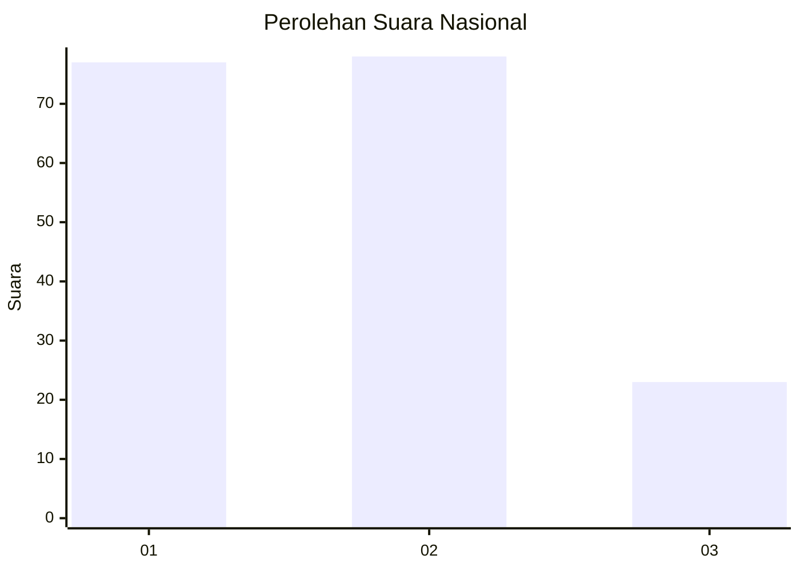
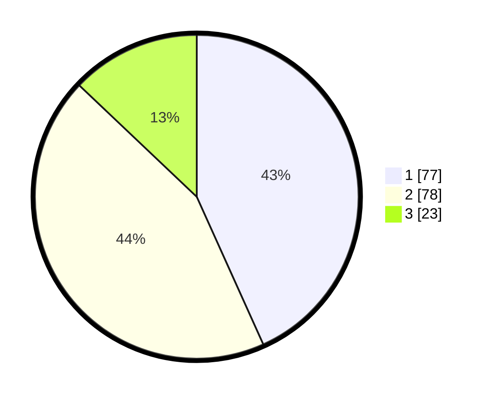

# Hasil

## Grafik

## Tabel

| No.    | Nama Paslon    | Suara | Suara (raw) | Persentase |
|:------ |:-------------- | -----:| -----------:| ----------:|
| 100025 | ANIES MUHAIMIN | 77    | [77][p-1]   | 43,26      |
| 100026 | PRABOWO GIBRAN | 78    | [78][p-2]   | 43,82      |
| 100027 | GANJAR MAHFUD  | 23    | [23][p-3]   | 12,92      |

[p-1]: https://github.com/gigit-pemilu/pemilu-2024/blob/main/pilpres/hitung-suara/sub/31-dki-jakarta/sub/74-jakarta-selatan/sub/09-jagakarsa/sub/1005-tanjung-barat/sub/062-tps/sub/paslon-1.txt
[p-2]: https://github.com/gigit-pemilu/pemilu-2024/blob/main/pilpres/hitung-suara/sub/31-dki-jakarta/sub/74-jakarta-selatan/sub/09-jagakarsa/sub/1005-tanjung-barat/sub/062-tps/sub/paslon-2.txt
[p-3]: https://github.com/gigit-pemilu/pemilu-2024/blob/main/pilpres/hitung-suara/sub/31-dki-jakarta/sub/74-jakarta-selatan/sub/09-jagakarsa/sub/1005-tanjung-barat/sub/062-tps/sub/paslon-3.txt

## Foto C Plano

https://sirekap-obj-formc.kpu.go.id/dc09/pemilu/ppwp/31/74/09/10/05/3174091005062-20240214-214352--04f43cff-8db0-46ba-b6b0-5a1b474440d8.jpg

https://sirekap-obj-formc.kpu.go.id/dc09/pemilu/ppwp/31/74/09/10/05/3174091005062-20240214-214912--ff1786d6-eea1-49a6-b9be-8c3062c050f8.jpg

https://sirekap-obj-formc.kpu.go.id/dc09/pemilu/ppwp/31/74/09/10/05/3174091005062-20240214-215038--c0963ec3-7a7b-4393-b98c-1be16d2c28a3.jpg

## Metadata

| Key        | Value               |
| ---------- | ------------------- |
| Time Stamp | 2024-02-25 12:00:00 |

