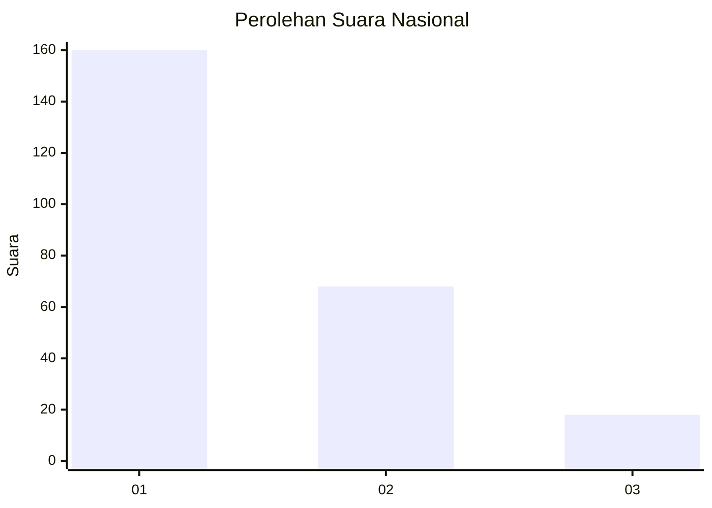
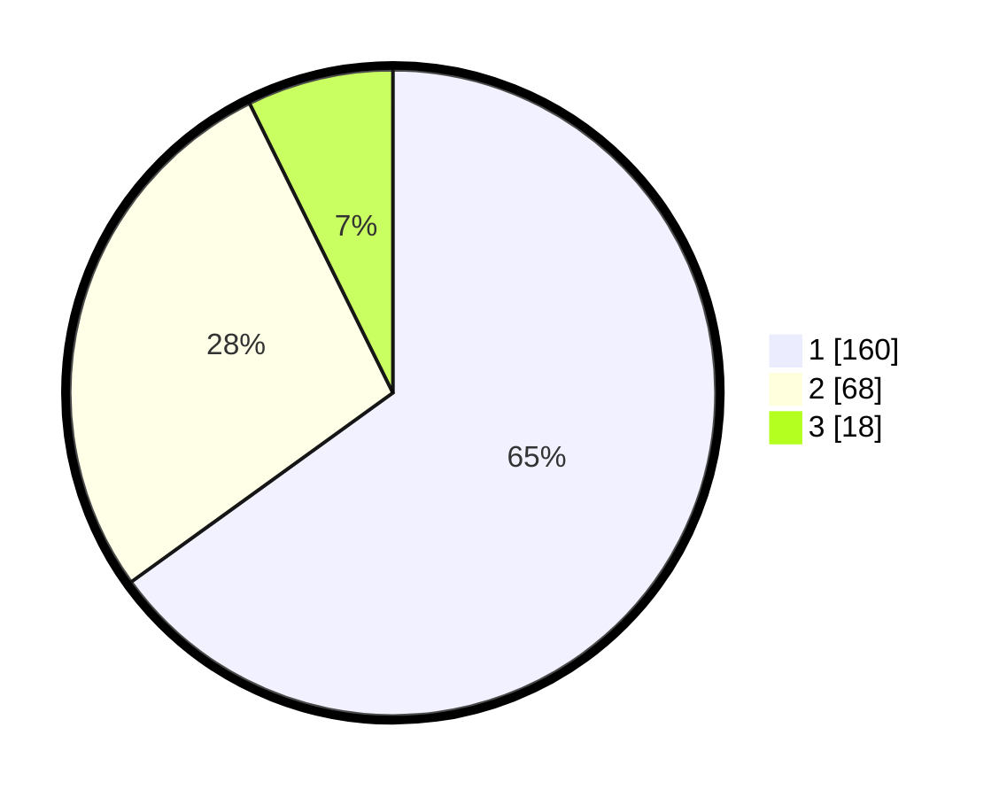

# Hasil

## Grafik

## Tabel

| No.    | Nama Paslon    | Suara | Suara (raw) | Persentase |
|:------ |:-------------- | -----:| -----------:| ----------:|
| 100025 | ANIES MUHAIMIN | 160   | [160][p-1]  | 65,04      |
| 100026 | PRABOWO GIBRAN | 68    | [68][p-2]   | 27,64      |
| 100027 | GANJAR MAHFUD  | 18    | [18][p-3]   | 7,32       |

[p-1]: https://github.com/gigit-pemilu/pemilu-2024/blob/main/pilpres/hitung-suara/sub/31-dki-jakarta/sub/74-jakarta-selatan/sub/09-jagakarsa/sub/1005-tanjung-barat/sub/067-tps/sub/paslon-1.txt
[p-2]: https://github.com/gigit-pemilu/pemilu-2024/blob/main/pilpres/hitung-suara/sub/31-dki-jakarta/sub/74-jakarta-selatan/sub/09-jagakarsa/sub/1005-tanjung-barat/sub/067-tps/sub/paslon-2.txt
[p-3]: https://github.com/gigit-pemilu/pemilu-2024/blob/main/pilpres/hitung-suara/sub/31-dki-jakarta/sub/74-jakarta-selatan/sub/09-jagakarsa/sub/1005-tanjung-barat/sub/067-tps/sub/paslon-3.txt

## Foto C Plano

https://sirekap-obj-formc.kpu.go.id/824f/pemilu/ppwp/31/74/09/10/05/3174091005067-20240215-034009--b31e62f1-4aa3-44e7-8484-c00d1a589758.jpg

https://sirekap-obj-formc.kpu.go.id/824f/pemilu/ppwp/31/74/09/10/05/3174091005067-20240215-033437--658f5765-6ef4-44a4-b68e-920dac64b56f.jpg

https://sirekap-obj-formc.kpu.go.id/824f/pemilu/ppwp/31/74/09/10/05/3174091005067-20240215-033653--28cc4115-956d-416c-9d1c-9fb6e4aa52e8.jpg

## Metadata

| Key        | Value               |
| ---------- | ------------------- |
| Time Stamp | 2024-02-24 22:31:28 |

