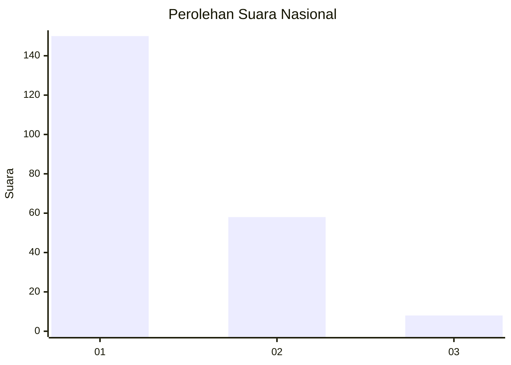
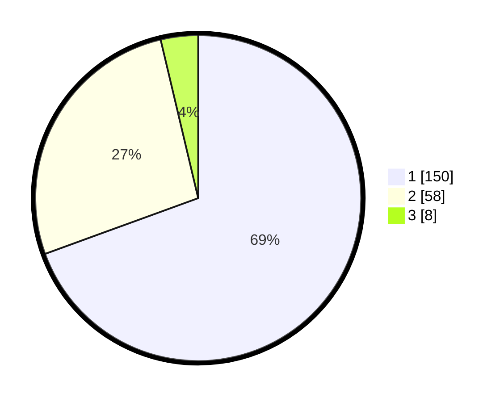

# Hasil

## Grafik

## Tabel

| No.    | Nama Paslon    | Suara | Suara (raw) | Persentase |
|:------ |:-------------- | -----:| -----------:| ----------:|
| 100025 | ANIES MUHAIMIN | 150   | [150][p-1]  | 69,44      |
| 100026 | PRABOWO GIBRAN | 58    | [58][p-2]   | 26,85      |
| 100027 | GANJAR MAHFUD  | 8     | [8][p-3]    | 3,70       |

[p-1]: https://github.com/gigit-pemilu/pemilu-2024/blob/main/pilpres/hitung-suara/sub/31-dki-jakarta/sub/74-jakarta-selatan/sub/09-jagakarsa/sub/1005-tanjung-barat/sub/069-tps/sub/paslon-1.txt
[p-2]: https://github.com/gigit-pemilu/pemilu-2024/blob/main/pilpres/hitung-suara/sub/31-dki-jakarta/sub/74-jakarta-selatan/sub/09-jagakarsa/sub/1005-tanjung-barat/sub/069-tps/sub/paslon-2.txt
[p-3]: https://github.com/gigit-pemilu/pemilu-2024/blob/main/pilpres/hitung-suara/sub/31-dki-jakarta/sub/74-jakarta-selatan/sub/09-jagakarsa/sub/1005-tanjung-barat/sub/069-tps/sub/paslon-3.txt

## Foto C Plano

https://sirekap-obj-formc.kpu.go.id/a15e/pemilu/ppwp/31/74/09/10/05/3174091005069-20240214-232242--17d06c77-5f6a-4141-ac90-4d1036312b2d.jpg

https://sirekap-obj-formc.kpu.go.id/a15e/pemilu/ppwp/31/74/09/10/05/3174091005069-20240214-232712--c6d8afb3-5818-491d-94c7-8d5a5d0ef62b.jpg

https://sirekap-obj-formc.kpu.go.id/a15e/pemilu/ppwp/31/74/09/10/05/3174091005069-20240214-232816--1b811243-b8de-49c4-b6f2-7f92a8c83c6c.jpg

## Metadata

| Key        | Value               |
| ---------- | ------------------- |
| Time Stamp | 2024-02-25 15:00:00 |

