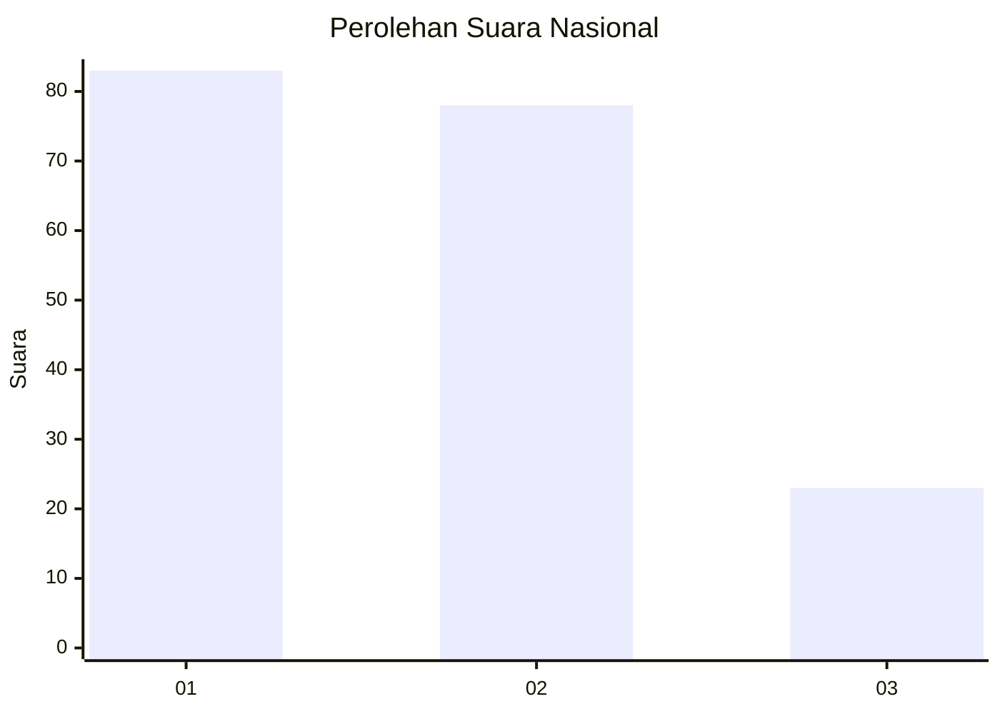
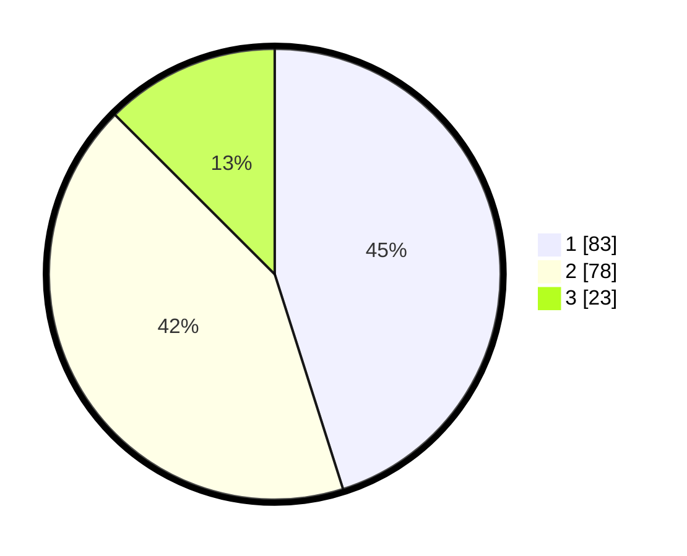

# Hasil

## Grafik

## Tabel

| No.    | Nama Paslon    | Suara | Suara (raw) | Persentase |
|:------ |:-------------- | -----:| -----------:| ----------:|
| 100025 | ANIES MUHAIMIN | 83    | [83][p-1]   | 45,11      |
| 100026 | PRABOWO GIBRAN | 78    | [78][p-2]   | 42,39      |
| 100027 | GANJAR MAHFUD  | 23    | [23][p-3]   | 12,50      |

[p-1]: https://github.com/gigit-pemilu/pemilu-2024/blob/main/pilpres/hitung-suara/sub/31-dki-jakarta/sub/74-jakarta-selatan/sub/09-jagakarsa/sub/1005-tanjung-barat/sub/077-tps/sub/paslon-1.txt
[p-2]: https://github.com/gigit-pemilu/pemilu-2024/blob/main/pilpres/hitung-suara/sub/31-dki-jakarta/sub/74-jakarta-selatan/sub/09-jagakarsa/sub/1005-tanjung-barat/sub/077-tps/sub/paslon-2.txt
[p-3]: https://github.com/gigit-pemilu/pemilu-2024/blob/main/pilpres/hitung-suara/sub/31-dki-jakarta/sub/74-jakarta-selatan/sub/09-jagakarsa/sub/1005-tanjung-barat/sub/077-tps/sub/paslon-3.txt

## Foto C Plano

https://sirekap-obj-formc.kpu.go.id/2f6b/pemilu/ppwp/31/74/09/10/05/3174091005077-20240214-202722--477583ee-3cdc-43b5-b350-bc4aeb2770b0.jpg

https://sirekap-obj-formc.kpu.go.id/2f6b/pemilu/ppwp/31/74/09/10/05/3174091005077-20240214-202702--add8731d-e6c0-4278-97ee-84d490a658b1.jpg

https://sirekap-obj-formc.kpu.go.id/2f6b/pemilu/ppwp/31/74/09/10/05/3174091005077-20240214-202738--ba68a90a-38b7-473d-a9b2-5bfc714c7b31.jpg

## Metadata

| Key        | Value               |
| ---------- | ------------------- |
| Time Stamp | 2024-02-14 21:46:01 |

