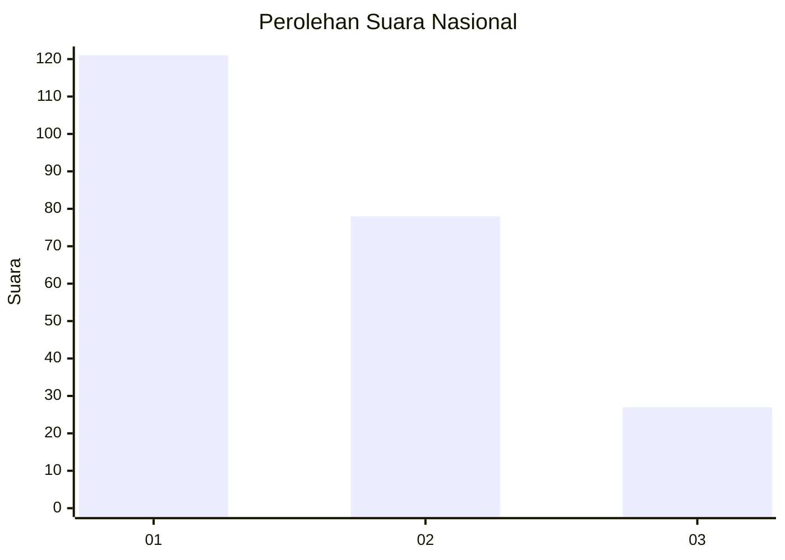
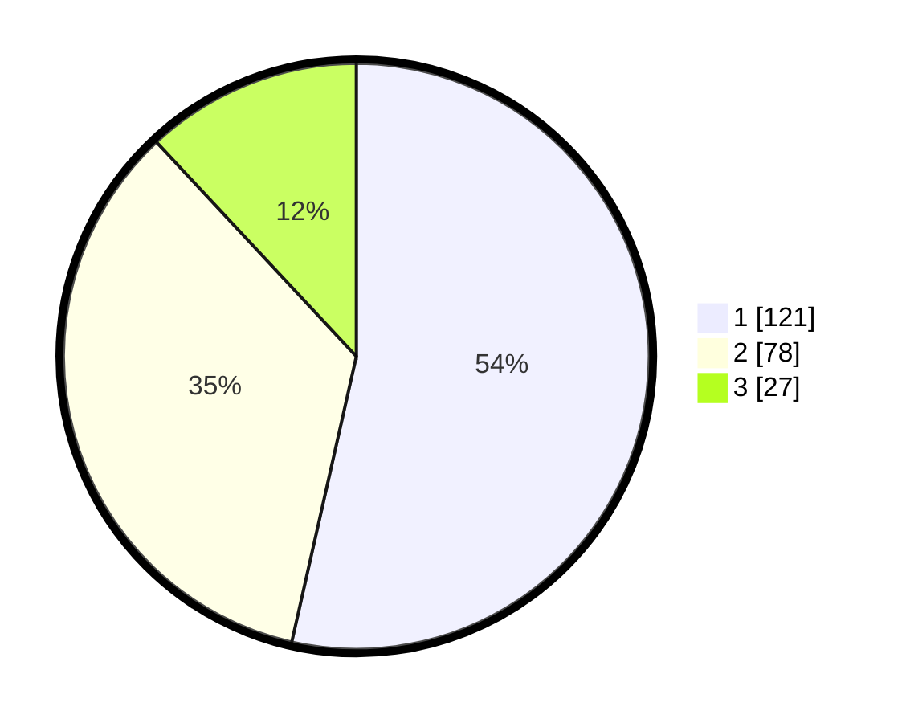

# Hasil

## Grafik

## Tabel

| No.    | Nama Paslon    | Suara | Suara (raw) | Persentase |
|:------ |:-------------- | -----:| -----------:| ----------:|
| 100025 | ANIES MUHAIMIN | 121   | [121][p-1]  | 53,54      |
| 100026 | PRABOWO GIBRAN | 78    | [78][p-2]   | 34,51      |
| 100027 | GANJAR MAHFUD  | 27    | [27][p-3]   | 11,95      |

[p-1]: https://github.com/gigit-pemilu/pemilu-2024/blob/main/pilpres/hitung-suara/sub/31-dki-jakarta/sub/74-jakarta-selatan/sub/09-jagakarsa/sub/1005-tanjung-barat/sub/086-tps/sub/paslon-1.txt
[p-2]: https://github.com/gigit-pemilu/pemilu-2024/blob/main/pilpres/hitung-suara/sub/31-dki-jakarta/sub/74-jakarta-selatan/sub/09-jagakarsa/sub/1005-tanjung-barat/sub/086-tps/sub/paslon-2.txt
[p-3]: https://github.com/gigit-pemilu/pemilu-2024/blob/main/pilpres/hitung-suara/sub/31-dki-jakarta/sub/74-jakarta-selatan/sub/09-jagakarsa/sub/1005-tanjung-barat/sub/086-tps/sub/paslon-3.txt

## Foto C Plano

https://sirekap-obj-formc.kpu.go.id/701f/pemilu/ppwp/31/74/09/10/05/3174091005086-20240215-001338--7c68b426-b8bc-464c-8f58-9f0d40da0e0e.jpg

https://sirekap-obj-formc.kpu.go.id/701f/pemilu/ppwp/31/74/09/10/05/3174091005086-20240215-001313--f6c77d1f-ac02-499d-b4e5-14ffe206494c.jpg

https://sirekap-obj-formc.kpu.go.id/701f/pemilu/ppwp/31/74/09/10/05/3174091005086-20240215-001320--d8a203be-b3f6-4e40-a07b-d3dbb3b8166b.jpg

## Metadata

| Key        | Value               |
| ---------- | ------------------- |
| Time Stamp | 2024-02-24 22:31:28 |

