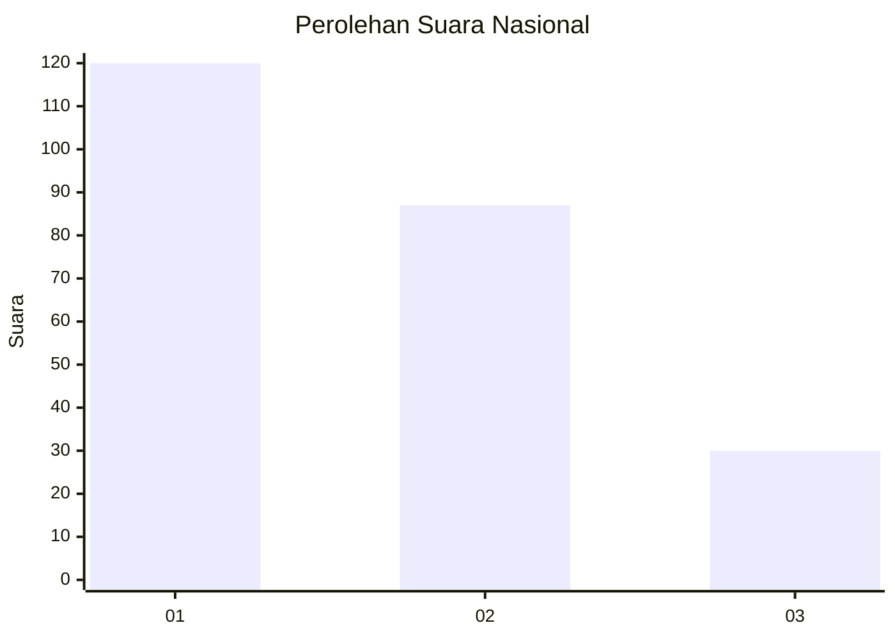
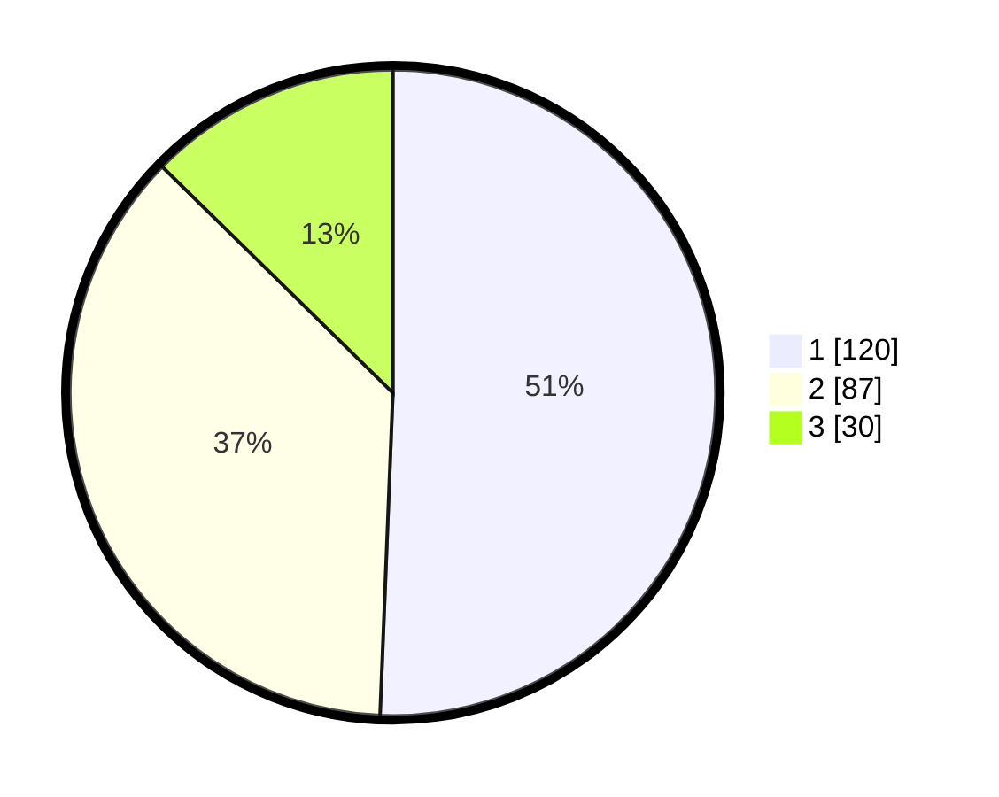

# Hasil

## Grafik

## Tabel

| No.    | Nama Paslon    | Suara | Suara (raw) | Persentase |
|:------ |:-------------- | -----:| -----------:| ----------:|
| 100025 | ANIES MUHAIMIN | 120   | [120][p-1]  | 50,63      |
| 100026 | PRABOWO GIBRAN | 87    | [87][p-2]   | 36,71      |
| 100027 | GANJAR MAHFUD  | 30    | [30][p-3]   | 12,66      |

[p-1]: https://github.com/gigit-pemilu/pemilu-2024/blob/main/pilpres/hitung-suara/sub/31-dki-jakarta/sub/74-jakarta-selatan/sub/09-jagakarsa/sub/1005-tanjung-barat/sub/090-tps/sub/paslon-1.txt
[p-2]: https://github.com/gigit-pemilu/pemilu-2024/blob/main/pilpres/hitung-suara/sub/31-dki-jakarta/sub/74-jakarta-selatan/sub/09-jagakarsa/sub/1005-tanjung-barat/sub/090-tps/sub/paslon-2.txt
[p-3]: https://github.com/gigit-pemilu/pemilu-2024/blob/main/pilpres/hitung-suara/sub/31-dki-jakarta/sub/74-jakarta-selatan/sub/09-jagakarsa/sub/1005-tanjung-barat/sub/090-tps/sub/paslon-3.txt

## Foto C Plano

https://sirekap-obj-formc.kpu.go.id/d554/pemilu/ppwp/31/74/09/10/05/3174091005090-20240214-193455--ca2be0d1-d12e-4041-86cf-06308dd62e30.jpg

https://sirekap-obj-formc.kpu.go.id/d554/pemilu/ppwp/31/74/09/10/05/3174091005090-20240214-192755--a3459ce0-38a4-4b11-b07a-60140a65ecf4.jpg

https://sirekap-obj-formc.kpu.go.id/d554/pemilu/ppwp/31/74/09/10/05/3174091005090-20240214-193732--9e9bc796-8f90-46af-aaac-f1c918d56350.jpg

## Metadata

| Key        | Value               |
| ---------- | ------------------- |
| Time Stamp | 2024-02-24 22:31:28 |

