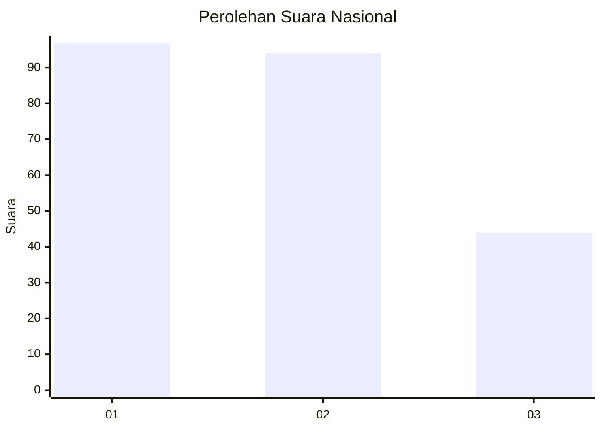
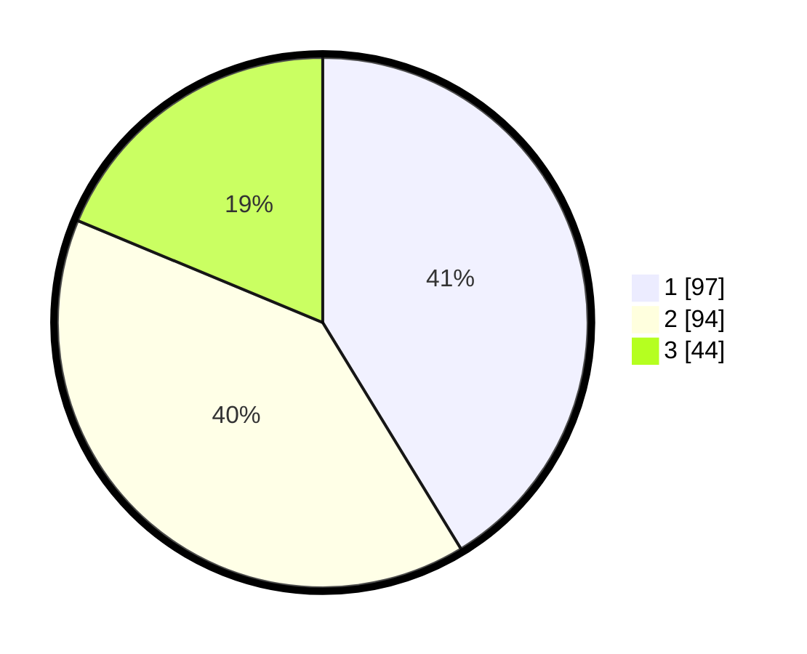

# Hasil

## Grafik

## Tabel

| No.    | Nama Paslon    | Suara | Suara (raw) | Persentase |
|:------ |:-------------- | -----:| -----------:| ----------:|
| 100025 | ANIES MUHAIMIN | 97    | [97][p-1]   | 41,28      |
| 100026 | PRABOWO GIBRAN | 94    | [94][p-2]   | 40,00      |
| 100027 | GANJAR MAHFUD  | 44    | [44][p-3]   | 18,72      |

[p-1]: https://github.com/gigit-pemilu/pemilu-2024/blob/main/pilpres/hitung-suara/sub/31-dki-jakarta/sub/74-jakarta-selatan/sub/09-jagakarsa/sub/1005-tanjung-barat/sub/091-tps/sub/paslon-1.txt
[p-2]: https://github.com/gigit-pemilu/pemilu-2024/blob/main/pilpres/hitung-suara/sub/31-dki-jakarta/sub/74-jakarta-selatan/sub/09-jagakarsa/sub/1005-tanjung-barat/sub/091-tps/sub/paslon-2.txt
[p-3]: https://github.com/gigit-pemilu/pemilu-2024/blob/main/pilpres/hitung-suara/sub/31-dki-jakarta/sub/74-jakarta-selatan/sub/09-jagakarsa/sub/1005-tanjung-barat/sub/091-tps/sub/paslon-3.txt

## Foto C Plano

https://sirekap-obj-formc.kpu.go.id/ee3a/pemilu/ppwp/31/74/09/10/05/3174091005091-20240214-220455--79b02d23-9e60-456b-853e-06612b3efac5.jpg

https://sirekap-obj-formc.kpu.go.id/ee3a/pemilu/ppwp/31/74/09/10/05/3174091005091-20240214-220451--e73061ac-3271-439b-86e0-b73b36f7138c.jpg

https://sirekap-obj-formc.kpu.go.id/ee3a/pemilu/ppwp/31/74/09/10/05/3174091005091-20240214-220445--7ecaa566-a322-46bf-bf1d-d46955668d46.jpg

## Metadata

| Key        | Value               |
| ---------- | ------------------- |
| Time Stamp | 2024-02-24 22:31:28 |

