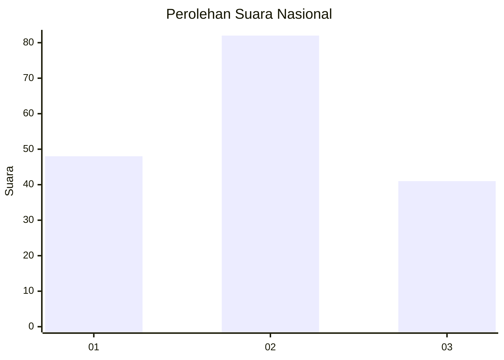
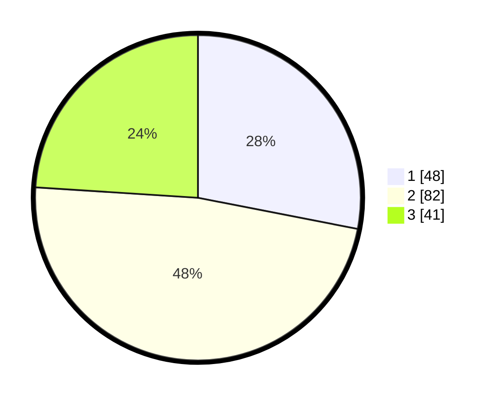

# Hasil

## Grafik

## Tabel

| No.    | Nama Paslon    | Suara | Suara (raw) | Persentase |
|:------ |:-------------- | -----:| -----------:| ----------:|
| 100025 | ANIES MUHAIMIN | 48    | [48][p-1]   | 28,07      |
| 100026 | PRABOWO GIBRAN | 82    | [82][p-2]   | 47,95      |
| 100027 | GANJAR MAHFUD  | 41    | [41][p-3]   | 23,98      |

[p-1]: https://github.com/gigit-pemilu/pemilu-2024/blob/main/pilpres/hitung-suara/sub/31-dki-jakarta/sub/74-jakarta-selatan/sub/09-jagakarsa/sub/1005-tanjung-barat/sub/093-tps/sub/paslon-1.txt
[p-2]: https://github.com/gigit-pemilu/pemilu-2024/blob/main/pilpres/hitung-suara/sub/31-dki-jakarta/sub/74-jakarta-selatan/sub/09-jagakarsa/sub/1005-tanjung-barat/sub/093-tps/sub/paslon-2.txt
[p-3]: https://github.com/gigit-pemilu/pemilu-2024/blob/main/pilpres/hitung-suara/sub/31-dki-jakarta/sub/74-jakarta-selatan/sub/09-jagakarsa/sub/1005-tanjung-barat/sub/093-tps/sub/paslon-3.txt

## Foto C Plano

https://sirekap-obj-formc.kpu.go.id/971e/pemilu/ppwp/31/74/09/10/05/3174091005093-20240214-213439--08fe150b-8538-4538-8587-13bb5ef87cc7.jpg

https://sirekap-obj-formc.kpu.go.id/971e/pemilu/ppwp/31/74/09/10/05/3174091005093-20240214-213450--c7de6813-9a81-4e71-9271-d13ed7f8f587.jpg

https://sirekap-obj-formc.kpu.go.id/971e/pemilu/ppwp/31/74/09/10/05/3174091005093-20240214-213458--aa3ca3cd-bd28-4fbd-8edb-cf514e50180a.jpg

## Metadata

| Key        | Value               |
| ---------- | ------------------- |
| Time Stamp | 2024-02-24 22:31:28 |

