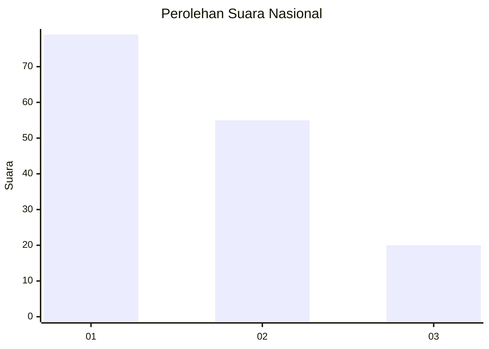
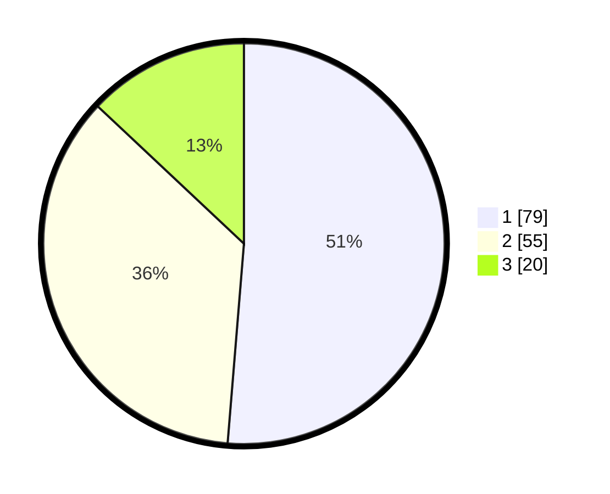

# Hasil

## Grafik

## Tabel

| No.    | Nama Paslon    | Suara | Suara (raw) | Persentase |
|:------ |:-------------- | -----:| -----------:| ----------:|
| 100025 | ANIES MUHAIMIN | 79    | [79][p-1]   | 51,30      |
| 100026 | PRABOWO GIBRAN | 55    | [55][p-2]   | 35,71      |
| 100027 | GANJAR MAHFUD  | 20    | [20][p-3]   | 12,99      |

[p-1]: https://github.com/gigit-pemilu/pemilu-2024/blob/main/pilpres/hitung-suara/sub/31-dki-jakarta/sub/74-jakarta-selatan/sub/09-jagakarsa/sub/1005-tanjung-barat/sub/101-tps/sub/paslon-1.txt
[p-2]: https://github.com/gigit-pemilu/pemilu-2024/blob/main/pilpres/hitung-suara/sub/31-dki-jakarta/sub/74-jakarta-selatan/sub/09-jagakarsa/sub/1005-tanjung-barat/sub/101-tps/sub/paslon-2.txt
[p-3]: https://github.com/gigit-pemilu/pemilu-2024/blob/main/pilpres/hitung-suara/sub/31-dki-jakarta/sub/74-jakarta-selatan/sub/09-jagakarsa/sub/1005-tanjung-barat/sub/101-tps/sub/paslon-3.txt

## Foto C Plano

https://sirekap-obj-formc.kpu.go.id/b01f/pemilu/ppwp/31/74/09/10/05/3174091005101-20240214-155700--2ea70ced-deb9-4c42-bf2a-f464fb0120e0.jpg

https://sirekap-obj-formc.kpu.go.id/b01f/pemilu/ppwp/31/74/09/10/05/3174091005101-20240214-155759--afdebe66-d246-4b06-a046-906e68971227.jpg

https://sirekap-obj-formc.kpu.go.id/b01f/pemilu/ppwp/31/74/09/10/05/3174091005101-20240214-155854--611baeb6-dbe8-4007-84a0-62453c510de8.jpg

## Metadata

| Key        | Value               |
| ---------- | ------------------- |
| Time Stamp | 2024-02-24 22:31:28 |

