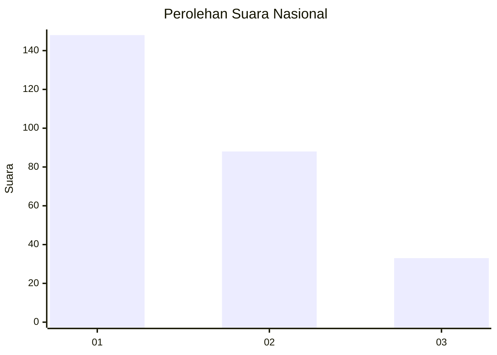
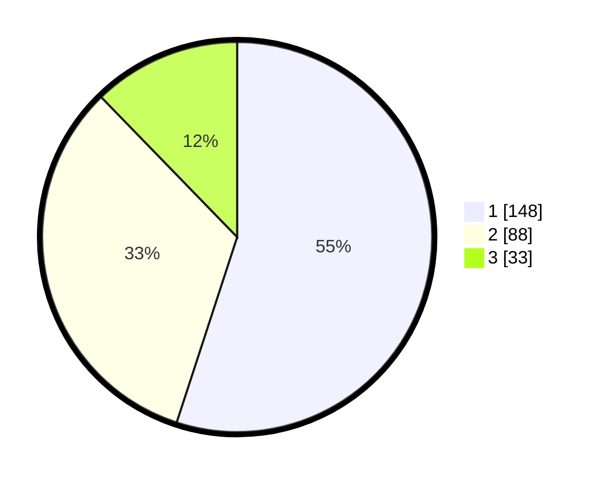

# Hasil

## Grafik

## Tabel

| No. | Nama Paslon    | Suara | Suara (raw) | Persentase |
|:--- |:-------------- | -----:| -----------:| ----------:|
| 1   | ANIES MUHAIMIN | 148   | [148][p-1]  | 55,02      |
| 2   | PRABOWO GIBRAN | 88    | [88][p-2]   | 32,71      |
| 3   | GANJAR MAHFUD  | 33    | [33][p-3]   | 12,27      |

[p-1]: https://github.com/gigit-pemilu/pemilu-2024/blob/main/pilpres/hitung-suara/sub/31-dki-jakarta/sub/74-jakarta-selatan/sub/09-jagakarsa/sub/1005-tanjung-barat/sub/115-tps/sub/paslon-1.txt
[p-2]: https://github.com/gigit-pemilu/pemilu-2024/blob/main/pilpres/hitung-suara/sub/31-dki-jakarta/sub/74-jakarta-selatan/sub/09-jagakarsa/sub/1005-tanjung-barat/sub/115-tps/sub/paslon-2.txt
[p-3]: https://github.com/gigit-pemilu/pemilu-2024/blob/main/pilpres/hitung-suara/sub/31-dki-jakarta/sub/74-jakarta-selatan/sub/09-jagakarsa/sub/1005-tanjung-barat/sub/115-tps/sub/paslon-3.txt

## Foto C Plano

https://sirekap-obj-formc.kpu.go.id/3efb/pemilu/ppwp/31/74/09/10/05/3174091005115-20240214-210527--6a889bdf-aebb-4490-877f-15999e3f74b0.jpg

https://sirekap-obj-formc.kpu.go.id/3efb/pemilu/ppwp/31/74/09/10/05/3174091005115-20240216-131301--8200da44-c802-420b-b094-9974f663d23a.jpg

https://sirekap-obj-formc.kpu.go.id/3efb/pemilu/ppwp/31/74/09/10/05/3174091005115-20240216-131502--972b4288-c377-4672-9070-aed45116606c.jpg

## Metadata

| Key        | Value               |
| ---------- | ------------------- |
| Time Stamp | 2024-02-24 22:31:28 |

