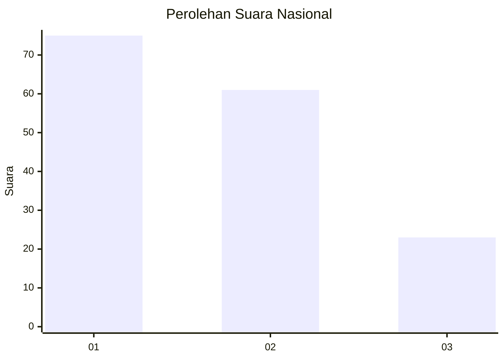
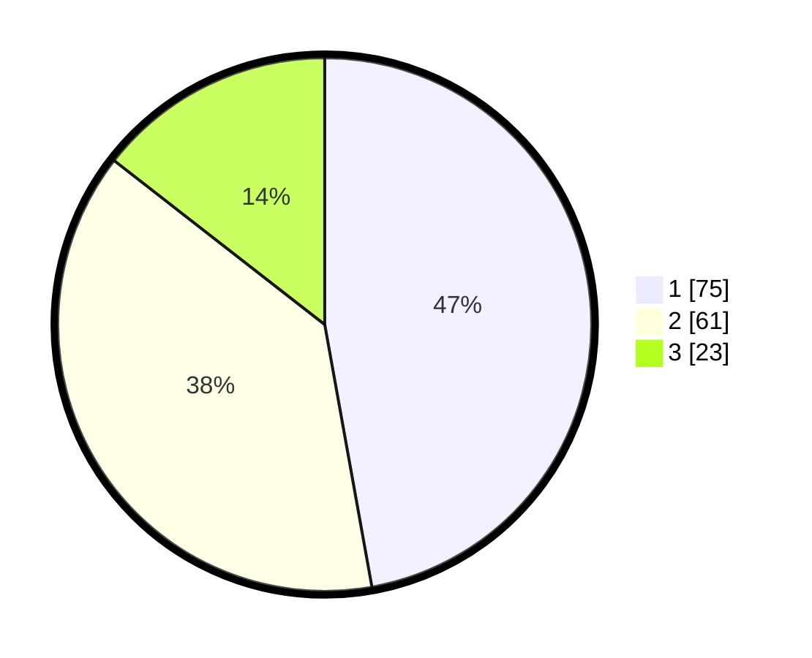

# Hasil

## Grafik

## Tabel

| No.    | Nama Paslon    | Suara | Suara (raw) | Persentase |
|:------ |:-------------- | -----:| -----------:| ----------:|
| 100025 | ANIES MUHAIMIN | 75    | [75][p-1]   | 47,17      |
| 100026 | PRABOWO GIBRAN | 61    | [61][p-2]   | 38,36      |
| 100027 | GANJAR MAHFUD  | 23    | [23][p-3]   | 14,47      |

[p-1]: https://github.com/gigit-pemilu/pemilu-2024/blob/main/pilpres/hitung-suara/sub/31-dki-jakarta/sub/74-jakarta-selatan/sub/09-jagakarsa/sub/1005-tanjung-barat/sub/118-tps/sub/paslon-1.txt
[p-2]: https://github.com/gigit-pemilu/pemilu-2024/blob/main/pilpres/hitung-suara/sub/31-dki-jakarta/sub/74-jakarta-selatan/sub/09-jagakarsa/sub/1005-tanjung-barat/sub/118-tps/sub/paslon-2.txt
[p-3]: https://github.com/gigit-pemilu/pemilu-2024/blob/main/pilpres/hitung-suara/sub/31-dki-jakarta/sub/74-jakarta-selatan/sub/09-jagakarsa/sub/1005-tanjung-barat/sub/118-tps/sub/paslon-3.txt

## Foto C Plano

https://sirekap-obj-formc.kpu.go.id/52f3/pemilu/ppwp/31/74/09/10/05/3174091005118-20240214-195603--01c84d71-adc2-46ae-b805-541ccb89ea58.jpg

https://sirekap-obj-formc.kpu.go.id/52f3/pemilu/ppwp/31/74/09/10/05/3174091005118-20240214-195757--9c8b2046-01e7-414f-b135-4eb408b737a6.jpg

https://sirekap-obj-formc.kpu.go.id/52f3/pemilu/ppwp/31/74/09/10/05/3174091005118-20240214-195909--50acd4f2-5264-4665-8688-c73b8a71a0eb.jpg

## Metadata

| Key        | Value               |
| ---------- | ------------------- |
| Time Stamp | 2024-02-24 22:31:28 |

