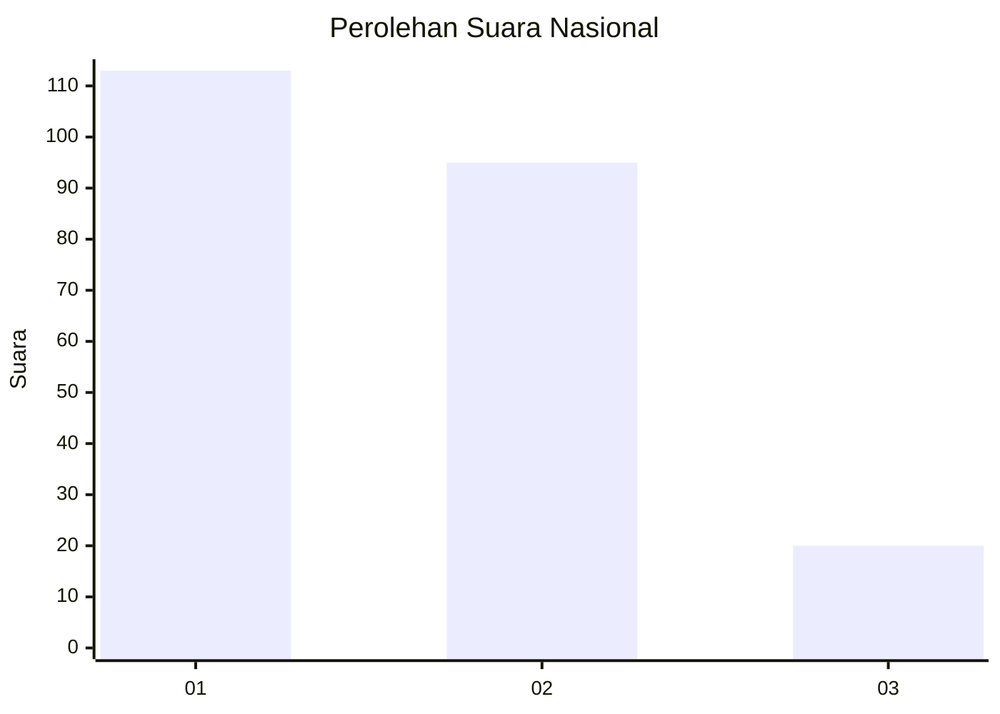
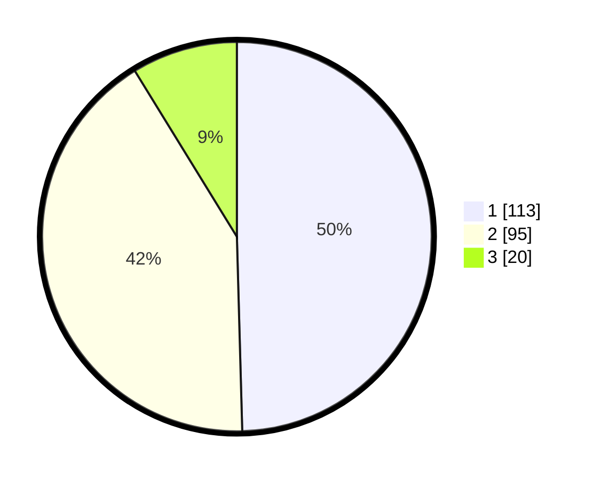

# Hasil

## Grafik

## Tabel

| No.    | Nama Paslon    | Suara | Suara (raw) | Persentase |
|:------ |:-------------- | -----:| -----------:| ----------:|
| 100025 | ANIES MUHAIMIN | 113   | [113][p-1]  | 49,56      |
| 100026 | PRABOWO GIBRAN | 95    | [95][p-2]   | 41,67      |
| 100027 | GANJAR MAHFUD  | 20    | [20][p-3]   | 8,77       |

[p-1]: https://github.com/gigit-pemilu/pemilu-2024/blob/main/pilpres/hitung-suara/sub/31-dki-jakarta/sub/74-jakarta-selatan/sub/09-jagakarsa/sub/1005-tanjung-barat/sub/121-tps/sub/paslon-1.txt
[p-2]: https://github.com/gigit-pemilu/pemilu-2024/blob/main/pilpres/hitung-suara/sub/31-dki-jakarta/sub/74-jakarta-selatan/sub/09-jagakarsa/sub/1005-tanjung-barat/sub/121-tps/sub/paslon-2.txt
[p-3]: https://github.com/gigit-pemilu/pemilu-2024/blob/main/pilpres/hitung-suara/sub/31-dki-jakarta/sub/74-jakarta-selatan/sub/09-jagakarsa/sub/1005-tanjung-barat/sub/121-tps/sub/paslon-3.txt

## Foto C Plano

https://sirekap-obj-formc.kpu.go.id/a6b7/pemilu/ppwp/31/74/09/10/05/3174091005121-20240214-232837--a0ae04d7-e1d3-472e-beb7-6c24d3bdbbd2.jpg

https://sirekap-obj-formc.kpu.go.id/a6b7/pemilu/ppwp/31/74/09/10/05/3174091005121-20240214-233039--6a547ae3-ae2f-4fba-866a-bbdf7c92f1e9.jpg

https://sirekap-obj-formc.kpu.go.id/a6b7/pemilu/ppwp/31/74/09/10/05/3174091005121-20240214-233216--1c75696b-d204-453f-861a-f465f0038c4b.jpg

## Metadata

| Key        | Value               |
| ---------- | ------------------- |
| Time Stamp | 2024-02-25 16:00:00 |

