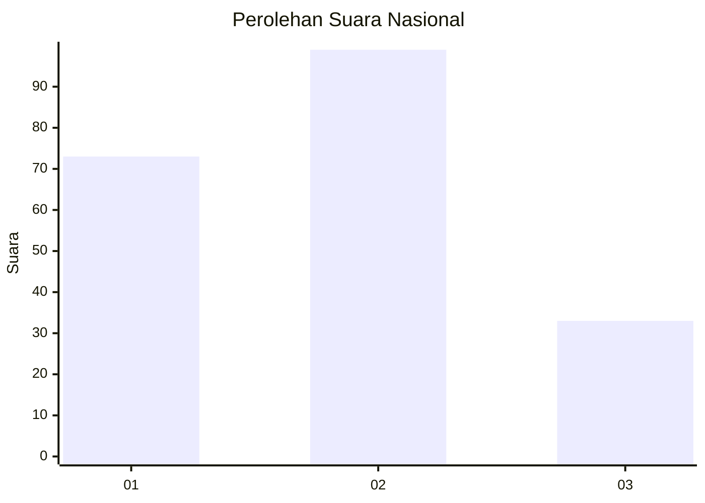
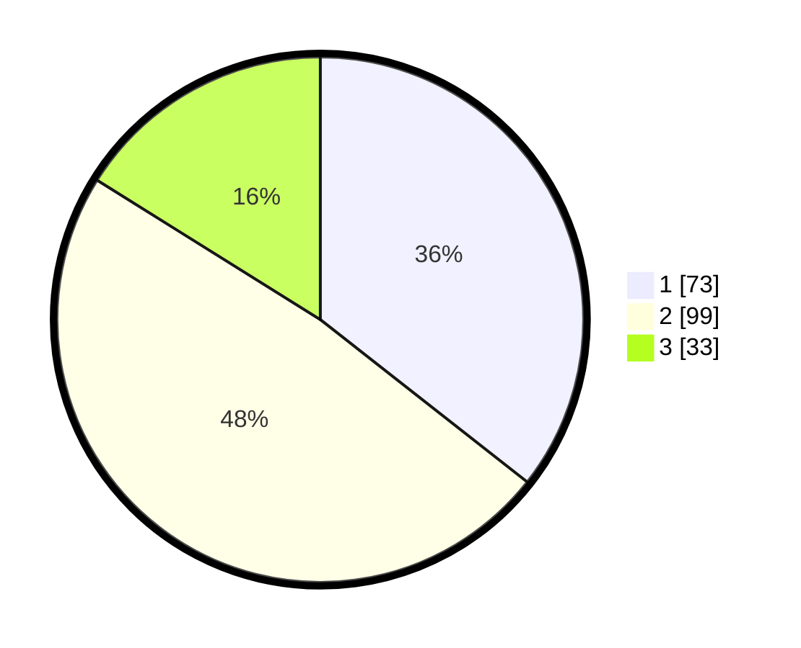

# Hasil

## Grafik

## Tabel

| No.    | Nama Paslon    | Suara | Suara (raw) | Persentase |
|:------ |:-------------- | -----:| -----------:| ----------:|
| 100025 | ANIES MUHAIMIN | 73    | [73][p-1]   | 35,61      |
| 100026 | PRABOWO GIBRAN | 99    | [99][p-2]   | 48,29      |
| 100027 | GANJAR MAHFUD  | 33    | [33][p-3]   | 16,10      |

[p-1]: https://github.com/gigit-pemilu/pemilu-2024/blob/main/pilpres/hitung-suara/sub/31-dki-jakarta/sub/74-jakarta-selatan/sub/09-jagakarsa/sub/1005-tanjung-barat/sub/124-tps/sub/paslon-1.txt
[p-2]: https://github.com/gigit-pemilu/pemilu-2024/blob/main/pilpres/hitung-suara/sub/31-dki-jakarta/sub/74-jakarta-selatan/sub/09-jagakarsa/sub/1005-tanjung-barat/sub/124-tps/sub/paslon-2.txt
[p-3]: https://github.com/gigit-pemilu/pemilu-2024/blob/main/pilpres/hitung-suara/sub/31-dki-jakarta/sub/74-jakarta-selatan/sub/09-jagakarsa/sub/1005-tanjung-barat/sub/124-tps/sub/paslon-3.txt

## Foto C Plano

https://sirekap-obj-formc.kpu.go.id/b40d/pemilu/ppwp/31/74/09/10/05/3174091005124-20240214-192707--4bdd31ce-53bf-42ed-add7-0d285f6911f7.jpg

https://sirekap-obj-formc.kpu.go.id/b40d/pemilu/ppwp/31/74/09/10/05/3174091005124-20240214-192811--7bc15bba-f2f3-48cb-bd31-1df33f40d8ba.jpg

https://sirekap-obj-formc.kpu.go.id/b40d/pemilu/ppwp/31/74/09/10/05/3174091005124-20240214-192503--381be9e6-50d4-46dd-8389-ef7dd1d266ca.jpg

## Metadata

| Key        | Value               |
| ---------- | ------------------- |
| Time Stamp | 2024-02-25 12:00:00 |

