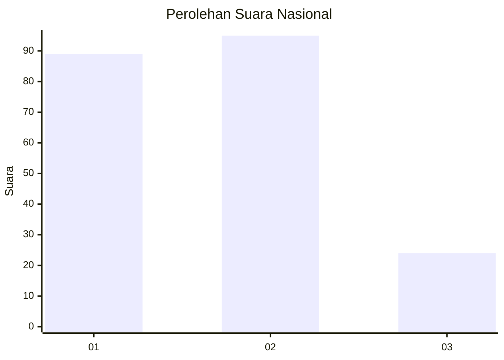
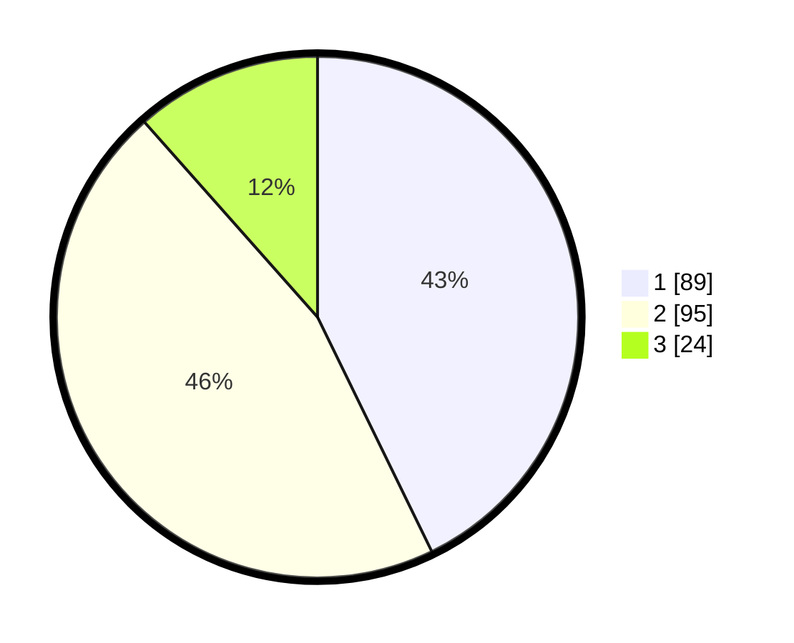

# Hasil

## Grafik

## Tabel

| No.    | Nama Paslon    | Suara | Suara (raw) | Persentase |
|:------ |:-------------- | -----:| -----------:| ----------:|
| 100025 | ANIES MUHAIMIN | 89    | [89][p-1]   | 42,79      |
| 100026 | PRABOWO GIBRAN | 95    | [95][p-2]   | 45,67      |
| 100027 | GANJAR MAHFUD  | 24    | [24][p-3]   | 11,54      |

[p-1]: https://github.com/gigit-pemilu/pemilu-2024/blob/main/pilpres/hitung-suara/sub/31-dki-jakarta/sub/74-jakarta-selatan/sub/09-jagakarsa/sub/1005-tanjung-barat/sub/143-tps/sub/paslon-1.txt
[p-2]: https://github.com/gigit-pemilu/pemilu-2024/blob/main/pilpres/hitung-suara/sub/31-dki-jakarta/sub/74-jakarta-selatan/sub/09-jagakarsa/sub/1005-tanjung-barat/sub/143-tps/sub/paslon-2.txt
[p-3]: https://github.com/gigit-pemilu/pemilu-2024/blob/main/pilpres/hitung-suara/sub/31-dki-jakarta/sub/74-jakarta-selatan/sub/09-jagakarsa/sub/1005-tanjung-barat/sub/143-tps/sub/paslon-3.txt

## Foto C Plano

https://sirekap-obj-formc.kpu.go.id/d048/pemilu/ppwp/31/74/09/10/05/3174091005143-20240215-004153--7a598b4d-9736-4295-b2c7-12c5ede3afde.jpg

https://sirekap-obj-formc.kpu.go.id/d048/pemilu/ppwp/31/74/09/10/05/3174091005143-20240215-004425--fa512cc2-c5f9-4942-9c5b-790e2f11c0ae.jpg

https://sirekap-obj-formc.kpu.go.id/d048/pemilu/ppwp/31/74/09/10/05/3174091005143-20240215-004554--be3bb8a7-0f2a-4a4e-a770-879b81ff9a48.jpg

## Metadata

| Key        | Value               |
| ---------- | ------------------- |
| Time Stamp | 2024-02-25 14:00:00 |

