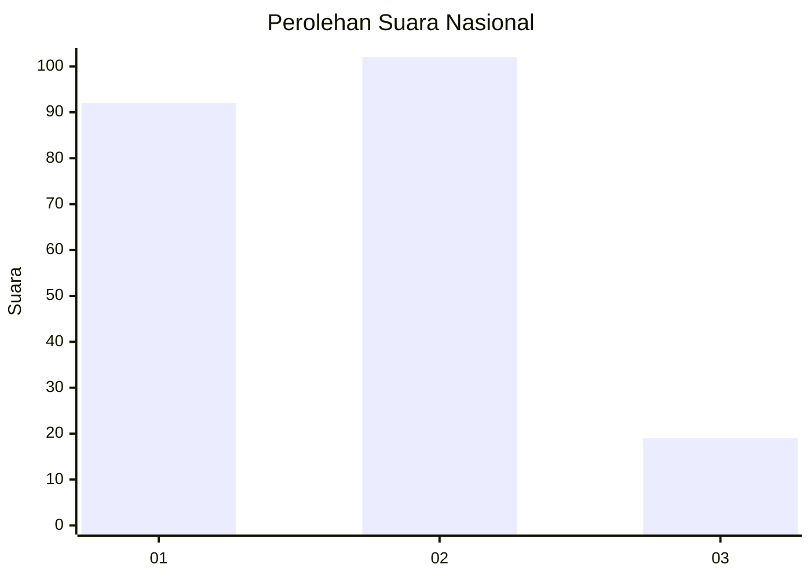
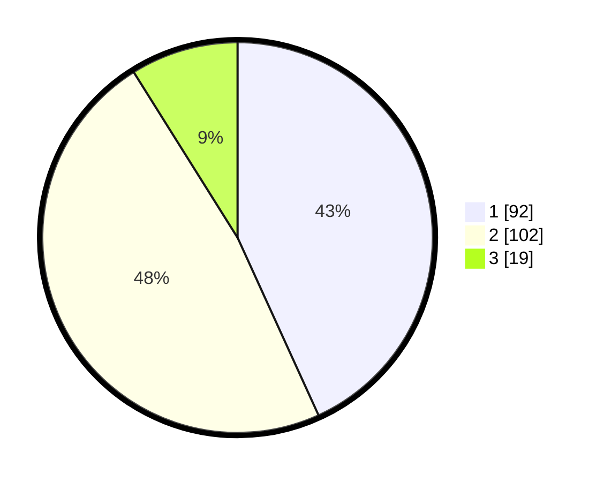

# Hasil

## Grafik

## Tabel

| No.    | Nama Paslon    | Suara | Suara (raw) | Persentase |
|:------ |:-------------- | -----:| -----------:| ----------:|
| 100025 | ANIES MUHAIMIN | 92    | [92][p-1]   | 43,19      |
| 100026 | PRABOWO GIBRAN | 102   | [102][p-2]  | 47,89      |
| 100027 | GANJAR MAHFUD  | 19    | [19][p-3]   | 8,92       |

[p-1]: https://github.com/gigit-pemilu/pemilu-2024/blob/main/pilpres/hitung-suara/sub/31-dki-jakarta/sub/74-jakarta-selatan/sub/09-jagakarsa/sub/1006-cipedak/sub/001-tps/sub/paslon-1.txt
[p-2]: https://github.com/gigit-pemilu/pemilu-2024/blob/main/pilpres/hitung-suara/sub/31-dki-jakarta/sub/74-jakarta-selatan/sub/09-jagakarsa/sub/1006-cipedak/sub/001-tps/sub/paslon-2.txt
[p-3]: https://github.com/gigit-pemilu/pemilu-2024/blob/main/pilpres/hitung-suara/sub/31-dki-jakarta/sub/74-jakarta-selatan/sub/09-jagakarsa/sub/1006-cipedak/sub/001-tps/sub/paslon-3.txt

## Foto C Plano

https://sirekap-obj-formc.kpu.go.id/5d94/pemilu/ppwp/31/74/09/10/06/3174091006001-20240214-204357--034fe540-9cb2-4028-aa14-53f6e0fb9fbf.jpg

https://sirekap-obj-formc.kpu.go.id/5d94/pemilu/ppwp/31/74/09/10/06/3174091006001-20240214-204348--2ddd42a4-f590-47c2-aa64-b3f3b2cd283f.jpg

https://sirekap-obj-formc.kpu.go.id/5d94/pemilu/ppwp/31/74/09/10/06/3174091006001-20240214-204958--193e9cf7-3630-4f22-beab-fa77a8b8fae7.jpg

## Metadata

| Key        | Value               |
| ---------- | ------------------- |
| Time Stamp | 2024-02-24 22:31:28 |

