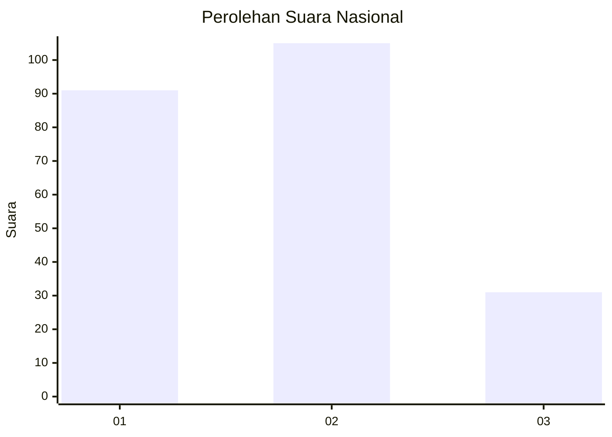
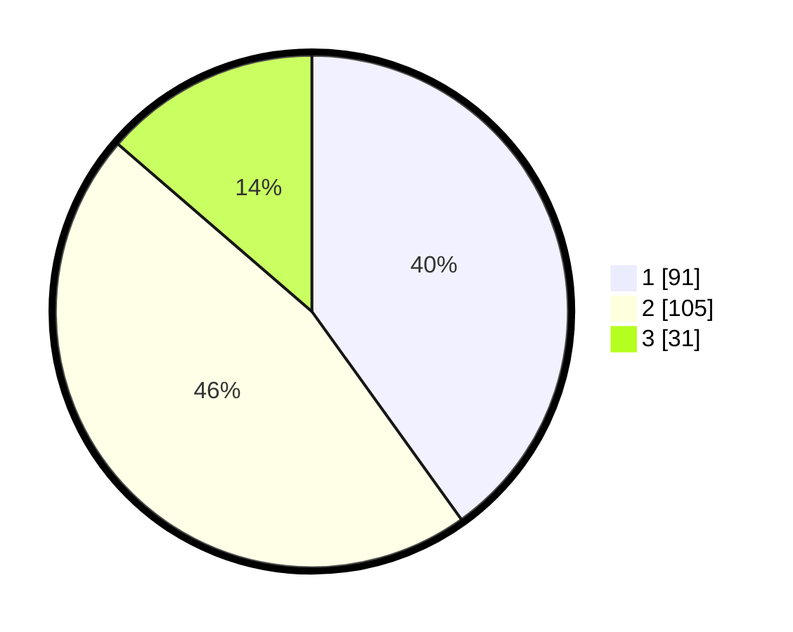

# Hasil

## Grafik

## Tabel

| No.    | Nama Paslon    | Suara | Suara (raw) | Persentase |
|:------ |:-------------- | -----:| -----------:| ----------:|
| 100025 | ANIES MUHAIMIN | 91    | [91][p-1]   | 40,09      |
| 100026 | PRABOWO GIBRAN | 105   | [105][p-2]  | 46,26      |
| 100027 | GANJAR MAHFUD  | 31    | [31][p-3]   | 13,66      |

[p-1]: https://github.com/gigit-pemilu/pemilu-2024/blob/main/pilpres/hitung-suara/sub/31-dki-jakarta/sub/74-jakarta-selatan/sub/09-jagakarsa/sub/1006-cipedak/sub/007-tps/sub/paslon-1.txt
[p-2]: https://github.com/gigit-pemilu/pemilu-2024/blob/main/pilpres/hitung-suara/sub/31-dki-jakarta/sub/74-jakarta-selatan/sub/09-jagakarsa/sub/1006-cipedak/sub/007-tps/sub/paslon-2.txt
[p-3]: https://github.com/gigit-pemilu/pemilu-2024/blob/main/pilpres/hitung-suara/sub/31-dki-jakarta/sub/74-jakarta-selatan/sub/09-jagakarsa/sub/1006-cipedak/sub/007-tps/sub/paslon-3.txt

## Foto C Plano

https://sirekap-obj-formc.kpu.go.id/f1c9/pemilu/ppwp/31/74/09/10/06/3174091006007-20240215-043552--bae43ae4-220a-4bbb-ba35-e4ce6e3a7dc6.jpg

https://sirekap-obj-formc.kpu.go.id/f1c9/pemilu/ppwp/31/74/09/10/06/3174091006007-20240215-043606--de85d351-898d-48a5-ac37-6e8df2504e72.jpg

https://sirekap-obj-formc.kpu.go.id/f1c9/pemilu/ppwp/31/74/09/10/06/3174091006007-20240215-043622--507a3d51-d52d-4202-9454-9f8f678a0d01.jpg

## Metadata

| Key        | Value               |
| ---------- | ------------------- |
| Time Stamp | 2024-02-24 22:31:28 |

