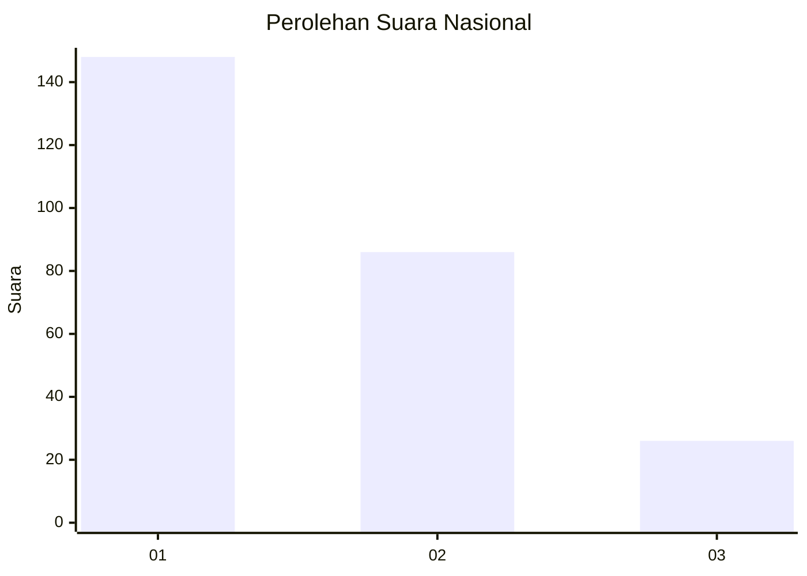
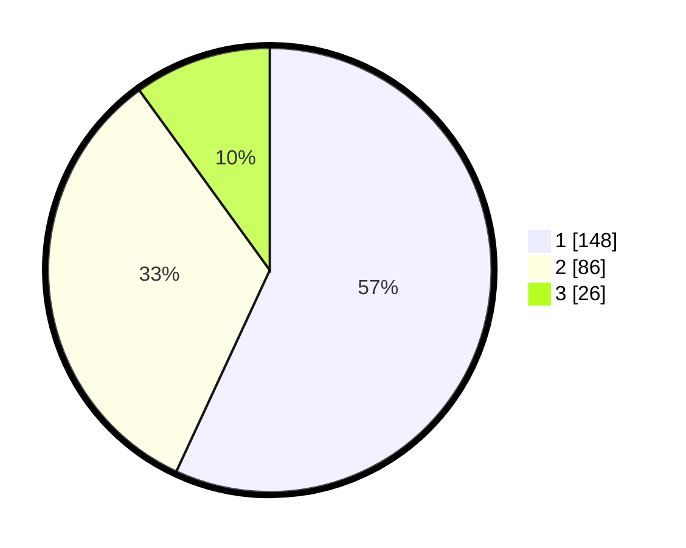

# Hasil

## Grafik

## Tabel

| No.    | Nama Paslon    | Suara | Suara (raw) | Persentase |
|:------ |:-------------- | -----:| -----------:| ----------:|
| 100025 | ANIES MUHAIMIN | 148   | [148][p-1]  | 56,92      |
| 100026 | PRABOWO GIBRAN | 86    | [86][p-2]   | 33,08      |
| 100027 | GANJAR MAHFUD  | 26    | [26][p-3]   | 10,00      |

[p-1]: https://github.com/gigit-pemilu/pemilu-2024/blob/main/pilpres/hitung-suara/sub/31-dki-jakarta/sub/74-jakarta-selatan/sub/09-jagakarsa/sub/1006-cipedak/sub/014-tps/sub/paslon-1.txt
[p-2]: https://github.com/gigit-pemilu/pemilu-2024/blob/main/pilpres/hitung-suara/sub/31-dki-jakarta/sub/74-jakarta-selatan/sub/09-jagakarsa/sub/1006-cipedak/sub/014-tps/sub/paslon-2.txt
[p-3]: https://github.com/gigit-pemilu/pemilu-2024/blob/main/pilpres/hitung-suara/sub/31-dki-jakarta/sub/74-jakarta-selatan/sub/09-jagakarsa/sub/1006-cipedak/sub/014-tps/sub/paslon-3.txt

## Foto C Plano

https://sirekap-obj-formc.kpu.go.id/f703/pemilu/ppwp/31/74/09/10/06/3174091006014-20240214-141914--9540f305-6163-4aa8-a1cb-7861806f12b5.jpg

https://sirekap-obj-formc.kpu.go.id/f703/pemilu/ppwp/31/74/09/10/06/3174091006014-20240214-155010--30ecaf44-f5a6-4e03-ae3d-b0b8f9793b47.jpg

https://sirekap-obj-formc.kpu.go.id/f703/pemilu/ppwp/31/74/09/10/06/3174091006014-20240214-155023--ed4c15c6-e4d1-4b5b-aaf7-1a622be15b25.jpg

## Metadata

| Key        | Value               |
| ---------- | ------------------- |
| Time Stamp | 2024-02-24 22:31:28 |

