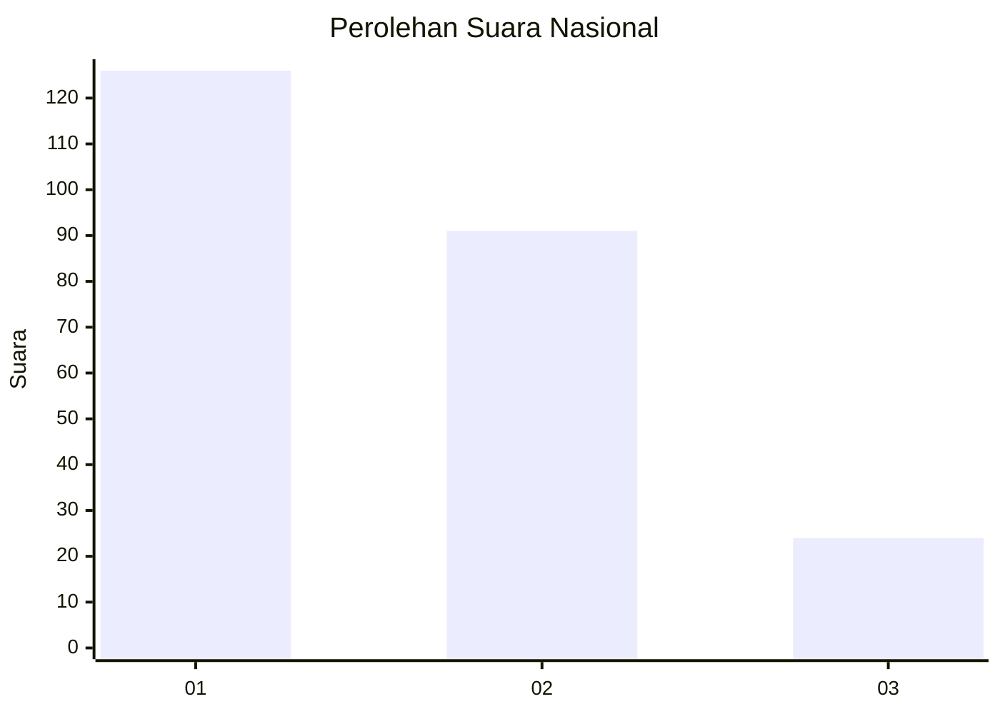
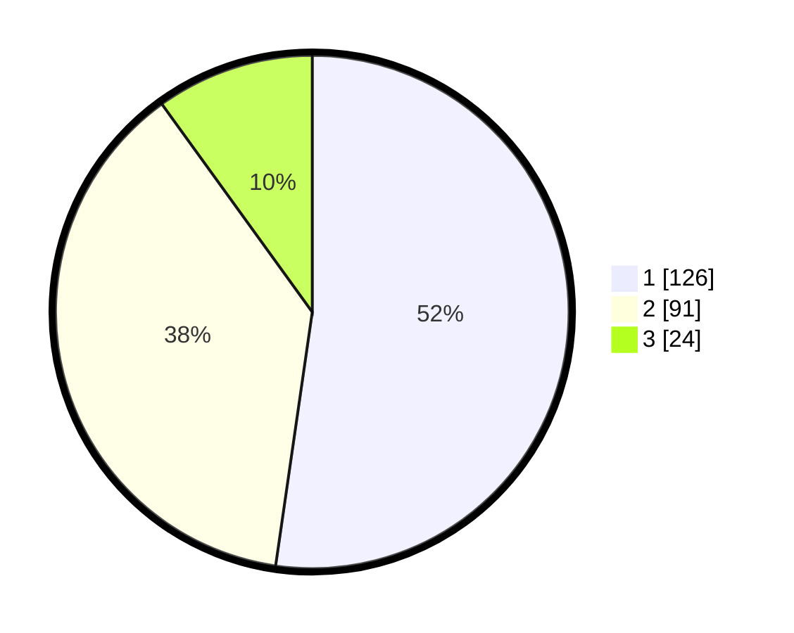

# Hasil

## Grafik

## Tabel

| No.    | Nama Paslon    | Suara | Suara (raw) | Persentase |
|:------ |:-------------- | -----:| -----------:| ----------:|
| 100025 | ANIES MUHAIMIN | 126   | [126][p-1]  | 52,28      |
| 100026 | PRABOWO GIBRAN | 91    | [91][p-2]   | 37,76      |
| 100027 | GANJAR MAHFUD  | 24    | [24][p-3]   | 9,96       |

[p-1]: https://github.com/gigit-pemilu/pemilu-2024/blob/main/pilpres/hitung-suara/sub/31-dki-jakarta/sub/74-jakarta-selatan/sub/09-jagakarsa/sub/1006-cipedak/sub/020-tps/sub/paslon-1.txt
[p-2]: https://github.com/gigit-pemilu/pemilu-2024/blob/main/pilpres/hitung-suara/sub/31-dki-jakarta/sub/74-jakarta-selatan/sub/09-jagakarsa/sub/1006-cipedak/sub/020-tps/sub/paslon-2.txt
[p-3]: https://github.com/gigit-pemilu/pemilu-2024/blob/main/pilpres/hitung-suara/sub/31-dki-jakarta/sub/74-jakarta-selatan/sub/09-jagakarsa/sub/1006-cipedak/sub/020-tps/sub/paslon-3.txt

## Foto C Plano

https://sirekap-obj-formc.kpu.go.id/e52b/pemilu/ppwp/31/74/09/10/06/3174091006020-20240215-001520--c85fc120-3dee-4669-931d-c45a1a28e348.jpg

https://sirekap-obj-formc.kpu.go.id/e52b/pemilu/ppwp/31/74/09/10/06/3174091006020-20240215-001625--0c48ffc6-4143-4235-ab92-1f7a66be8e2f.jpg

https://sirekap-obj-formc.kpu.go.id/e52b/pemilu/ppwp/31/74/09/10/06/3174091006020-20240215-001729--8beb99b0-dd68-46fd-a738-e46ca2e23916.jpg

## Metadata

| Key        | Value               |
| ---------- | ------------------- |
| Time Stamp | 2024-02-25 12:00:00 |

