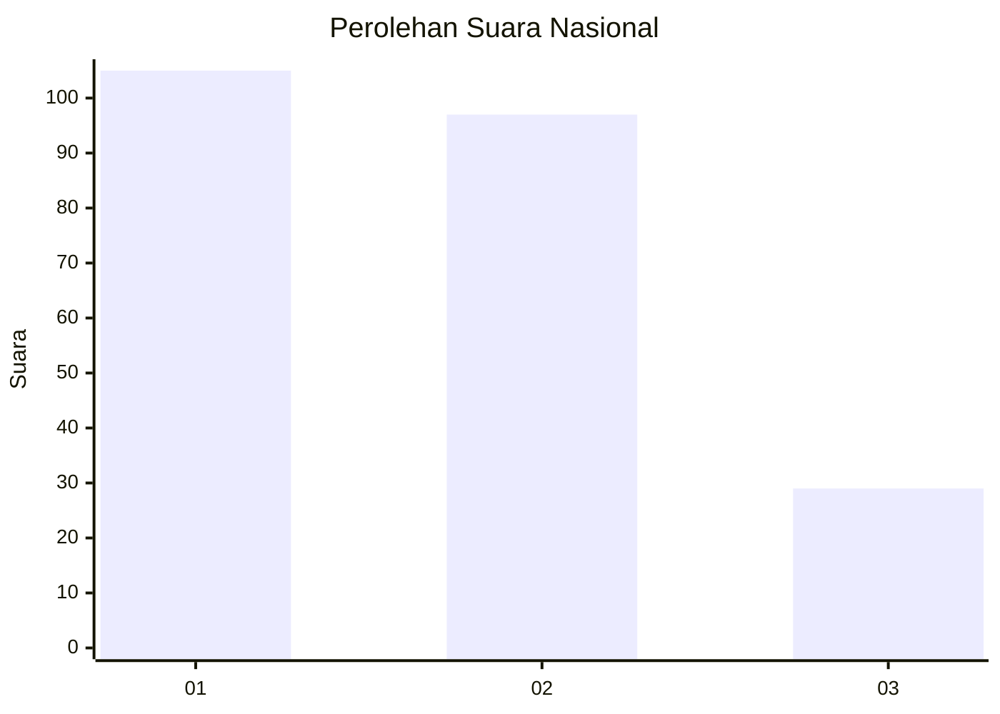
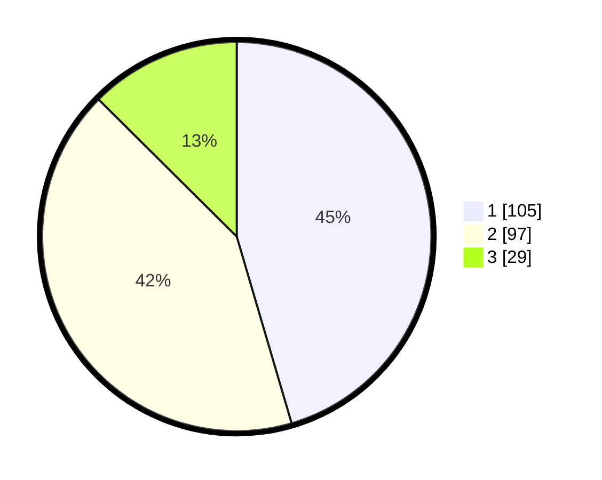

# Hasil

## Grafik

## Tabel

| No.    | Nama Paslon    | Suara | Suara (raw) | Persentase |
|:------ |:-------------- | -----:| -----------:| ----------:|
| 100025 | ANIES MUHAIMIN | 105   | [105][p-1]  | 45,45      |
| 100026 | PRABOWO GIBRAN | 97    | [97][p-2]   | 41,99      |
| 100027 | GANJAR MAHFUD  | 29    | [29][p-3]   | 12,55      |

[p-1]: https://github.com/gigit-pemilu/pemilu-2024/blob/main/pilpres/hitung-suara/sub/31-dki-jakarta/sub/74-jakarta-selatan/sub/09-jagakarsa/sub/1006-cipedak/sub/021-tps/sub/paslon-1.txt
[p-2]: https://github.com/gigit-pemilu/pemilu-2024/blob/main/pilpres/hitung-suara/sub/31-dki-jakarta/sub/74-jakarta-selatan/sub/09-jagakarsa/sub/1006-cipedak/sub/021-tps/sub/paslon-2.txt
[p-3]: https://github.com/gigit-pemilu/pemilu-2024/blob/main/pilpres/hitung-suara/sub/31-dki-jakarta/sub/74-jakarta-selatan/sub/09-jagakarsa/sub/1006-cipedak/sub/021-tps/sub/paslon-3.txt

## Foto C Plano

https://sirekap-obj-formc.kpu.go.id/ccad/pemilu/ppwp/31/74/09/10/06/3174091006021-20240214-214155--a33060e5-f81d-44da-9600-75c92feefad6.jpg

https://sirekap-obj-formc.kpu.go.id/ccad/pemilu/ppwp/31/74/09/10/06/3174091006021-20240214-214611--8a3deeed-8289-4491-b88c-8064b354bd31.jpg

https://sirekap-obj-formc.kpu.go.id/ccad/pemilu/ppwp/31/74/09/10/06/3174091006021-20240214-214509--c5407d6b-478f-4d8e-a134-ca29e735920c.jpg

## Metadata

| Key        | Value               |
| ---------- | ------------------- |
| Time Stamp | 2024-02-24 22:31:28 |

