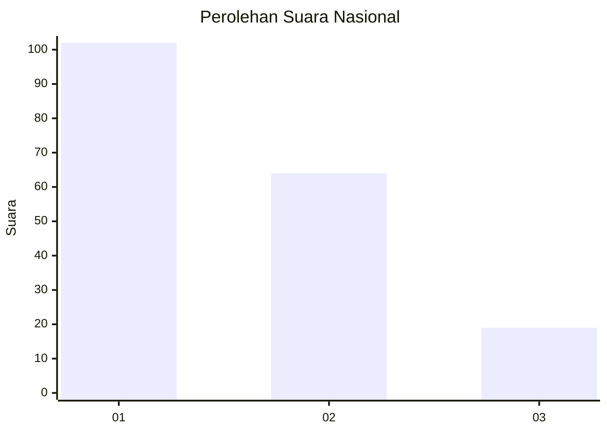
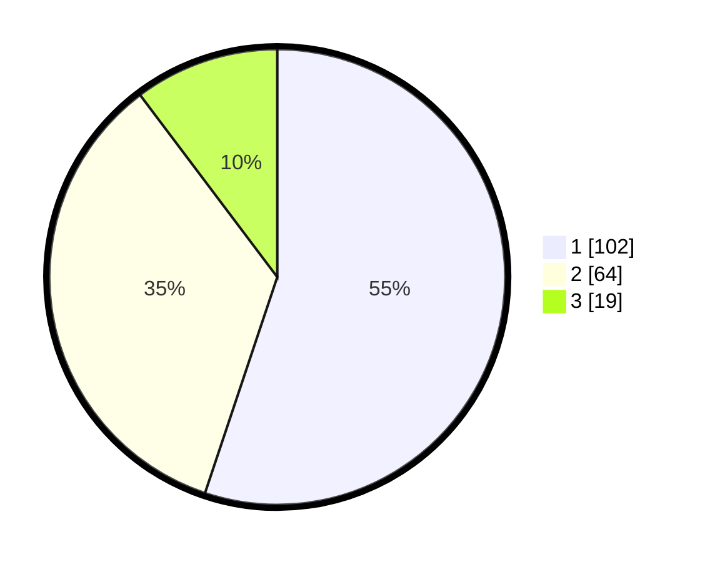

# Hasil

## Grafik

## Tabel

| No.    | Nama Paslon    | Suara | Suara (raw) | Persentase |
|:------ |:-------------- | -----:| -----------:| ----------:|
| 100025 | ANIES MUHAIMIN | 102   | [102][p-1]  | 55,14      |
| 100026 | PRABOWO GIBRAN | 64    | [64][p-2]   | 34,59      |
| 100027 | GANJAR MAHFUD  | 19    | [19][p-3]   | 10,27      |

[p-1]: https://github.com/gigit-pemilu/pemilu-2024/blob/main/pilpres/hitung-suara/sub/31-dki-jakarta/sub/74-jakarta-selatan/sub/09-jagakarsa/sub/1006-cipedak/sub/042-tps/sub/paslon-1.txt
[p-2]: https://github.com/gigit-pemilu/pemilu-2024/blob/main/pilpres/hitung-suara/sub/31-dki-jakarta/sub/74-jakarta-selatan/sub/09-jagakarsa/sub/1006-cipedak/sub/042-tps/sub/paslon-2.txt
[p-3]: https://github.com/gigit-pemilu/pemilu-2024/blob/main/pilpres/hitung-suara/sub/31-dki-jakarta/sub/74-jakarta-selatan/sub/09-jagakarsa/sub/1006-cipedak/sub/042-tps/sub/paslon-3.txt

## Foto C Plano

https://sirekap-obj-formc.kpu.go.id/70d6/pemilu/ppwp/31/74/09/10/06/3174091006042-20240217-185352--1ff6d0be-ccc8-4d41-9ceb-94e92a940db3.jpg

https://sirekap-obj-formc.kpu.go.id/70d6/pemilu/ppwp/31/74/09/10/06/3174091006042-20240214-235814--12f1e54a-5d1a-48dd-ad41-23c00051db88.jpg

https://sirekap-obj-formc.kpu.go.id/70d6/pemilu/ppwp/31/74/09/10/06/3174091006042-20240214-235829--fb22bde0-6bf6-4c7c-9853-b4ebf384ff64.jpg

## Metadata

| Key        | Value               |
| ---------- | ------------------- |
| Time Stamp | 2024-02-24 22:31:28 |

