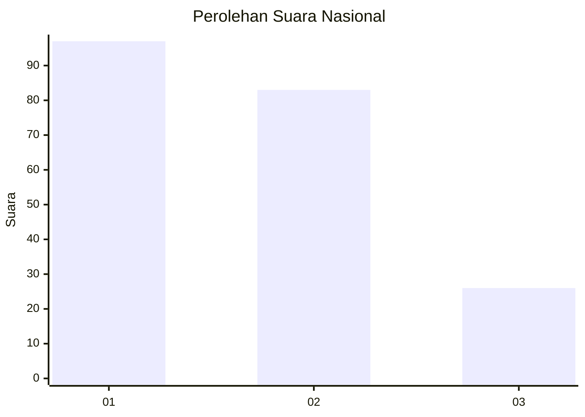
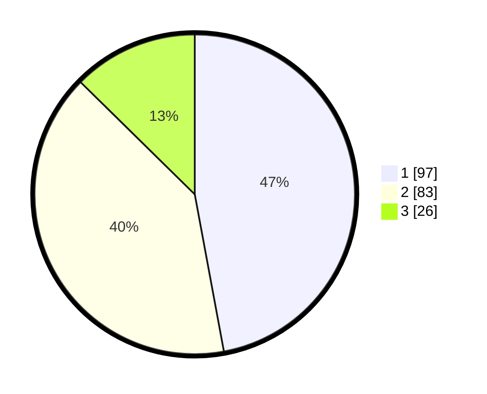

# Hasil

## Grafik

## Tabel

| No.    | Nama Paslon    | Suara | Suara (raw) | Persentase |
|:------ |:-------------- | -----:| -----------:| ----------:|
| 100025 | ANIES MUHAIMIN | 97    | [97][p-1]   | 47,09      |
| 100026 | PRABOWO GIBRAN | 83    | [83][p-2]   | 40,29      |
| 100027 | GANJAR MAHFUD  | 26    | [26][p-3]   | 12,62      |

[p-1]: https://github.com/gigit-pemilu/pemilu-2024/blob/main/pilpres/hitung-suara/sub/31-dki-jakarta/sub/74-jakarta-selatan/sub/09-jagakarsa/sub/1006-cipedak/sub/047-tps/sub/paslon-1.txt
[p-2]: https://github.com/gigit-pemilu/pemilu-2024/blob/main/pilpres/hitung-suara/sub/31-dki-jakarta/sub/74-jakarta-selatan/sub/09-jagakarsa/sub/1006-cipedak/sub/047-tps/sub/paslon-2.txt
[p-3]: https://github.com/gigit-pemilu/pemilu-2024/blob/main/pilpres/hitung-suara/sub/31-dki-jakarta/sub/74-jakarta-selatan/sub/09-jagakarsa/sub/1006-cipedak/sub/047-tps/sub/paslon-3.txt

## Foto C Plano

https://sirekap-obj-formc.kpu.go.id/f7de/pemilu/ppwp/31/74/09/10/06/3174091006047-20240214-222043--81b1fa41-a057-4b6c-99a4-8d4214776e9e.jpg

https://sirekap-obj-formc.kpu.go.id/f7de/pemilu/ppwp/31/74/09/10/06/3174091006047-20240214-220044--6efaf476-8999-4918-be25-f98d2621528c.jpg

https://sirekap-obj-formc.kpu.go.id/f7de/pemilu/ppwp/31/74/09/10/06/3174091006047-20240214-220314--7e66fa9f-bf1b-491b-993e-fb40296a9af5.jpg

## Metadata

| Key        | Value               |
| ---------- | ------------------- |
| Time Stamp | 2024-02-24 22:31:28 |

