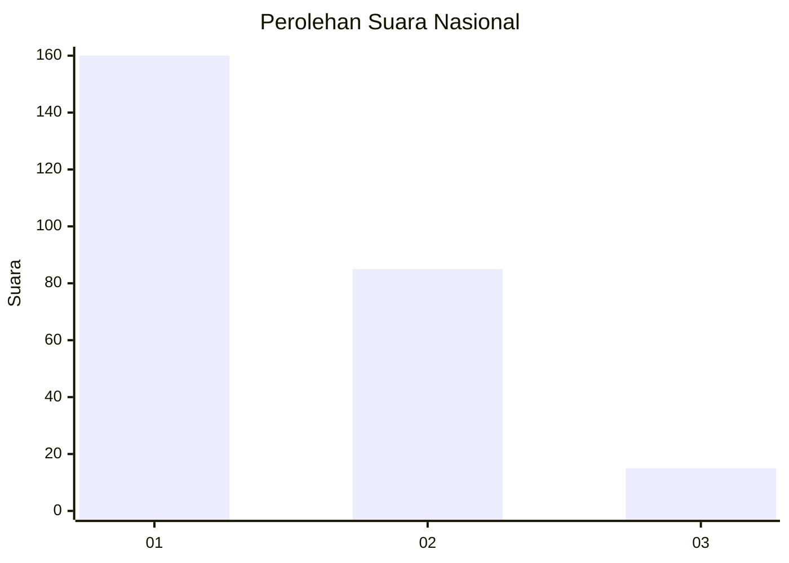
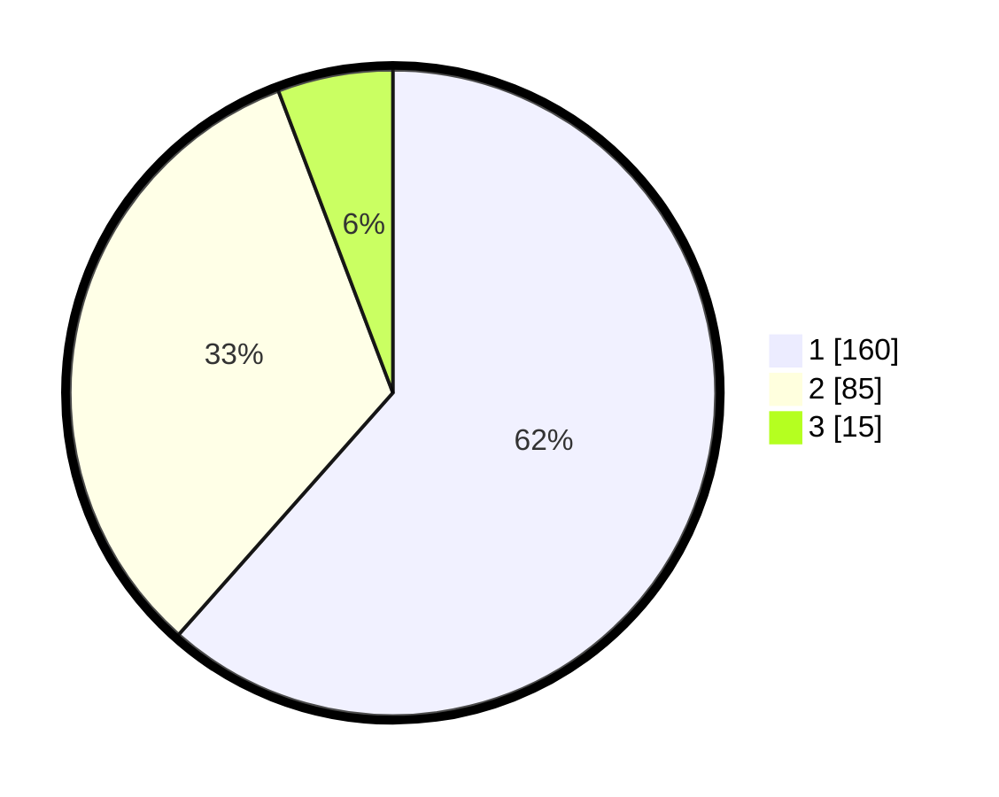

# Hasil

## Grafik

## Tabel

| No.    | Nama Paslon    | Suara | Suara (raw) | Persentase |
|:------ |:-------------- | -----:| -----------:| ----------:|
| 100025 | ANIES MUHAIMIN | 160   | [160][p-1]  | 61,54      |
| 100026 | PRABOWO GIBRAN | 85    | [85][p-2]   | 32,69      |
| 100027 | GANJAR MAHFUD  | 15    | [15][p-3]   | 5,77       |

[p-1]: https://github.com/gigit-pemilu/pemilu-2024/blob/main/pilpres/hitung-suara/sub/31-dki-jakarta/sub/74-jakarta-selatan/sub/09-jagakarsa/sub/1006-cipedak/sub/088-tps/sub/paslon-1.txt
[p-2]: https://github.com/gigit-pemilu/pemilu-2024/blob/main/pilpres/hitung-suara/sub/31-dki-jakarta/sub/74-jakarta-selatan/sub/09-jagakarsa/sub/1006-cipedak/sub/088-tps/sub/paslon-2.txt
[p-3]: https://github.com/gigit-pemilu/pemilu-2024/blob/main/pilpres/hitung-suara/sub/31-dki-jakarta/sub/74-jakarta-selatan/sub/09-jagakarsa/sub/1006-cipedak/sub/088-tps/sub/paslon-3.txt

## Foto C Plano

https://sirekap-obj-formc.kpu.go.id/fcd5/pemilu/ppwp/31/74/09/10/06/3174091006088-20240214-213012--7bd88872-32ec-4097-a950-5ae47bdf1ecc.jpg

https://sirekap-obj-formc.kpu.go.id/fcd5/pemilu/ppwp/31/74/09/10/06/3174091006088-20240214-222228--8619b21c-2207-4f8e-91d2-087774faf48a.jpg

https://sirekap-obj-formc.kpu.go.id/fcd5/pemilu/ppwp/31/74/09/10/06/3174091006088-20240214-204621--a21f9eb9-a945-40a2-a062-e526b790d211.jpg

## Metadata

| Key        | Value               |
| ---------- | ------------------- |
| Time Stamp | 2024-02-24 22:31:28 |

