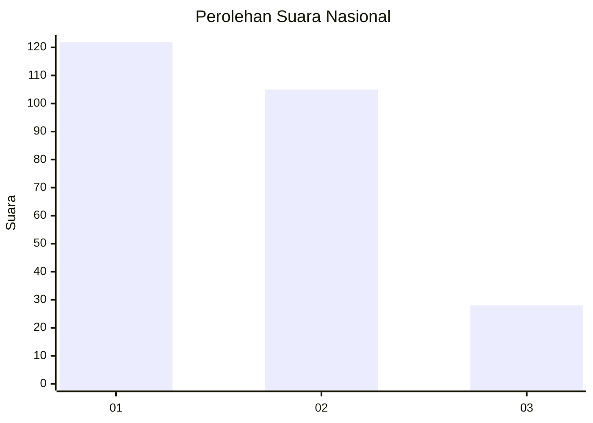
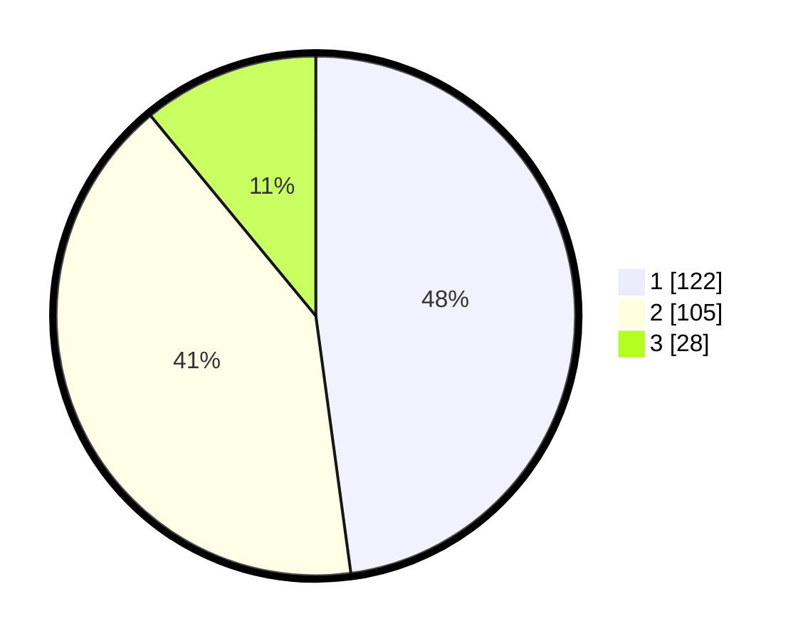

# Hasil

## Grafik

## Tabel

| No.    | Nama Paslon    | Suara | Suara (raw) | Persentase |
|:------ |:-------------- | -----:| -----------:| ----------:|
| 100025 | ANIES MUHAIMIN | 122   | [122][p-1]  | 47,84      |
| 100026 | PRABOWO GIBRAN | 105   | [105][p-2]  | 41,18      |
| 100027 | GANJAR MAHFUD  | 28    | [28][p-3]   | 10,98      |

[p-1]: https://github.com/gigit-pemilu/pemilu-2024/blob/main/pilpres/hitung-suara/sub/31-dki-jakarta/sub/74-jakarta-selatan/sub/09-jagakarsa/sub/1006-cipedak/sub/095-tps/sub/paslon-1.txt
[p-2]: https://github.com/gigit-pemilu/pemilu-2024/blob/main/pilpres/hitung-suara/sub/31-dki-jakarta/sub/74-jakarta-selatan/sub/09-jagakarsa/sub/1006-cipedak/sub/095-tps/sub/paslon-2.txt
[p-3]: https://github.com/gigit-pemilu/pemilu-2024/blob/main/pilpres/hitung-suara/sub/31-dki-jakarta/sub/74-jakarta-selatan/sub/09-jagakarsa/sub/1006-cipedak/sub/095-tps/sub/paslon-3.txt

## Foto C Plano

https://sirekap-obj-formc.kpu.go.id/6c31/pemilu/ppwp/31/74/09/10/06/3174091006095-20240215-023048--9f4d3d2d-6ee7-4a9a-b351-ba06ac537413.jpg

https://sirekap-obj-formc.kpu.go.id/6c31/pemilu/ppwp/31/74/09/10/06/3174091006095-20240215-023200--41aa9963-3a9b-464c-ac0c-1e8bf9f6082b.jpg

https://sirekap-obj-formc.kpu.go.id/6c31/pemilu/ppwp/31/74/09/10/06/3174091006095-20240215-023335--449e7a00-b867-43a0-8d08-ec7aead9ace9.jpg

## Metadata

| Key        | Value               |
| ---------- | ------------------- |
| Time Stamp | 2024-02-24 22:31:28 |

