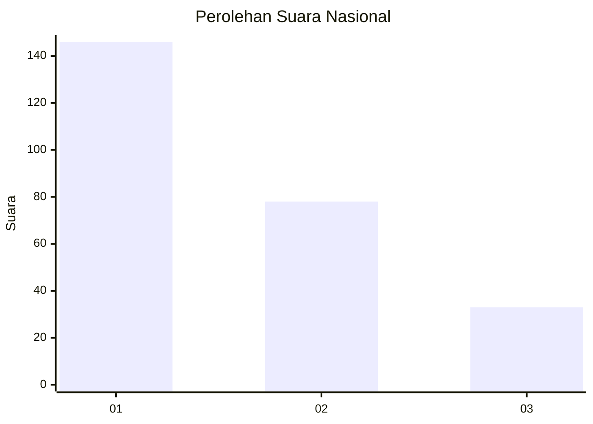
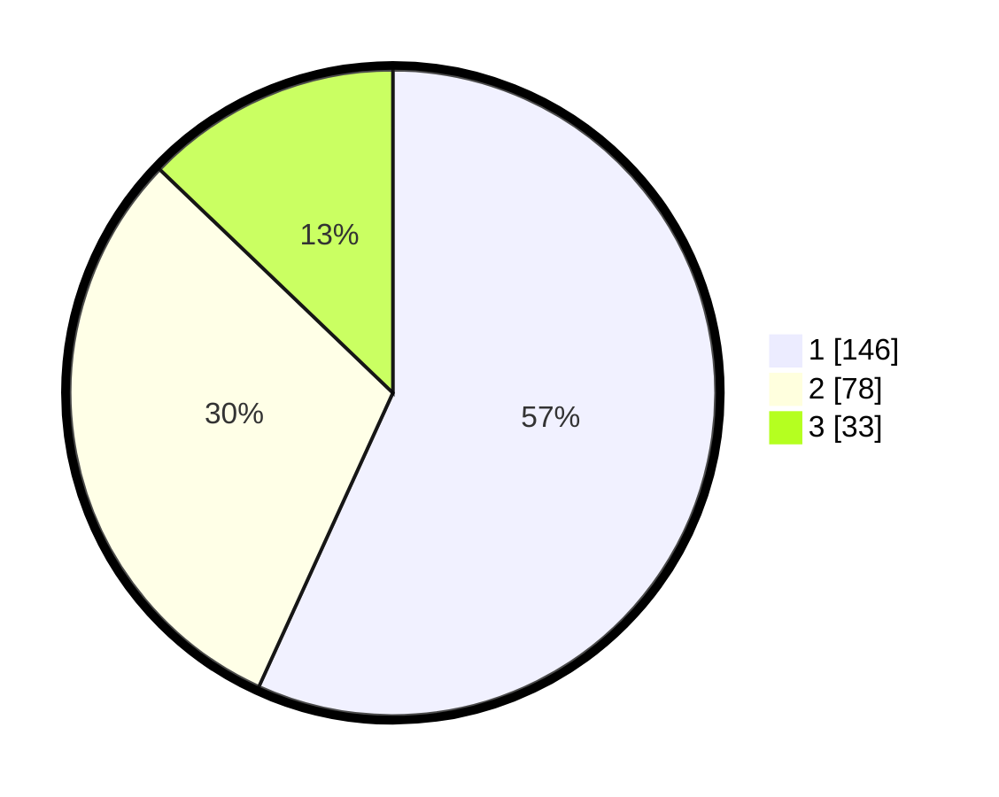

# Hasil

## Grafik

## Tabel

| No. | Nama Paslon    | Suara | Suara (raw) | Persentase |
|:--- |:-------------- | -----:| -----------:| ----------:|
| 1   | ANIES MUHAIMIN | 146   | [146][p-1]  | 56,81      |
| 2   | PRABOWO GIBRAN | 78    | [78][p-2]   | 30,35      |
| 3   | GANJAR MAHFUD  | 33    | [33][p-3]   | 12,84      |

[p-1]: https://github.com/gigit-pemilu/pemilu-2024/blob/main/pilpres/hitung-suara/sub/31-dki-jakarta/sub/74-jakarta-selatan/sub/09-jagakarsa/sub/1006-cipedak/sub/096-tps/sub/paslon-1.txt
[p-2]: https://github.com/gigit-pemilu/pemilu-2024/blob/main/pilpres/hitung-suara/sub/31-dki-jakarta/sub/74-jakarta-selatan/sub/09-jagakarsa/sub/1006-cipedak/sub/096-tps/sub/paslon-2.txt
[p-3]: https://github.com/gigit-pemilu/pemilu-2024/blob/main/pilpres/hitung-suara/sub/31-dki-jakarta/sub/74-jakarta-selatan/sub/09-jagakarsa/sub/1006-cipedak/sub/096-tps/sub/paslon-3.txt

## Foto C Plano

https://sirekap-obj-formc.kpu.go.id/f365/pemilu/ppwp/31/74/09/10/06/3174091006096-20240215-000159--c77c95bc-e74b-4c2f-9fd8-9a098812eced.jpg

https://sirekap-obj-formc.kpu.go.id/f365/pemilu/ppwp/31/74/09/10/06/3174091006096-20240215-000458--3f4b9559-9f9a-490c-8af6-7eb0546793bd.jpg

https://sirekap-obj-formc.kpu.go.id/f365/pemilu/ppwp/31/74/09/10/06/3174091006096-20240215-000633--438faf93-fe15-49c0-a06d-98db4151566b.jpg

## Metadata

| Key        | Value               |
| ---------- | ------------------- |
| Time Stamp | 2024-02-24 22:31:28 |

