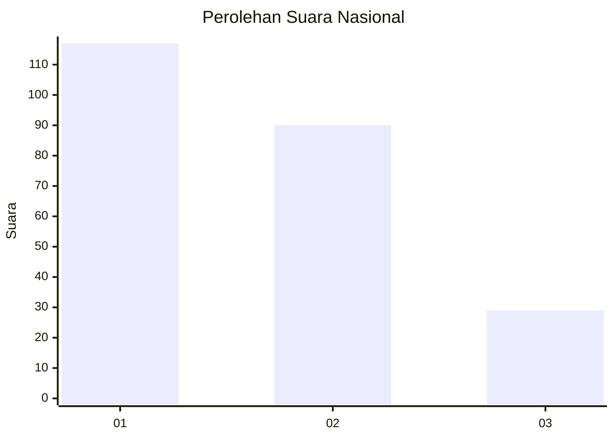
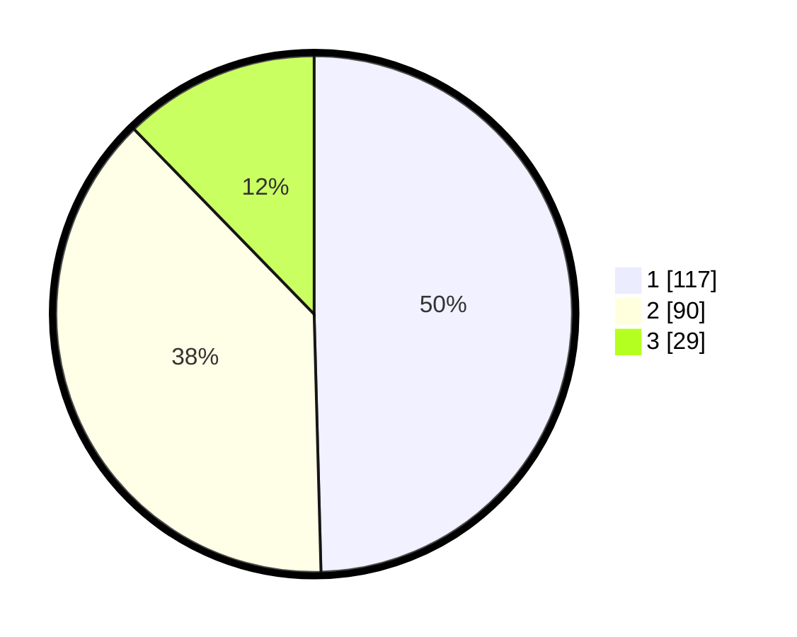

# Hasil

## Grafik

## Tabel

| No.    | Nama Paslon    | Suara | Suara (raw) | Persentase |
|:------ |:-------------- | -----:| -----------:| ----------:|
| 100025 | ANIES MUHAIMIN | 117   | [117][p-1]  | 49,58      |
| 100026 | PRABOWO GIBRAN | 90    | [90][p-2]   | 38,14      |
| 100027 | GANJAR MAHFUD  | 29    | [29][p-3]   | 12,29      |

[p-1]: https://github.com/gigit-pemilu/pemilu-2024/blob/main/pilpres/hitung-suara/sub/31-dki-jakarta/sub/74-jakarta-selatan/sub/09-jagakarsa/sub/1006-cipedak/sub/098-tps/sub/paslon-1.txt
[p-2]: https://github.com/gigit-pemilu/pemilu-2024/blob/main/pilpres/hitung-suara/sub/31-dki-jakarta/sub/74-jakarta-selatan/sub/09-jagakarsa/sub/1006-cipedak/sub/098-tps/sub/paslon-2.txt
[p-3]: https://github.com/gigit-pemilu/pemilu-2024/blob/main/pilpres/hitung-suara/sub/31-dki-jakarta/sub/74-jakarta-selatan/sub/09-jagakarsa/sub/1006-cipedak/sub/098-tps/sub/paslon-3.txt

## Foto C Plano

https://sirekap-obj-formc.kpu.go.id/e464/pemilu/ppwp/31/74/09/10/06/3174091006098-20240215-022721--23a4d595-4570-444e-a728-d01b840b972f.jpg

https://sirekap-obj-formc.kpu.go.id/e464/pemilu/ppwp/31/74/09/10/06/3174091006098-20240215-022737--3a76a6ae-740b-4d46-8832-ee1dedaf97d7.jpg

https://sirekap-obj-formc.kpu.go.id/e464/pemilu/ppwp/31/74/09/10/06/3174091006098-20240215-022745--b2c34e63-e488-4417-b137-20dbee656e60.jpg

## Metadata

| Key        | Value               |
| ---------- | ------------------- |
| Time Stamp | 2024-02-24 22:31:28 |

