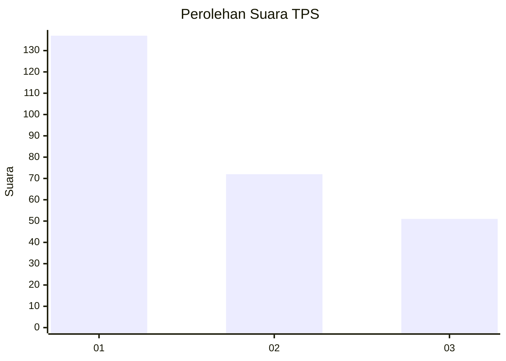
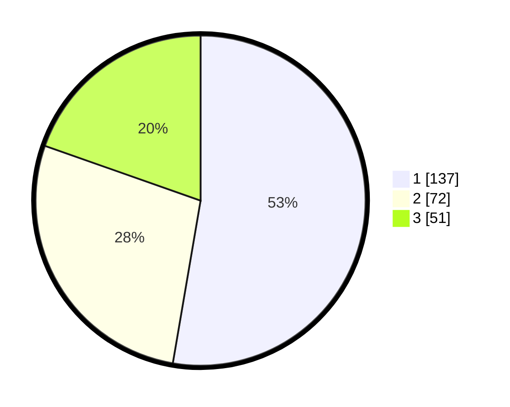

# Hasil

## Grafik

## Tabel

| No. | Nama Paslon    | Suara | Suara (raw) | Persentase |
|:--- |:-------------- | -----:| -----------:| ----------:|
| 1   | ANIES MUHAIMIN | 137   | [137][p-1]  | 52,69      |
| 2   | PRABOWO GIBRAN | 72    | [72][p-2]   | 27,69      |
| 3   | GANJAR MAHFUD  | 51    | [51][p-3]   | 19,62      |

[p-1]: https://github.com/gigit-pemilu/pemilu-2024-31-dki-jakarta/blob/main/pilpres/hitung-suara/sub/31-dki-jakarta/sub/74-jakarta-selatan/sub/09-jagakarsa/sub/1006-cipedak/sub/130-tps/sub/paslon-1.txt
[p-2]: https://github.com/gigit-pemilu/pemilu-2024-31-dki-jakarta/blob/main/pilpres/hitung-suara/sub/31-dki-jakarta/sub/74-jakarta-selatan/sub/09-jagakarsa/sub/1006-cipedak/sub/130-tps/sub/paslon-2.txt
[p-3]: https://github.com/gigit-pemilu/pemilu-2024-31-dki-jakarta/blob/main/pilpres/hitung-suara/sub/31-dki-jakarta/sub/74-jakarta-selatan/sub/09-jagakarsa/sub/1006-cipedak/sub/130-tps/sub/paslon-3.txt

## Foto C Plano

https://sirekap-obj-formc.kpu.go.id/925a/pemilu/ppwp/31/74/09/10/06/3174091006130-20240215-000517--f142fba1-32da-4cbb-9ea8-c88a7ffe2e4b.jpg

https://sirekap-obj-formc.kpu.go.id/925a/pemilu/ppwp/31/74/09/10/06/3174091006130-20240215-000530--df84a61f-a836-4f04-ae23-db7909d3b484.jpg

https://sirekap-obj-formc.kpu.go.id/925a/pemilu/ppwp/31/74/09/10/06/3174091006130-20240215-000436--6101d791-e472-446d-9f42-2e2c037db4eb.jpg

## Metadata

| Key        | Value               |
| ---------- | ------------------- |
| Time Stamp | 2024-02-24 22:31:28 |

