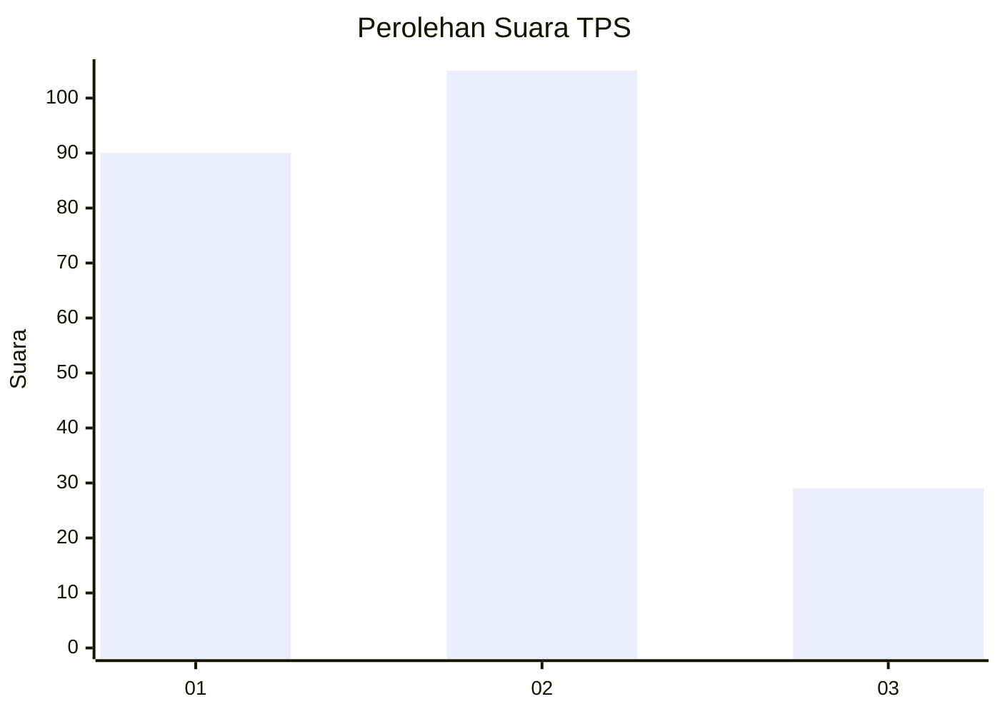
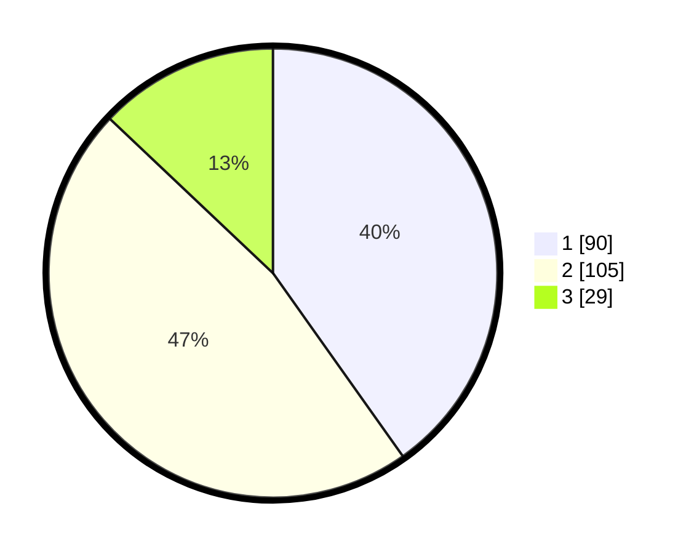

# Hasil

## Grafik

## Tabel

| No. | Nama Paslon    | Suara | Suara (raw) | Persentase |
|:--- |:-------------- | -----:| -----------:| ----------:|
| 1   | ANIES MUHAIMIN | 90    | [90][p-1]   | 40,18      |
| 2   | PRABOWO GIBRAN | 105   | [105][p-2]  | 46,88      |
| 3   | GANJAR MAHFUD  | 29    | [29][p-3]   | 12,95      |

[p-1]: https://github.com/gigit-pemilu/pemilu-2024-31-dki-jakarta/blob/main/pilpres/hitung-suara/sub/31-dki-jakarta/sub/74-jakarta-selatan/sub/10-pesanggrahan/sub/1001-pesanggrahan/sub/004-tps/sub/paslon-1.txt
[p-2]: https://github.com/gigit-pemilu/pemilu-2024-31-dki-jakarta/blob/main/pilpres/hitung-suara/sub/31-dki-jakarta/sub/74-jakarta-selatan/sub/10-pesanggrahan/sub/1001-pesanggrahan/sub/004-tps/sub/paslon-2.txt
[p-3]: https://github.com/gigit-pemilu/pemilu-2024-31-dki-jakarta/blob/main/pilpres/hitung-suara/sub/31-dki-jakarta/sub/74-jakarta-selatan/sub/10-pesanggrahan/sub/1001-pesanggrahan/sub/004-tps/sub/paslon-3.txt

## Foto C Plano

https://sirekap-obj-formc.kpu.go.id/dd72/pemilu/ppwp/31/74/10/10/01/3174101001004-20240216-202533--44c37b8f-4a3e-42f0-8293-b77c1d4a4c98.jpg

https://sirekap-obj-formc.kpu.go.id/dd72/pemilu/ppwp/31/74/10/10/01/3174101001004-20240215-021755--4bc9bf4e-9db1-44b1-8bb9-98a73ff5fa3e.jpg

https://sirekap-obj-formc.kpu.go.id/dd72/pemilu/ppwp/31/74/10/10/01/3174101001004-20240215-021801--3e7cb374-bc5f-4c2e-8929-782a52a6d492.jpg

## Metadata

| Key        | Value               |
| ---------- | ------------------- |
| Time Stamp | 2024-02-16 21:01:00 |

