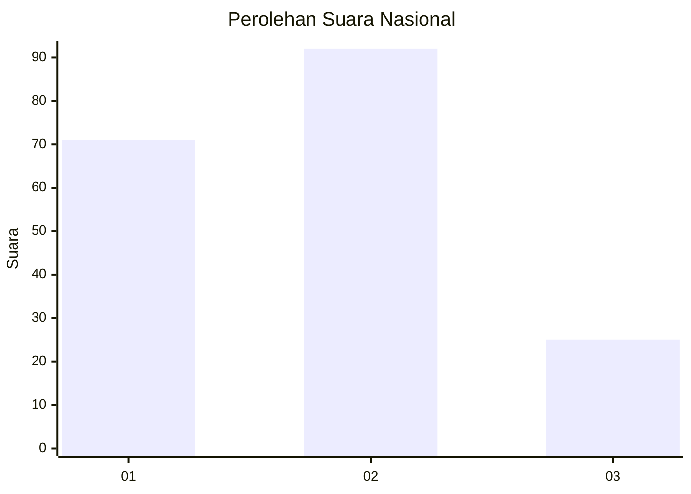
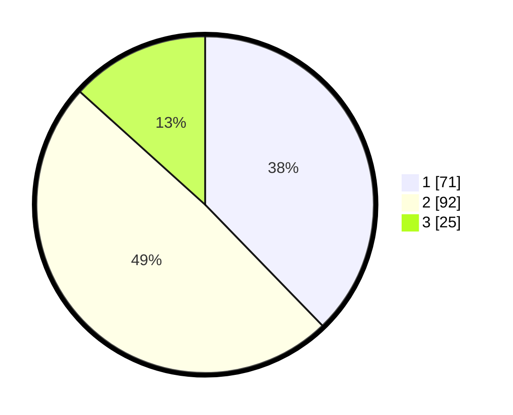

# Hasil

## Grafik

## Tabel

| No.    | Nama Paslon    | Suara | Suara (raw) | Persentase |
|:------ |:-------------- | -----:| -----------:| ----------:|
| 100025 | ANIES MUHAIMIN | 71    | [71][p-1]   | 37,77      |
| 100026 | PRABOWO GIBRAN | 92    | [92][p-2]   | 48,94      |
| 100027 | GANJAR MAHFUD  | 25    | [25][p-3]   | 13,30      |

[p-1]: https://github.com/gigit-pemilu/pemilu-2024/blob/main/pilpres/hitung-suara/sub/31-dki-jakarta/sub/74-jakarta-selatan/sub/10-pesanggrahan/sub/1001-pesanggrahan/sub/054-tps/sub/paslon-1.txt
[p-2]: https://github.com/gigit-pemilu/pemilu-2024/blob/main/pilpres/hitung-suara/sub/31-dki-jakarta/sub/74-jakarta-selatan/sub/10-pesanggrahan/sub/1001-pesanggrahan/sub/054-tps/sub/paslon-2.txt
[p-3]: https://github.com/gigit-pemilu/pemilu-2024/blob/main/pilpres/hitung-suara/sub/31-dki-jakarta/sub/74-jakarta-selatan/sub/10-pesanggrahan/sub/1001-pesanggrahan/sub/054-tps/sub/paslon-3.txt

## Foto C Plano

https://sirekap-obj-formc.kpu.go.id/0388/pemilu/ppwp/31/74/10/10/01/3174101001054-20240214-194614--dcf9609a-d0c4-4da2-a05f-71faf3a4cae9.jpg

https://sirekap-obj-formc.kpu.go.id/0388/pemilu/ppwp/31/74/10/10/01/3174101001054-20240214-194905--406d81f1-64b0-42ab-b0e1-534c03dbbdc1.jpg

https://sirekap-obj-formc.kpu.go.id/0388/pemilu/ppwp/31/74/10/10/01/3174101001054-20240214-195018--fc5c5208-9ed7-493d-9cb7-bee67662de9e.jpg

## Metadata

| Key        | Value               |
| ---------- | ------------------- |
| Time Stamp | 2024-02-24 22:31:28 |

