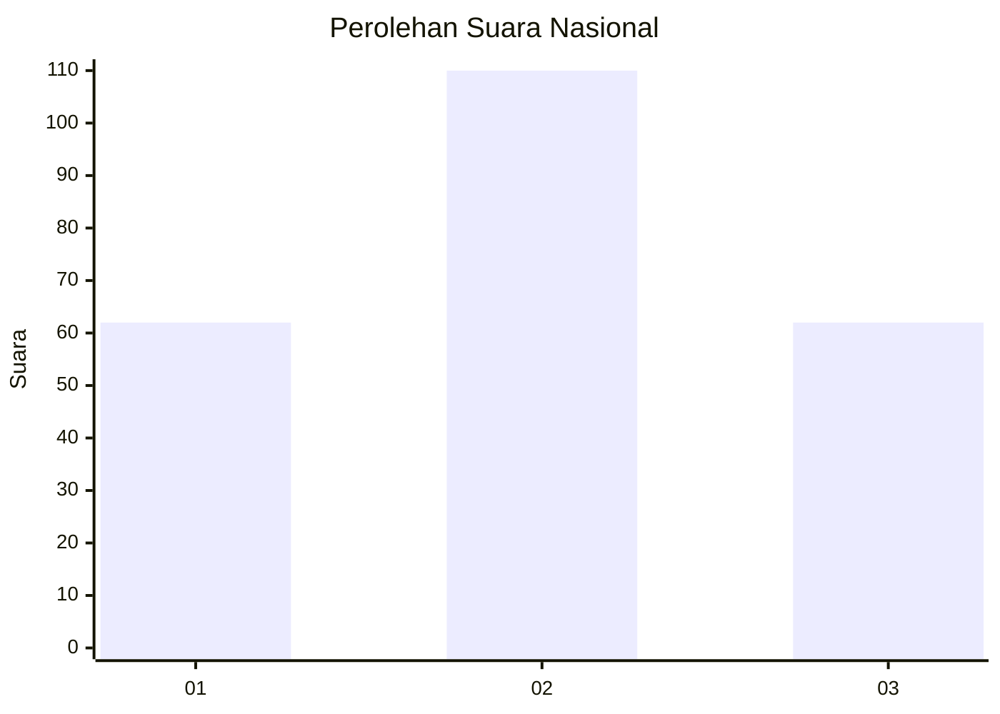
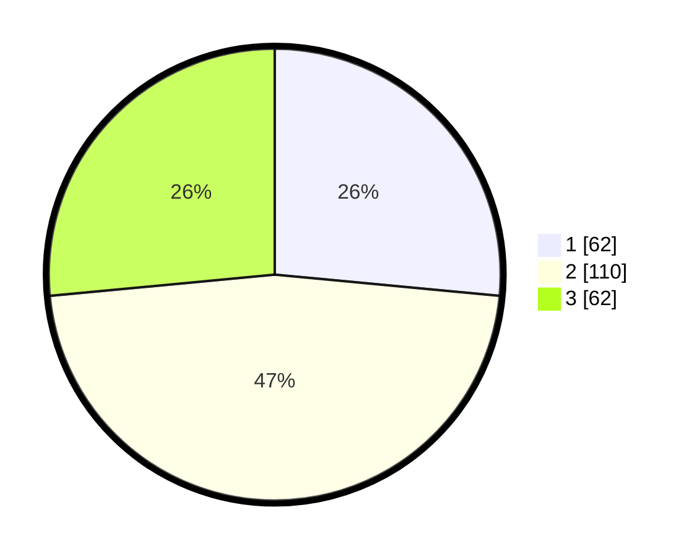

# Hasil

## Grafik

## Tabel

| No.    | Nama Paslon    | Suara | Suara (raw) | Persentase |
|:------ |:-------------- | -----:| -----------:| ----------:|
| 100025 | ANIES MUHAIMIN | 62    | [62][p-1]   | 26,50      |
| 100026 | PRABOWO GIBRAN | 110   | [110][p-2]  | 47,01      |
| 100027 | GANJAR MAHFUD  | 62    | [62][p-3]   | 26,50      |

[p-1]: https://github.com/gigit-pemilu/pemilu-2024/blob/main/pilpres/hitung-suara/sub/31-dki-jakarta/sub/74-jakarta-selatan/sub/10-pesanggrahan/sub/1001-pesanggrahan/sub/061-tps/sub/paslon-1.txt
[p-2]: https://github.com/gigit-pemilu/pemilu-2024/blob/main/pilpres/hitung-suara/sub/31-dki-jakarta/sub/74-jakarta-selatan/sub/10-pesanggrahan/sub/1001-pesanggrahan/sub/061-tps/sub/paslon-2.txt
[p-3]: https://github.com/gigit-pemilu/pemilu-2024/blob/main/pilpres/hitung-suara/sub/31-dki-jakarta/sub/74-jakarta-selatan/sub/10-pesanggrahan/sub/1001-pesanggrahan/sub/061-tps/sub/paslon-3.txt

## Foto C Plano

https://sirekap-obj-formc.kpu.go.id/22a9/pemilu/ppwp/31/74/10/10/01/3174101001061-20240215-013529--d7d69025-c9c3-4331-a7af-81aea0236495.jpg

https://sirekap-obj-formc.kpu.go.id/22a9/pemilu/ppwp/31/74/10/10/01/3174101001061-20240215-013553--6613ccb8-56ff-4c2d-a298-b2f93e3f8f1e.jpg

https://sirekap-obj-formc.kpu.go.id/22a9/pemilu/ppwp/31/74/10/10/01/3174101001061-20240215-013625--eceaf94d-7667-4f38-aaf0-fd8d9360c125.jpg

## Metadata

| Key        | Value               |
| ---------- | ------------------- |
| Time Stamp | 2024-02-24 22:31:28 |

