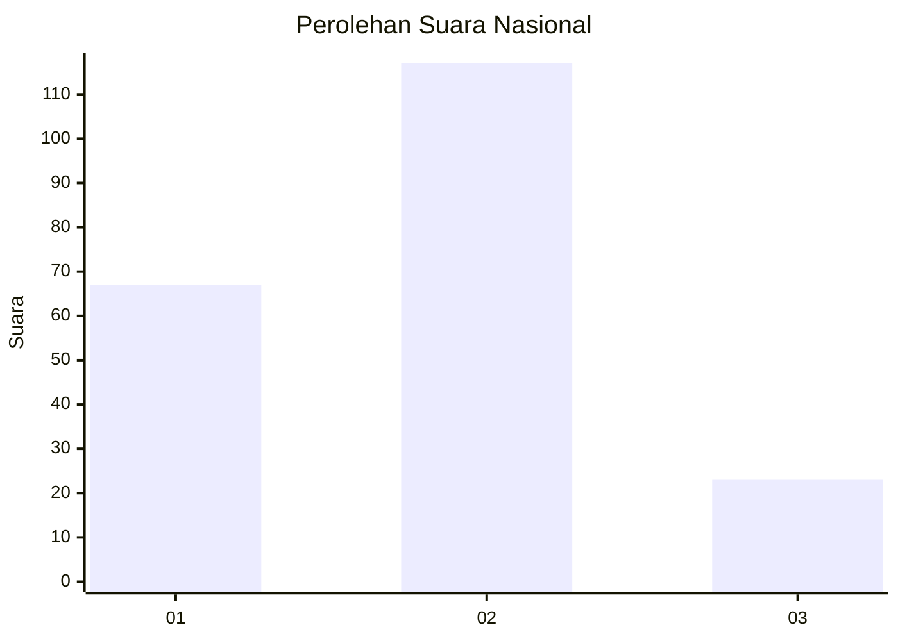
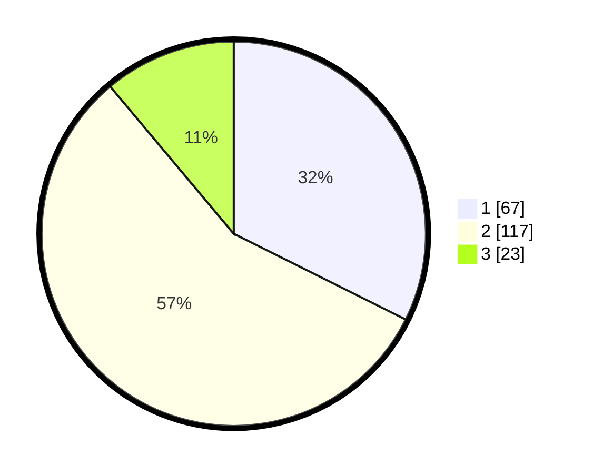

# Hasil

## Grafik

## Tabel

| No.    | Nama Paslon    | Suara | Suara (raw) | Persentase |
|:------ |:-------------- | -----:| -----------:| ----------:|
| 100025 | ANIES MUHAIMIN | 67    | [67][p-1]   | 32,37      |
| 100026 | PRABOWO GIBRAN | 117   | [117][p-2]  | 56,52      |
| 100027 | GANJAR MAHFUD  | 23    | [23][p-3]   | 11,11      |

[p-1]: https://github.com/gigit-pemilu/pemilu-2024/blob/main/pilpres/hitung-suara/sub/31-dki-jakarta/sub/74-jakarta-selatan/sub/10-pesanggrahan/sub/1001-pesanggrahan/sub/074-tps/sub/paslon-1.txt
[p-2]: https://github.com/gigit-pemilu/pemilu-2024/blob/main/pilpres/hitung-suara/sub/31-dki-jakarta/sub/74-jakarta-selatan/sub/10-pesanggrahan/sub/1001-pesanggrahan/sub/074-tps/sub/paslon-2.txt
[p-3]: https://github.com/gigit-pemilu/pemilu-2024/blob/main/pilpres/hitung-suara/sub/31-dki-jakarta/sub/74-jakarta-selatan/sub/10-pesanggrahan/sub/1001-pesanggrahan/sub/074-tps/sub/paslon-3.txt

## Foto C Plano

https://sirekap-obj-formc.kpu.go.id/b736/pemilu/ppwp/31/74/10/10/01/3174101001074-20240214-203750--38ca7642-b328-4665-aade-e8e621e2e81f.jpg

https://sirekap-obj-formc.kpu.go.id/b736/pemilu/ppwp/31/74/10/10/01/3174101001074-20240214-204034--f9592e26-57e6-4412-88a4-b475fdfc8867.jpg

https://sirekap-obj-formc.kpu.go.id/b736/pemilu/ppwp/31/74/10/10/01/3174101001074-20240214-203855--6b5a6d11-5ef1-4e99-9d85-cc78a8610f81.jpg

## Metadata

| Key        | Value               |
| ---------- | ------------------- |
| Time Stamp | 2024-02-26 11:00:00 |

