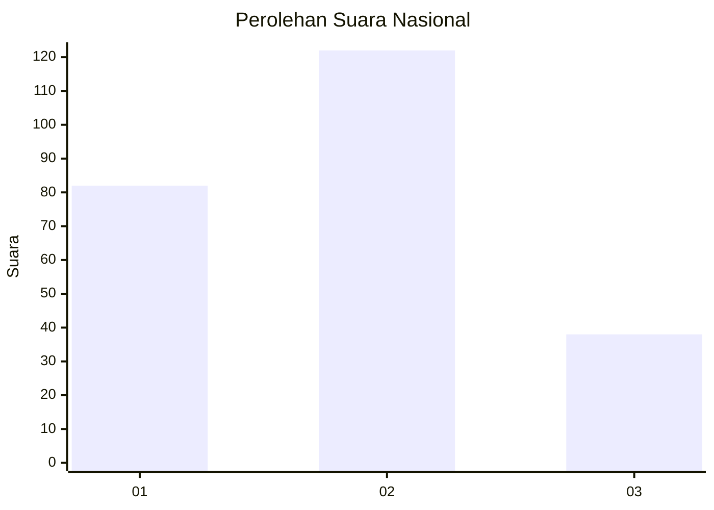
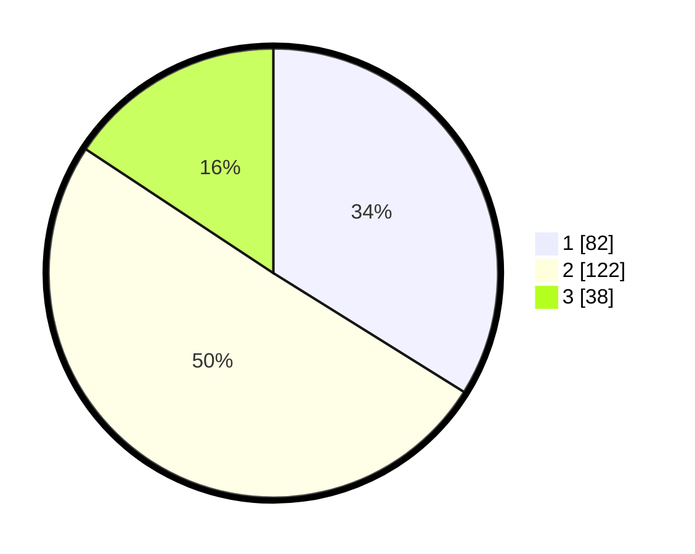

# Hasil

## Grafik

## Tabel

| No.    | Nama Paslon    | Suara | Suara (raw) | Persentase |
|:------ |:-------------- | -----:| -----------:| ----------:|
| 100025 | ANIES MUHAIMIN | 82    | [82][p-1]   | 33,88      |
| 100026 | PRABOWO GIBRAN | 122   | [122][p-2]  | 50,41      |
| 100027 | GANJAR MAHFUD  | 38    | [38][p-3]   | 15,70      |

[p-1]: https://github.com/gigit-pemilu/pemilu-2024/blob/main/pilpres/hitung-suara/sub/31-dki-jakarta/sub/74-jakarta-selatan/sub/10-pesanggrahan/sub/1002-bintaro/sub/061-tps/sub/paslon-1.txt
[p-2]: https://github.com/gigit-pemilu/pemilu-2024/blob/main/pilpres/hitung-suara/sub/31-dki-jakarta/sub/74-jakarta-selatan/sub/10-pesanggrahan/sub/1002-bintaro/sub/061-tps/sub/paslon-2.txt
[p-3]: https://github.com/gigit-pemilu/pemilu-2024/blob/main/pilpres/hitung-suara/sub/31-dki-jakarta/sub/74-jakarta-selatan/sub/10-pesanggrahan/sub/1002-bintaro/sub/061-tps/sub/paslon-3.txt

## Foto C Plano

https://sirekap-obj-formc.kpu.go.id/0e05/pemilu/ppwp/31/74/10/10/02/3174101002061-20240214-202059--a557019f-1cff-4457-a6ab-9bee7769d75f.jpg

https://sirekap-obj-formc.kpu.go.id/0e05/pemilu/ppwp/31/74/10/10/02/3174101002061-20240214-202427--479a1aeb-559b-47b6-ae98-53be048adfce.jpg

https://sirekap-obj-formc.kpu.go.id/0e05/pemilu/ppwp/31/74/10/10/02/3174101002061-20240214-200429--77b9a302-c594-495a-a5e2-0474ee4947ca.jpg

## Metadata

| Key        | Value               |
| ---------- | ------------------- |
| Time Stamp | 2024-02-24 22:31:28 |

