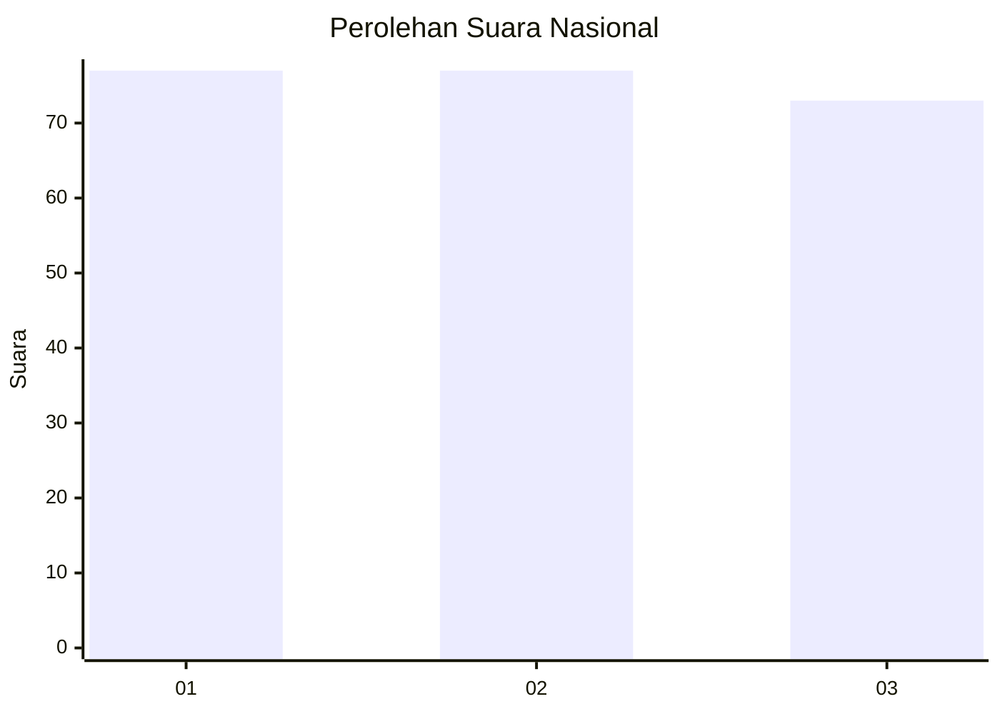
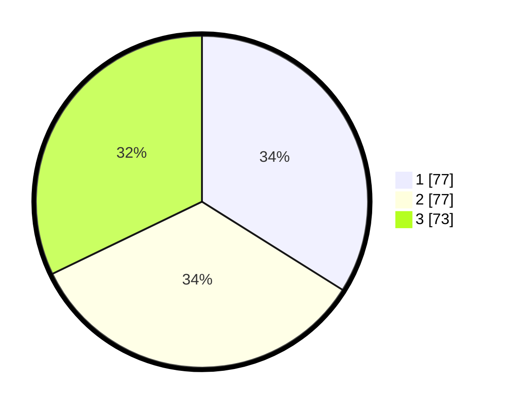

# Hasil

## Grafik

## Tabel

| No.    | Nama Paslon    | Suara | Suara (raw) | Persentase |
|:------ |:-------------- | -----:| -----------:| ----------:|
| 100025 | ANIES MUHAIMIN | 77    | [77][p-1]   | 33,92      |
| 100026 | PRABOWO GIBRAN | 77    | [77][p-2]   | 33,92      |
| 100027 | GANJAR MAHFUD  | 73    | [73][p-3]   | 32,16      |

[p-1]: https://github.com/gigit-pemilu/pemilu-2024/blob/main/pilpres/hitung-suara/sub/31-dki-jakarta/sub/74-jakarta-selatan/sub/10-pesanggrahan/sub/1002-bintaro/sub/080-tps/sub/paslon-1.txt
[p-2]: https://github.com/gigit-pemilu/pemilu-2024/blob/main/pilpres/hitung-suara/sub/31-dki-jakarta/sub/74-jakarta-selatan/sub/10-pesanggrahan/sub/1002-bintaro/sub/080-tps/sub/paslon-2.txt
[p-3]: https://github.com/gigit-pemilu/pemilu-2024/blob/main/pilpres/hitung-suara/sub/31-dki-jakarta/sub/74-jakarta-selatan/sub/10-pesanggrahan/sub/1002-bintaro/sub/080-tps/sub/paslon-3.txt

## Foto C Plano

https://sirekap-obj-formc.kpu.go.id/e46f/pemilu/ppwp/31/74/10/10/02/3174101002080-20240214-194107--c5db0ecc-899d-426c-b41f-c339449239dd.jpg

https://sirekap-obj-formc.kpu.go.id/e46f/pemilu/ppwp/31/74/10/10/02/3174101002080-20240214-194203--2175b065-c400-440b-998d-d9ea35bf3ce3.jpg

https://sirekap-obj-formc.kpu.go.id/e46f/pemilu/ppwp/31/74/10/10/02/3174101002080-20240214-194306--54cde3ef-1b08-4042-95e5-557bb1bec0dc.jpg

## Metadata

| Key        | Value               |
| ---------- | ------------------- |
| Time Stamp | 2024-02-24 22:31:28 |

