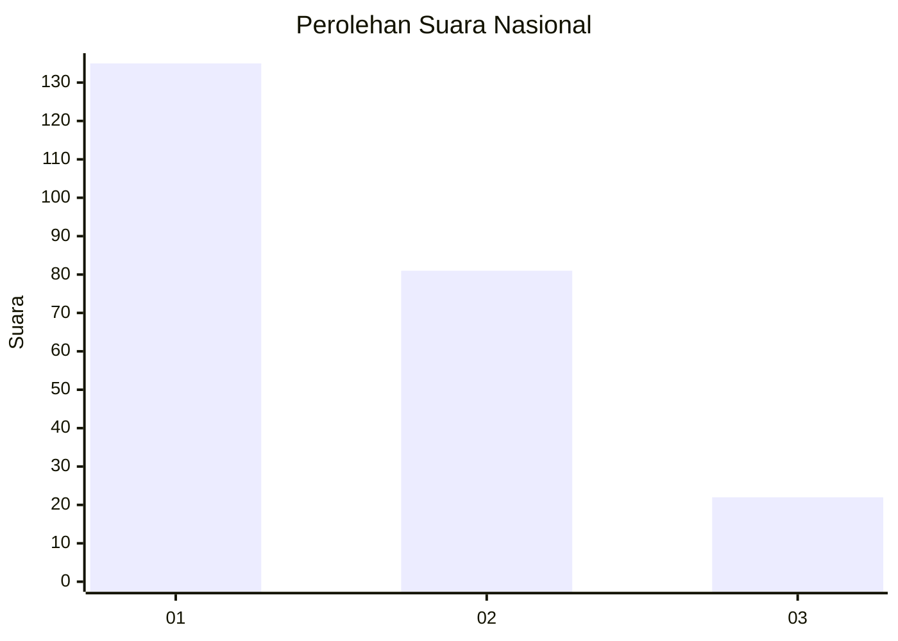
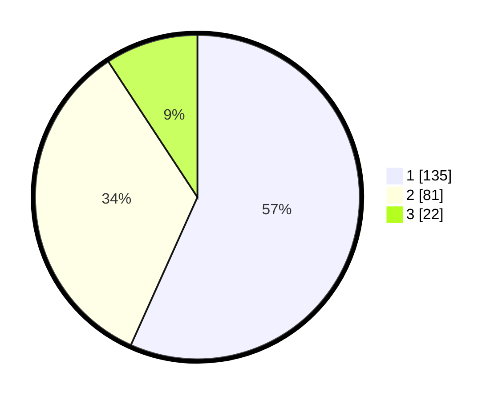

# Hasil

## Grafik

## Tabel

| No.    | Nama Paslon    | Suara | Suara (raw) | Persentase |
|:------ |:-------------- | -----:| -----------:| ----------:|
| 100025 | ANIES MUHAIMIN | 135   | [135][p-1]  | 56,72      |
| 100026 | PRABOWO GIBRAN | 81    | [81][p-2]   | 34,03      |
| 100027 | GANJAR MAHFUD  | 22    | [22][p-3]   | 9,24       |

[p-1]: https://github.com/gigit-pemilu/pemilu-2024/blob/main/pilpres/hitung-suara/sub/31-dki-jakarta/sub/74-jakarta-selatan/sub/10-pesanggrahan/sub/1002-bintaro/sub/087-tps/sub/paslon-1.txt
[p-2]: https://github.com/gigit-pemilu/pemilu-2024/blob/main/pilpres/hitung-suara/sub/31-dki-jakarta/sub/74-jakarta-selatan/sub/10-pesanggrahan/sub/1002-bintaro/sub/087-tps/sub/paslon-2.txt
[p-3]: https://github.com/gigit-pemilu/pemilu-2024/blob/main/pilpres/hitung-suara/sub/31-dki-jakarta/sub/74-jakarta-selatan/sub/10-pesanggrahan/sub/1002-bintaro/sub/087-tps/sub/paslon-3.txt

## Foto C Plano

https://sirekap-obj-formc.kpu.go.id/2c57/pemilu/ppwp/31/74/10/10/02/3174101002087-20240214-224312--f7b0f8f0-9d92-4d31-b12f-97cfd741ea9a.jpg

https://sirekap-obj-formc.kpu.go.id/2c57/pemilu/ppwp/31/74/10/10/02/3174101002087-20240214-224455--2bd6c016-a501-4427-9a94-2e86c228a42c.jpg

https://sirekap-obj-formc.kpu.go.id/2c57/pemilu/ppwp/31/74/10/10/02/3174101002087-20240214-224618--76fca1da-a89a-45f2-accb-3b425dbcdd50.jpg

## Metadata

| Key        | Value               |
| ---------- | ------------------- |
| Time Stamp | 2024-02-24 22:31:28 |

