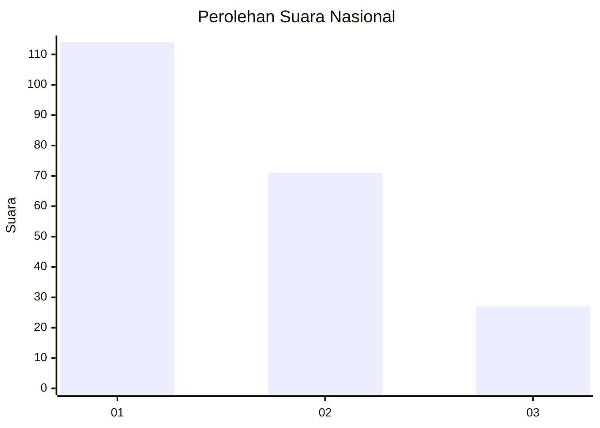
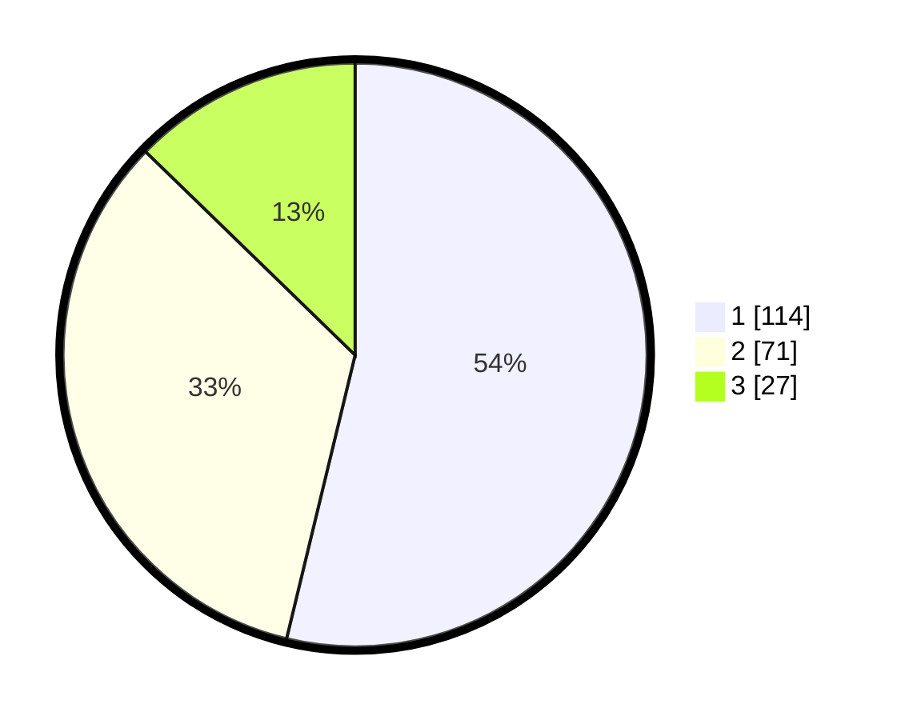

# Hasil

## Grafik

## Tabel

| No.    | Nama Paslon    | Suara | Suara (raw) | Persentase |
|:------ |:-------------- | -----:| -----------:| ----------:|
| 100025 | ANIES MUHAIMIN | 114   | [114][p-1]  | 53,77      |
| 100026 | PRABOWO GIBRAN | 71    | [71][p-2]   | 33,49      |
| 100027 | GANJAR MAHFUD  | 27    | [27][p-3]   | 12,74      |

[p-1]: https://github.com/gigit-pemilu/pemilu-2024/blob/main/pilpres/hitung-suara/sub/31-dki-jakarta/sub/74-jakarta-selatan/sub/10-pesanggrahan/sub/1002-bintaro/sub/098-tps/sub/paslon-1.txt
[p-2]: https://github.com/gigit-pemilu/pemilu-2024/blob/main/pilpres/hitung-suara/sub/31-dki-jakarta/sub/74-jakarta-selatan/sub/10-pesanggrahan/sub/1002-bintaro/sub/098-tps/sub/paslon-2.txt
[p-3]: https://github.com/gigit-pemilu/pemilu-2024/blob/main/pilpres/hitung-suara/sub/31-dki-jakarta/sub/74-jakarta-selatan/sub/10-pesanggrahan/sub/1002-bintaro/sub/098-tps/sub/paslon-3.txt

## Foto C Plano

https://sirekap-obj-formc.kpu.go.id/c8e2/pemilu/ppwp/31/74/10/10/02/3174101002098-20240214-233650--5419daee-ff5e-46f5-b203-806464acd51e.jpg

https://sirekap-obj-formc.kpu.go.id/c8e2/pemilu/ppwp/31/74/10/10/02/3174101002098-20240214-233806--b2778b36-8e10-4d92-a3ab-a6b173f333a5.jpg

https://sirekap-obj-formc.kpu.go.id/c8e2/pemilu/ppwp/31/74/10/10/02/3174101002098-20240214-233859--1feba6b6-824b-4650-bad8-c0d51724d995.jpg

## Metadata

| Key        | Value               |
| ---------- | ------------------- |
| Time Stamp | 2024-02-27 12:00:00 |

