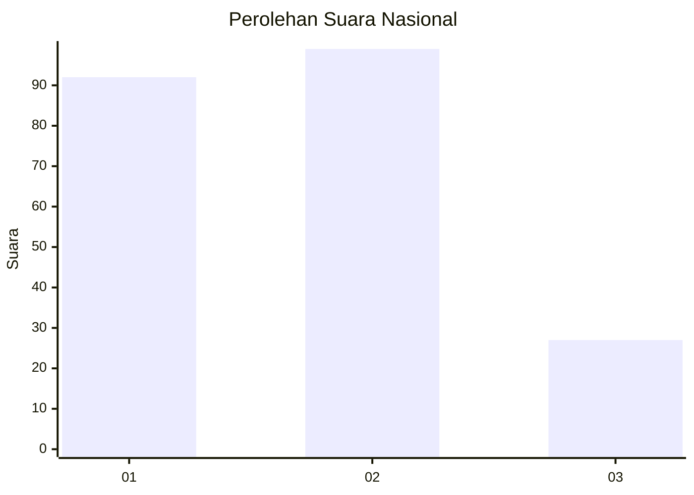
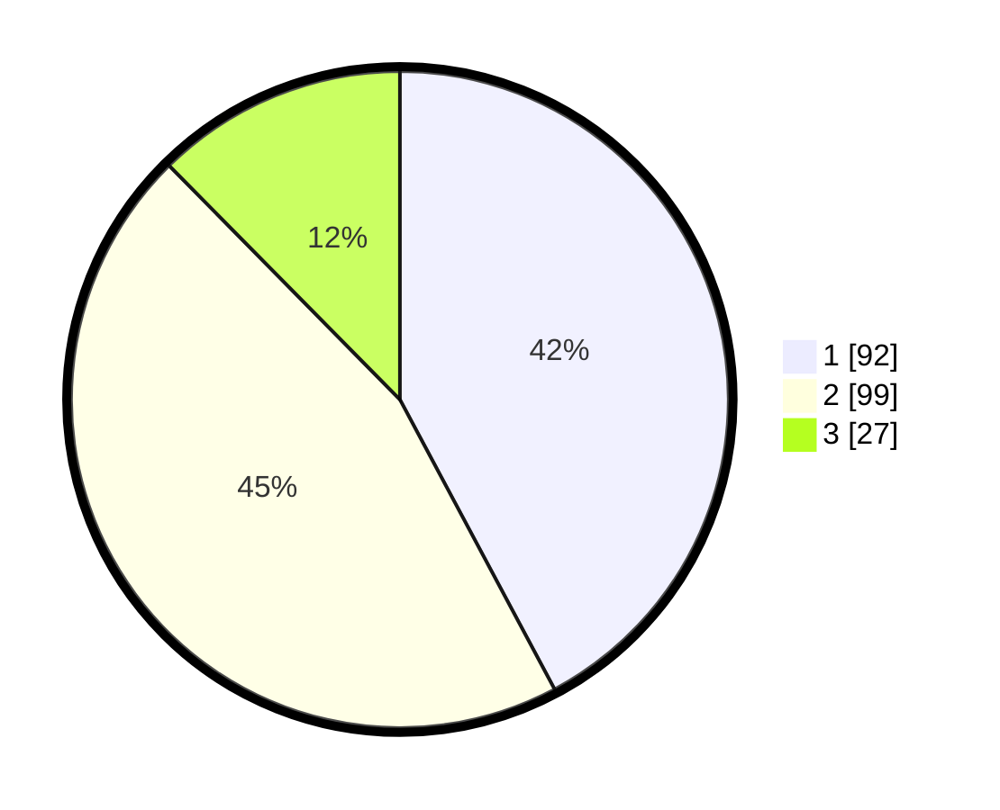

# Hasil

## Grafik

## Tabel

| No.    | Nama Paslon    | Suara | Suara (raw) | Persentase |
|:------ |:-------------- | -----:| -----------:| ----------:|
| 100025 | ANIES MUHAIMIN | 92    | [92][p-1]   | 42,20      |
| 100026 | PRABOWO GIBRAN | 99    | [99][p-2]   | 45,41      |
| 100027 | GANJAR MAHFUD  | 27    | [27][p-3]   | 12,39      |

[p-1]: https://github.com/gigit-pemilu/pemilu-2024/blob/main/pilpres/hitung-suara/sub/31-dki-jakarta/sub/74-jakarta-selatan/sub/10-pesanggrahan/sub/1002-bintaro/sub/163-tps/sub/paslon-1.txt
[p-2]: https://github.com/gigit-pemilu/pemilu-2024/blob/main/pilpres/hitung-suara/sub/31-dki-jakarta/sub/74-jakarta-selatan/sub/10-pesanggrahan/sub/1002-bintaro/sub/163-tps/sub/paslon-2.txt
[p-3]: https://github.com/gigit-pemilu/pemilu-2024/blob/main/pilpres/hitung-suara/sub/31-dki-jakarta/sub/74-jakarta-selatan/sub/10-pesanggrahan/sub/1002-bintaro/sub/163-tps/sub/paslon-3.txt

## Foto C Plano

https://sirekap-obj-formc.kpu.go.id/4453/pemilu/ppwp/31/74/10/10/02/3174101002163-20240214-185545--4130acd6-1758-441e-bf14-91b2f839ede1.jpg

https://sirekap-obj-formc.kpu.go.id/4453/pemilu/ppwp/31/74/10/10/02/3174101002163-20240214-190210--6eba087c-5078-4486-bb52-ca61f004914e.jpg

https://sirekap-obj-formc.kpu.go.id/4453/pemilu/ppwp/31/74/10/10/02/3174101002163-20240214-190358--79a4b7db-5af3-4c74-b9f2-0547c1965f04.jpg

## Metadata

| Key        | Value               |
| ---------- | ------------------- |
| Time Stamp | 2024-02-14 21:46:01 |

