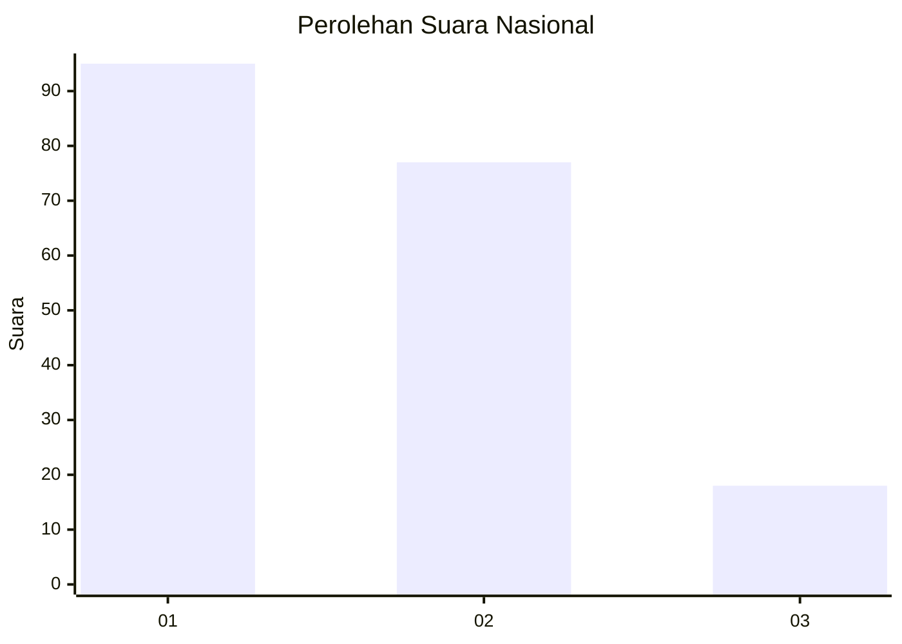
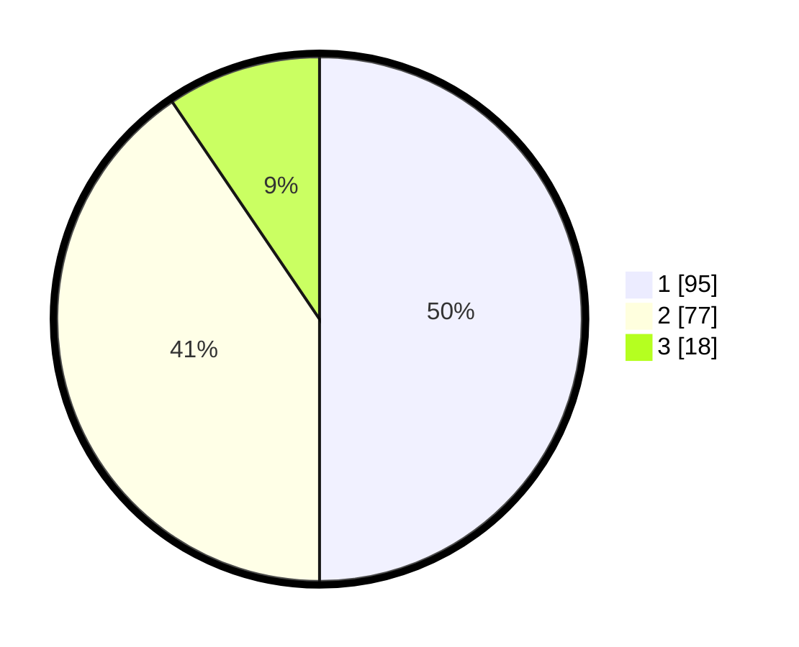

# Hasil

## Grafik

## Tabel

| No.    | Nama Paslon    | Suara | Suara (raw) | Persentase |
|:------ |:-------------- | -----:| -----------:| ----------:|
| 100025 | ANIES MUHAIMIN | 95    | [95][p-1]   | 50,00      |
| 100026 | PRABOWO GIBRAN | 77    | [77][p-2]   | 40,53      |
| 100027 | GANJAR MAHFUD  | 18    | [18][p-3]   | 9,47       |

[p-1]: https://github.com/gigit-pemilu/pemilu-2024/blob/main/pilpres/hitung-suara/sub/31-dki-jakarta/sub/74-jakarta-selatan/sub/10-pesanggrahan/sub/1003-petukangan-utara/sub/018-tps/sub/paslon-1.txt
[p-2]: https://github.com/gigit-pemilu/pemilu-2024/blob/main/pilpres/hitung-suara/sub/31-dki-jakarta/sub/74-jakarta-selatan/sub/10-pesanggrahan/sub/1003-petukangan-utara/sub/018-tps/sub/paslon-2.txt
[p-3]: https://github.com/gigit-pemilu/pemilu-2024/blob/main/pilpres/hitung-suara/sub/31-dki-jakarta/sub/74-jakarta-selatan/sub/10-pesanggrahan/sub/1003-petukangan-utara/sub/018-tps/sub/paslon-3.txt

## Foto C Plano

https://sirekap-obj-formc.kpu.go.id/86c3/pemilu/ppwp/31/74/10/10/03/3174101003018-20240214-223825--33d0f8df-c75e-4b94-807b-e2a5a2a16cf6.jpg

https://sirekap-obj-formc.kpu.go.id/86c3/pemilu/ppwp/31/74/10/10/03/3174101003018-20240214-230139--085bbea2-e285-49bf-a882-3d9068d306aa.jpg

https://sirekap-obj-formc.kpu.go.id/86c3/pemilu/ppwp/31/74/10/10/03/3174101003018-20240214-230324--2230bd12-d547-43e2-b55d-901d245955fd.jpg

## Metadata

| Key        | Value               |
| ---------- | ------------------- |
| Time Stamp | 2024-02-15 12:00:28 |

