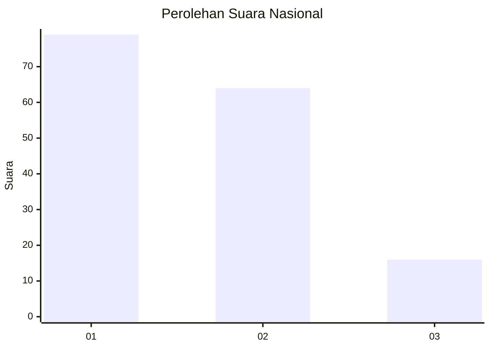
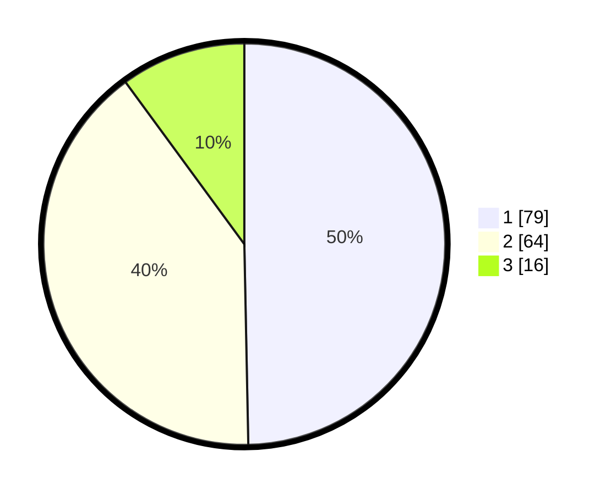

# Hasil

## Grafik

## Tabel

| No.    | Nama Paslon    | Suara | Suara (raw) | Persentase |
|:------ |:-------------- | -----:| -----------:| ----------:|
| 100025 | ANIES MUHAIMIN | 79    | [79][p-1]   | 49,69      |
| 100026 | PRABOWO GIBRAN | 64    | [64][p-2]   | 40,25      |
| 100027 | GANJAR MAHFUD  | 16    | [16][p-3]   | 10,06      |

[p-1]: https://github.com/gigit-pemilu/pemilu-2024/blob/main/pilpres/hitung-suara/sub/31-dki-jakarta/sub/74-jakarta-selatan/sub/10-pesanggrahan/sub/1003-petukangan-utara/sub/019-tps/sub/paslon-1.txt
[p-2]: https://github.com/gigit-pemilu/pemilu-2024/blob/main/pilpres/hitung-suara/sub/31-dki-jakarta/sub/74-jakarta-selatan/sub/10-pesanggrahan/sub/1003-petukangan-utara/sub/019-tps/sub/paslon-2.txt
[p-3]: https://github.com/gigit-pemilu/pemilu-2024/blob/main/pilpres/hitung-suara/sub/31-dki-jakarta/sub/74-jakarta-selatan/sub/10-pesanggrahan/sub/1003-petukangan-utara/sub/019-tps/sub/paslon-3.txt

## Foto C Plano

https://sirekap-obj-formc.kpu.go.id/1acc/pemilu/ppwp/31/74/10/10/03/3174101003019-20240214-210920--63ace197-3226-41af-a323-bda7d1add787.jpg

https://sirekap-obj-formc.kpu.go.id/1acc/pemilu/ppwp/31/74/10/10/03/3174101003019-20240214-211011--8b320a8d-923f-4a2f-b037-8635f78c8b00.jpg

https://sirekap-obj-formc.kpu.go.id/1acc/pemilu/ppwp/31/74/10/10/03/3174101003019-20240214-215604--dcb3777f-1eae-43fd-ac5a-4660e94dc24e.jpg

## Metadata

| Key        | Value               |
| ---------- | ------------------- |
| Time Stamp | 2024-02-24 22:31:28 |

