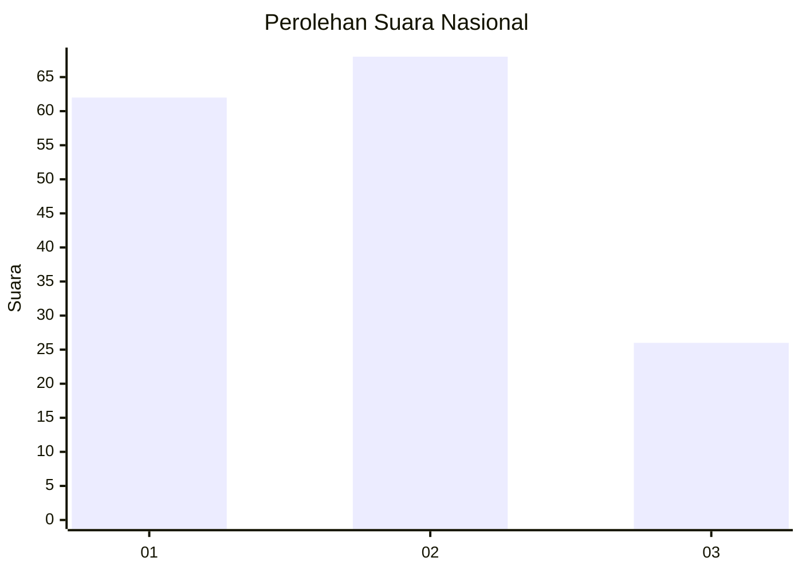
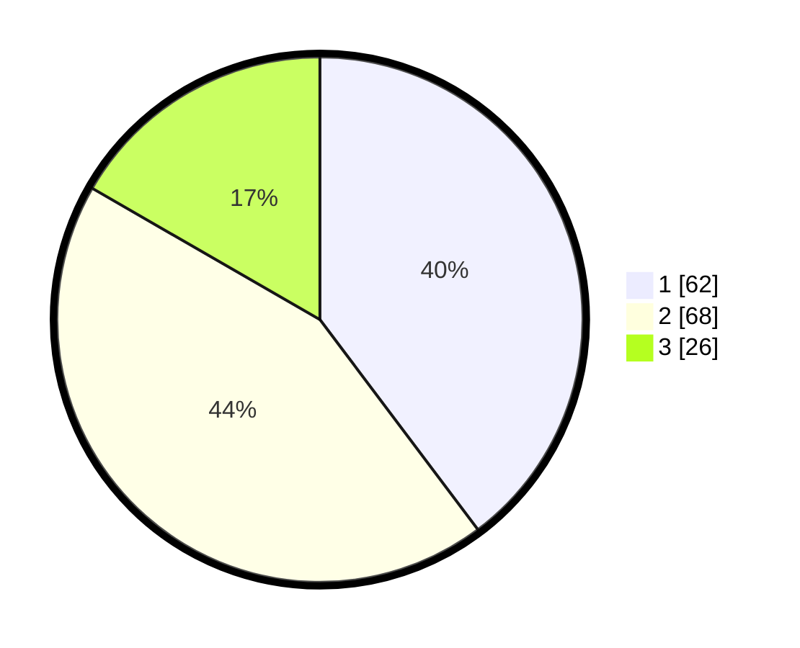

# Hasil

## Grafik

## Tabel

| No.    | Nama Paslon    | Suara | Suara (raw) | Persentase |
|:------ |:-------------- | -----:| -----------:| ----------:|
| 100025 | ANIES MUHAIMIN | 62    | [62][p-1]   | 39,74      |
| 100026 | PRABOWO GIBRAN | 68    | [68][p-2]   | 43,59      |
| 100027 | GANJAR MAHFUD  | 26    | [26][p-3]   | 16,67      |

[p-1]: https://github.com/gigit-pemilu/pemilu-2024/blob/main/pilpres/hitung-suara/sub/31-dki-jakarta/sub/74-jakarta-selatan/sub/10-pesanggrahan/sub/1003-petukangan-utara/sub/021-tps/sub/paslon-1.txt
[p-2]: https://github.com/gigit-pemilu/pemilu-2024/blob/main/pilpres/hitung-suara/sub/31-dki-jakarta/sub/74-jakarta-selatan/sub/10-pesanggrahan/sub/1003-petukangan-utara/sub/021-tps/sub/paslon-2.txt
[p-3]: https://github.com/gigit-pemilu/pemilu-2024/blob/main/pilpres/hitung-suara/sub/31-dki-jakarta/sub/74-jakarta-selatan/sub/10-pesanggrahan/sub/1003-petukangan-utara/sub/021-tps/sub/paslon-3.txt

## Foto C Plano

https://sirekap-obj-formc.kpu.go.id/23eb/pemilu/ppwp/31/74/10/10/03/3174101003021-20240214-225330--42ff2843-7802-419a-9792-e8f9cf27cf54.jpg

https://sirekap-obj-formc.kpu.go.id/23eb/pemilu/ppwp/31/74/10/10/03/3174101003021-20240214-221720--4c5c520c-57de-463a-bfd2-ed900463bab1.jpg

https://sirekap-obj-formc.kpu.go.id/23eb/pemilu/ppwp/31/74/10/10/03/3174101003021-20240214-222002--31bb2904-212c-4b56-9dea-be44a496187f.jpg

## Metadata

| Key        | Value               |
| ---------- | ------------------- |
| Time Stamp | 2024-02-19 08:00:00 |

