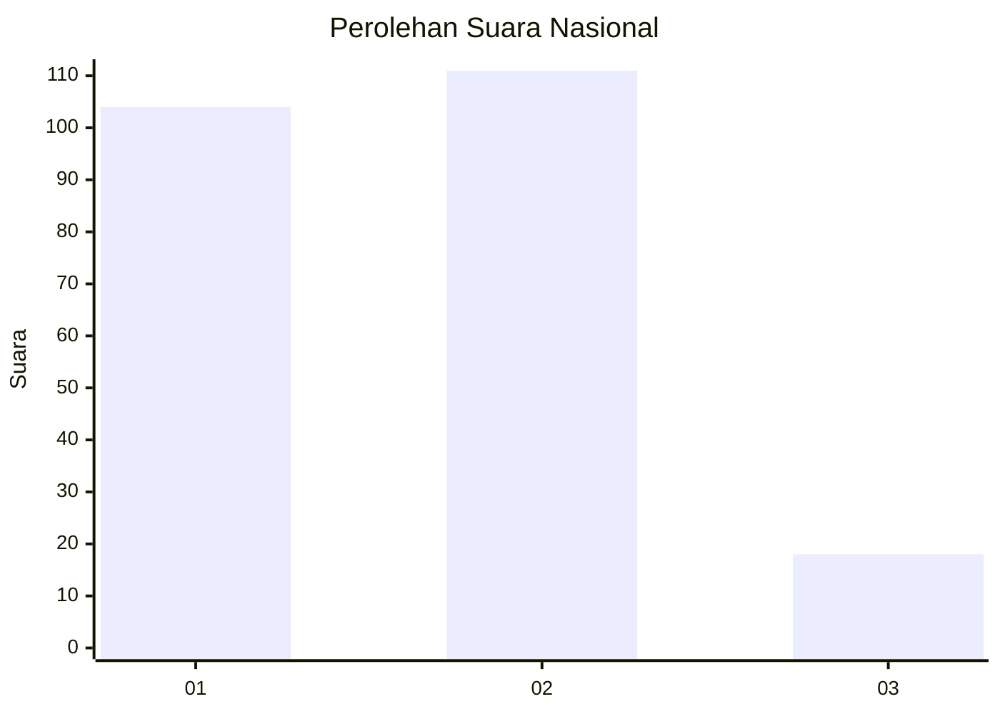
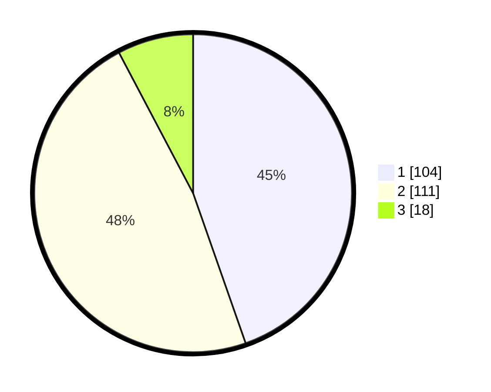

# Hasil

## Grafik

## Tabel

| No.    | Nama Paslon    | Suara | Suara (raw) | Persentase |
|:------ |:-------------- | -----:| -----------:| ----------:|
| 100025 | ANIES MUHAIMIN | 104   | [104][p-1]  | 44,64      |
| 100026 | PRABOWO GIBRAN | 111   | [111][p-2]  | 47,64      |
| 100027 | GANJAR MAHFUD  | 18    | [18][p-3]   | 7,73       |

[p-1]: https://github.com/gigit-pemilu/pemilu-2024/blob/main/pilpres/hitung-suara/sub/31-dki-jakarta/sub/74-jakarta-selatan/sub/10-pesanggrahan/sub/1003-petukangan-utara/sub/039-tps/sub/paslon-1.txt
[p-2]: https://github.com/gigit-pemilu/pemilu-2024/blob/main/pilpres/hitung-suara/sub/31-dki-jakarta/sub/74-jakarta-selatan/sub/10-pesanggrahan/sub/1003-petukangan-utara/sub/039-tps/sub/paslon-2.txt
[p-3]: https://github.com/gigit-pemilu/pemilu-2024/blob/main/pilpres/hitung-suara/sub/31-dki-jakarta/sub/74-jakarta-selatan/sub/10-pesanggrahan/sub/1003-petukangan-utara/sub/039-tps/sub/paslon-3.txt

## Foto C Plano

https://sirekap-obj-formc.kpu.go.id/1b27/pemilu/ppwp/31/74/10/10/03/3174101003039-20240214-225022--e9ac046d-039e-4b24-8e7b-fa534630a78d.jpg

https://sirekap-obj-formc.kpu.go.id/1b27/pemilu/ppwp/31/74/10/10/03/3174101003039-20240214-225307--061d2192-5427-4434-8c3e-d81d98b894b7.jpg

https://sirekap-obj-formc.kpu.go.id/1b27/pemilu/ppwp/31/74/10/10/03/3174101003039-20240214-225431--83f31b1e-adbd-4984-9282-d553ac0a2899.jpg

## Metadata

| Key        | Value               |
| ---------- | ------------------- |
| Time Stamp | 2024-02-24 22:31:28 |

