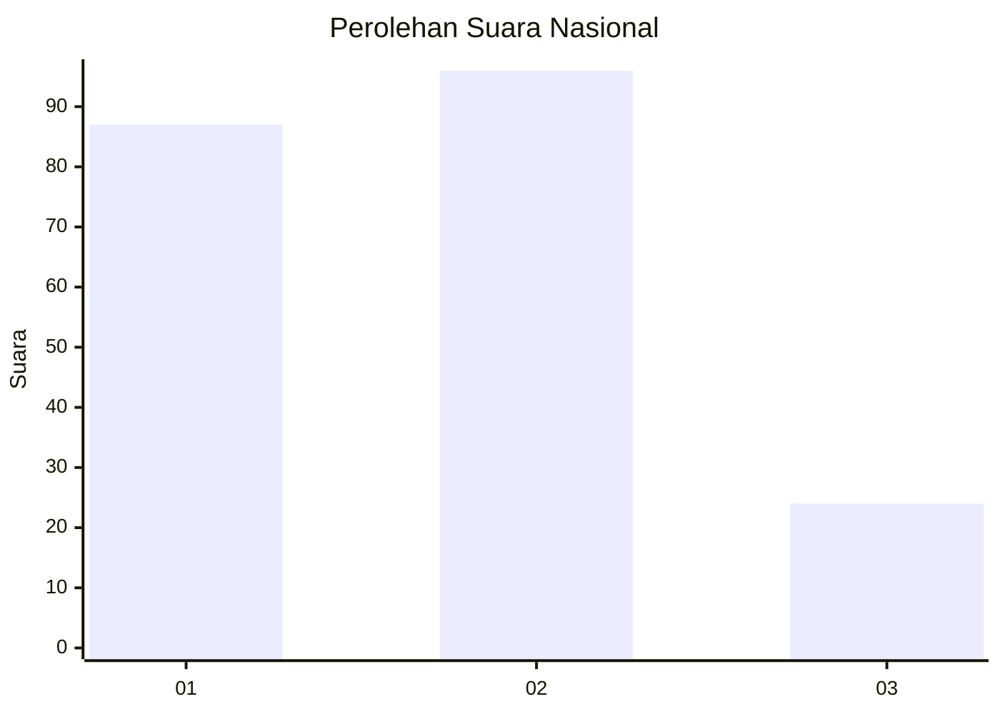
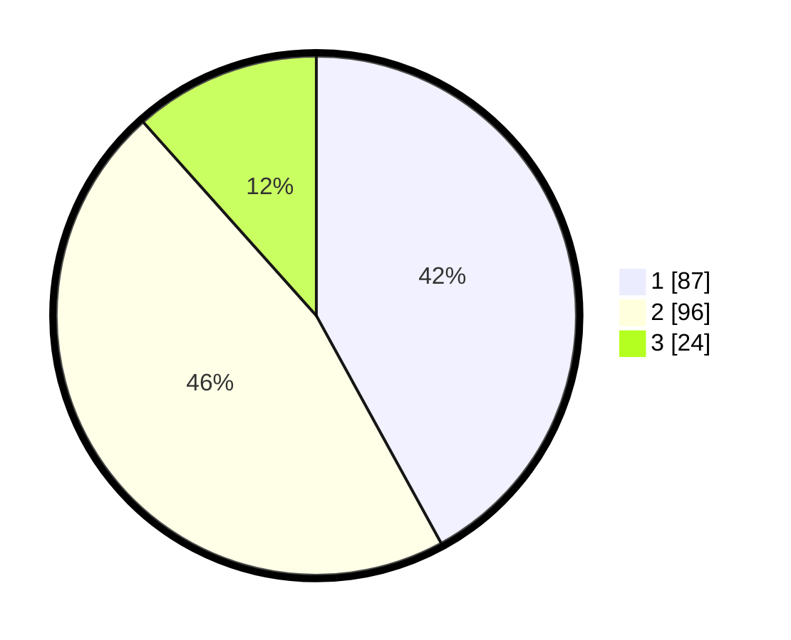

# Hasil

## Grafik

## Tabel

| No.    | Nama Paslon    | Suara | Suara (raw) | Persentase |
|:------ |:-------------- | -----:| -----------:| ----------:|
| 100025 | ANIES MUHAIMIN | 87    | [87][p-1]   | 42,03      |
| 100026 | PRABOWO GIBRAN | 96    | [96][p-2]   | 46,38      |
| 100027 | GANJAR MAHFUD  | 24    | [24][p-3]   | 11,59      |

[p-1]: https://github.com/gigit-pemilu/pemilu-2024/blob/main/pilpres/hitung-suara/sub/31-dki-jakarta/sub/74-jakarta-selatan/sub/10-pesanggrahan/sub/1003-petukangan-utara/sub/051-tps/sub/paslon-1.txt
[p-2]: https://github.com/gigit-pemilu/pemilu-2024/blob/main/pilpres/hitung-suara/sub/31-dki-jakarta/sub/74-jakarta-selatan/sub/10-pesanggrahan/sub/1003-petukangan-utara/sub/051-tps/sub/paslon-2.txt
[p-3]: https://github.com/gigit-pemilu/pemilu-2024/blob/main/pilpres/hitung-suara/sub/31-dki-jakarta/sub/74-jakarta-selatan/sub/10-pesanggrahan/sub/1003-petukangan-utara/sub/051-tps/sub/paslon-3.txt

## Foto C Plano

https://sirekap-obj-formc.kpu.go.id/8188/pemilu/ppwp/31/74/10/10/03/3174101003051-20240216-152002--c23317af-c02c-46a2-821c-9bc99e28d735.jpg

https://sirekap-obj-formc.kpu.go.id/8188/pemilu/ppwp/31/74/10/10/03/3174101003051-20240215-033602--d9729c73-e68c-466a-94ba-d29ef13d8a9a.jpg

https://sirekap-obj-formc.kpu.go.id/8188/pemilu/ppwp/31/74/10/10/03/3174101003051-20240216-152301--07b6f462-c3c0-4098-81ed-9f3c5e34de95.jpg

## Metadata

| Key        | Value               |
| ---------- | ------------------- |
| Time Stamp | 2024-02-24 22:31:28 |

