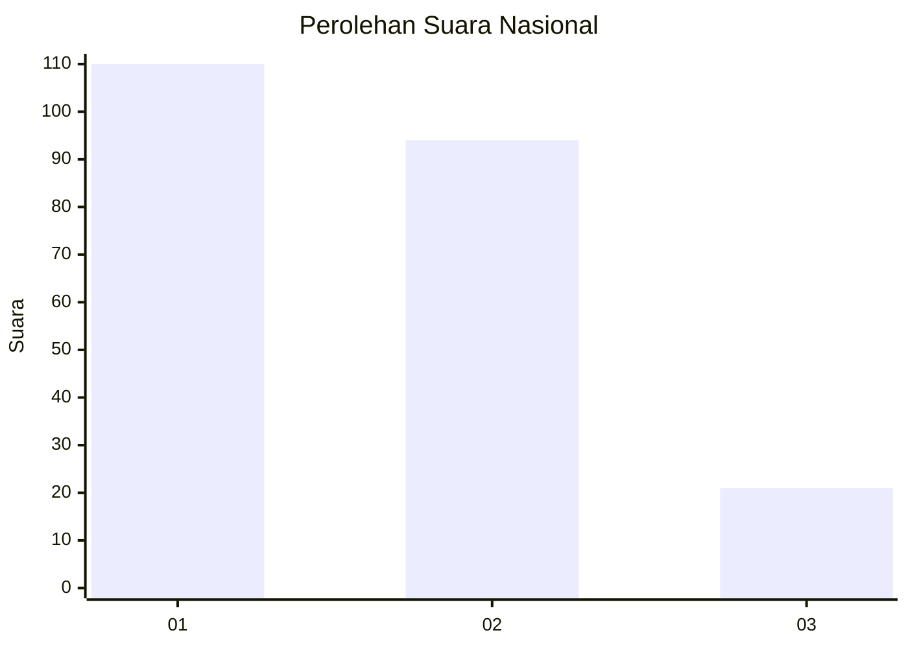
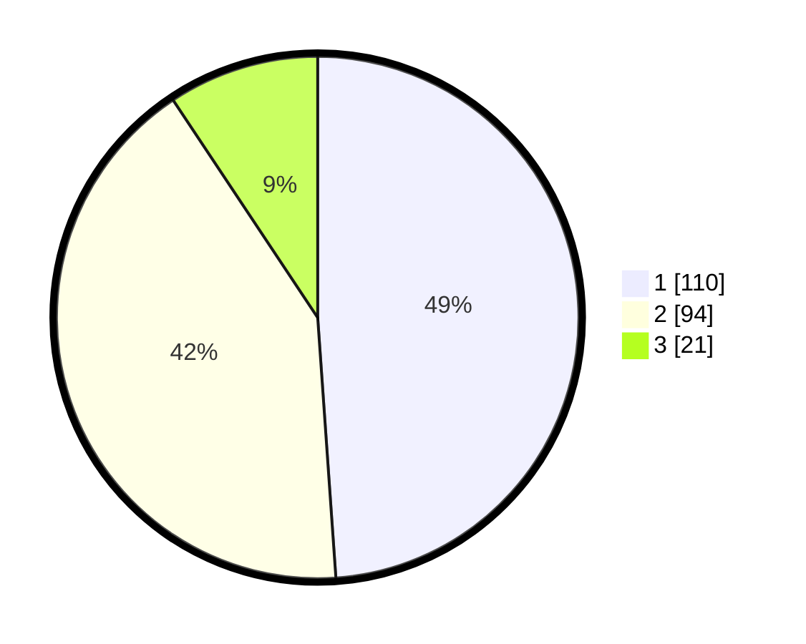

# Hasil

## Grafik

## Tabel

| No.    | Nama Paslon    | Suara | Suara (raw) | Persentase |
|:------ |:-------------- | -----:| -----------:| ----------:|
| 100025 | ANIES MUHAIMIN | 110   | [110][p-1]  | 48,89      |
| 100026 | PRABOWO GIBRAN | 94    | [94][p-2]   | 41,78      |
| 100027 | GANJAR MAHFUD  | 21    | [21][p-3]   | 9,33       |

[p-1]: https://github.com/gigit-pemilu/pemilu-2024/blob/main/pilpres/hitung-suara/sub/31-dki-jakarta/sub/74-jakarta-selatan/sub/10-pesanggrahan/sub/1003-petukangan-utara/sub/064-tps/sub/paslon-1.txt
[p-2]: https://github.com/gigit-pemilu/pemilu-2024/blob/main/pilpres/hitung-suara/sub/31-dki-jakarta/sub/74-jakarta-selatan/sub/10-pesanggrahan/sub/1003-petukangan-utara/sub/064-tps/sub/paslon-2.txt
[p-3]: https://github.com/gigit-pemilu/pemilu-2024/blob/main/pilpres/hitung-suara/sub/31-dki-jakarta/sub/74-jakarta-selatan/sub/10-pesanggrahan/sub/1003-petukangan-utara/sub/064-tps/sub/paslon-3.txt

## Foto C Plano

https://sirekap-obj-formc.kpu.go.id/620e/pemilu/ppwp/31/74/10/10/03/3174101003064-20240214-212651--aaed0441-afe2-45e5-bed0-da4929b211a9.jpg

https://sirekap-obj-formc.kpu.go.id/620e/pemilu/ppwp/31/74/10/10/03/3174101003064-20240214-213042--10b20277-aa7c-44dc-b309-e39665ff71b2.jpg

https://sirekap-obj-formc.kpu.go.id/620e/pemilu/ppwp/31/74/10/10/03/3174101003064-20240214-213220--2acd76b2-6fab-447e-8f86-c076cfb86857.jpg

## Metadata

| Key        | Value               |
| ---------- | ------------------- |
| Time Stamp | 2024-02-24 22:31:28 |

